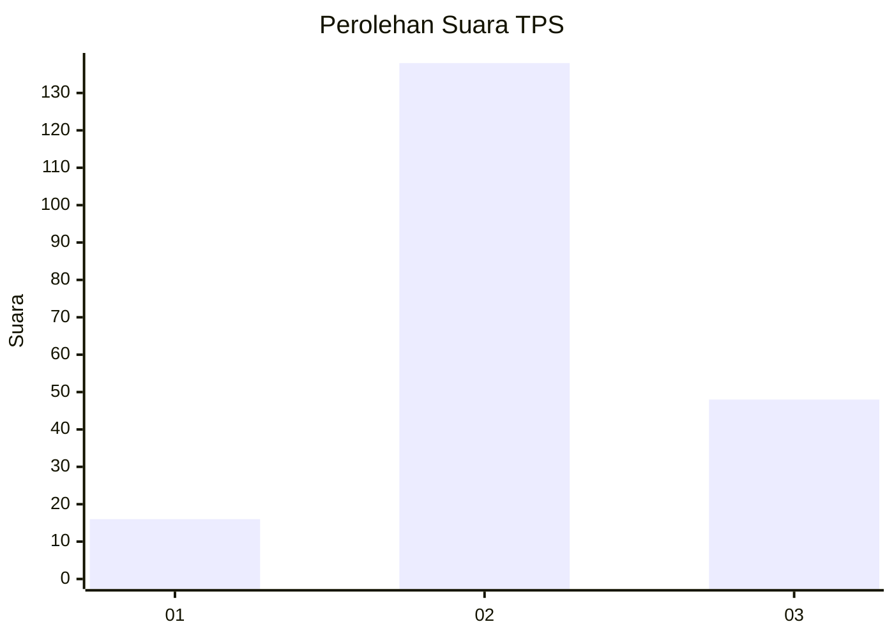
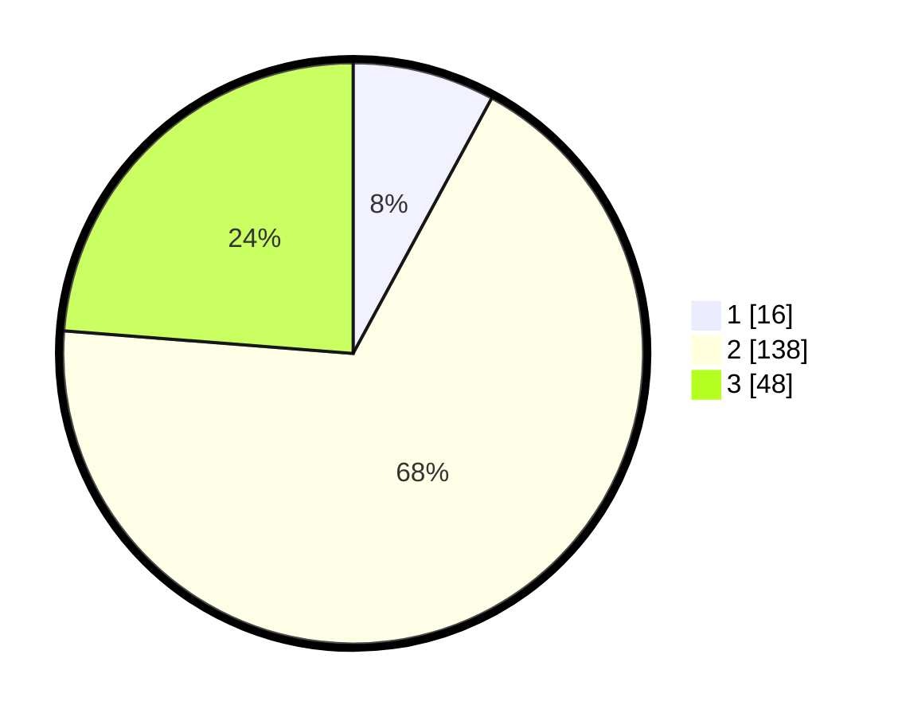

# Hasil

## Grafik

## Tabel

| No. | Nama Paslon    | Suara | Suara (raw) | Persentase |
|:--- |:-------------- | -----:| -----------:| ----------:|
| 1   | ANIES MUHAIMIN | 16    | [16][p-1]   | 7,92       |
| 2   | PRABOWO GIBRAN | 138   | [138][p-2]  | 68,32      |
| 3   | GANJAR MAHFUD  | 48    | [48][p-3]   | 23,76      |

[p-1]: https://github.com/gigit-pemilu/pemilu-2024-51-bali/blob/main/pilpres/hitung-suara/sub/51-bali/sub/71-kota-denpasar/sub/02-denpasar-timur/sub/2002-sumerta-kelod/sub/009-tps/sub/paslon-1.txt
[p-2]: https://github.com/gigit-pemilu/pemilu-2024-51-bali/blob/main/pilpres/hitung-suara/sub/51-bali/sub/71-kota-denpasar/sub/02-denpasar-timur/sub/2002-sumerta-kelod/sub/009-tps/sub/paslon-2.txt
[p-3]: https://github.com/gigit-pemilu/pemilu-2024-51-bali/blob/main/pilpres/hitung-suara/sub/51-bali/sub/71-kota-denpasar/sub/02-denpasar-timur/sub/2002-sumerta-kelod/sub/009-tps/sub/paslon-3.txt

## Foto C Plano

https://sirekap-obj-formc.kpu.go.id/2de4/pemilu/ppwp/51/71/02/20/02/5171022002009-20240215-014721--48e35e6c-9d86-48ee-b7b5-9f8ada645634.jpg

https://sirekap-obj-formc.kpu.go.id/2de4/pemilu/ppwp/51/71/02/20/02/5171022002009-20240215-014741--e5a64617-38bc-4ca3-8798-df26696bc4bd.jpg

https://sirekap-obj-formc.kpu.go.id/2de4/pemilu/ppwp/51/71/02/20/02/5171022002009-20240215-014759--172656ff-6724-40f1-8391-7d42fd90592d.jpg

## Metadata

| Key        | Value               |
| ---------- | ------------------- |
| Time Stamp | 2024-02-22 10:00:00 |

## DATA PEMILIH TETAP

Jumlah pemilih dalam DPT: **281**.
 * L: **130**.
 * P: **151**.

## DATA PENGGUNA HAK PILIH

Jumlah pengguna hak pilih dalam DPT: **189**.
 * L: **88**.
 * P: **101**.

Jumlah pengguna hak pilih dalam DPTb: **10**.
 * L: **6**.
 * P: **4**.

Jumlah pengguna hak pilih dalam DPK: **3**.
 * L: **1**.
 * P: **2**.

Jumlah pengguna hak pilih: **202**.
 * L: **95**.
 * P: **107**.

## JUMLAH SUARA SAH DAN TIDAK SAH

JUMLAH SELURUH SUARA SAH: **202**.

JUMLAH SUARA TIDAK SAH: **0**.

JUMLAH SELURUH SUARA SAH DAN SUARA TIDAK SAH: **202**.

