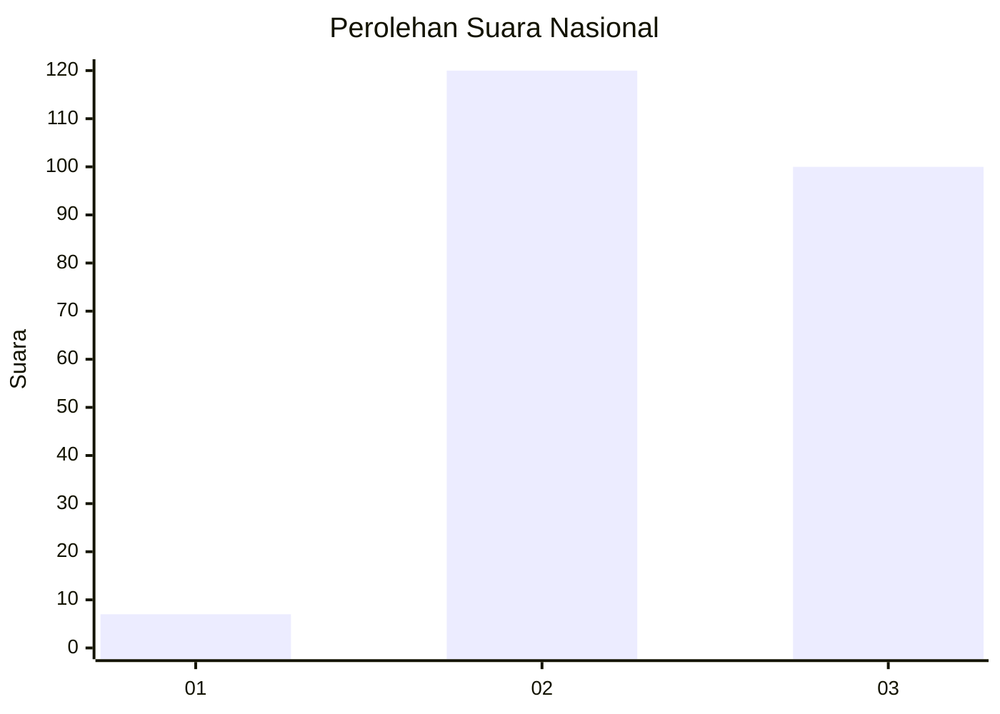
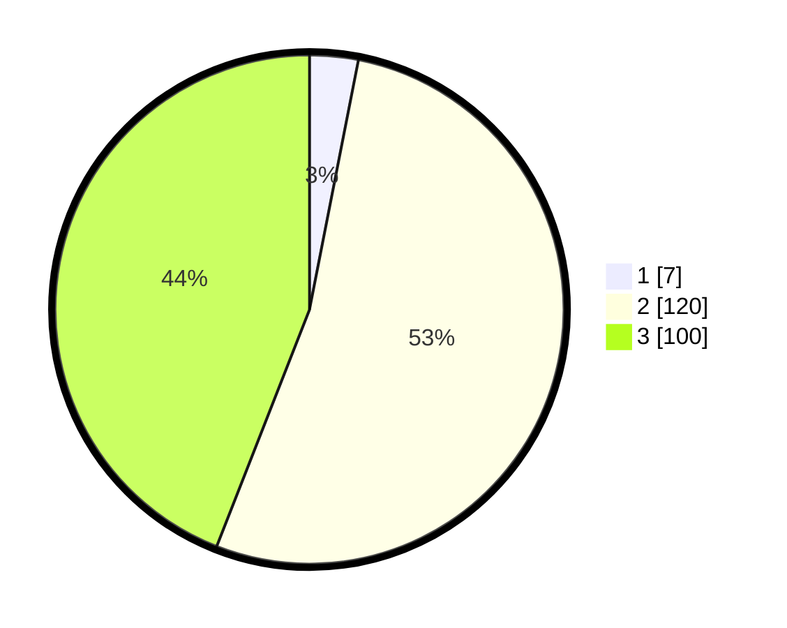

# Hasil

## Grafik

## Tabel

| No. | Nama Paslon    | Suara | Suara (raw) | Persentase |
|:--- |:-------------- | -----:| -----------:| ----------:|
| 1   | ANIES MUHAIMIN | 7     | [7][p-1]    | 3,08       |
| 2   | PRABOWO GIBRAN | 120   | [120][p-2]  | 52,86      |
| 3   | GANJAR MAHFUD  | 100   | [100][p-3]  | 44,05      |

[p-1]: https://github.com/gigit-pemilu/pemilu-2024/blob/main/pilpres/hitung-suara/sub/51-bali/sub/71-kota-denpasar/sub/02-denpasar-timur/sub/2002-sumerta-kelod/sub/021-tps/sub/paslon-1.txt
[p-2]: https://github.com/gigit-pemilu/pemilu-2024/blob/main/pilpres/hitung-suara/sub/51-bali/sub/71-kota-denpasar/sub/02-denpasar-timur/sub/2002-sumerta-kelod/sub/021-tps/sub/paslon-2.txt
[p-3]: https://github.com/gigit-pemilu/pemilu-2024/blob/main/pilpres/hitung-suara/sub/51-bali/sub/71-kota-denpasar/sub/02-denpasar-timur/sub/2002-sumerta-kelod/sub/021-tps/sub/paslon-3.txt

## Foto C Plano

https://sirekap-obj-formc.kpu.go.id/c316/pemilu/ppwp/51/71/02/20/02/5171022002021-20240214-222148--76eae277-ef5b-4d6d-942d-706165d7be61.jpg

https://sirekap-obj-formc.kpu.go.id/c316/pemilu/ppwp/51/71/02/20/02/5171022002021-20240214-222525--200a40f6-e06c-4596-aaf4-144322a2a8b9.jpg

https://sirekap-obj-formc.kpu.go.id/c316/pemilu/ppwp/51/71/02/20/02/5171022002021-20240214-222617--0abf0e02-98ac-424f-9bbb-d648fcafc8cf.jpg

## Metadata

| Key        | Value               |
| ---------- | ------------------- |
| Time Stamp | 2024-02-24 22:31:28 |

