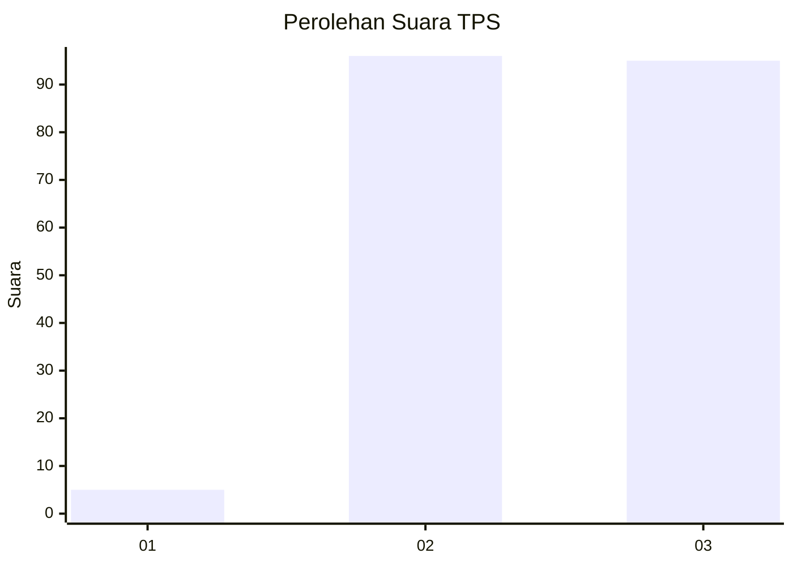
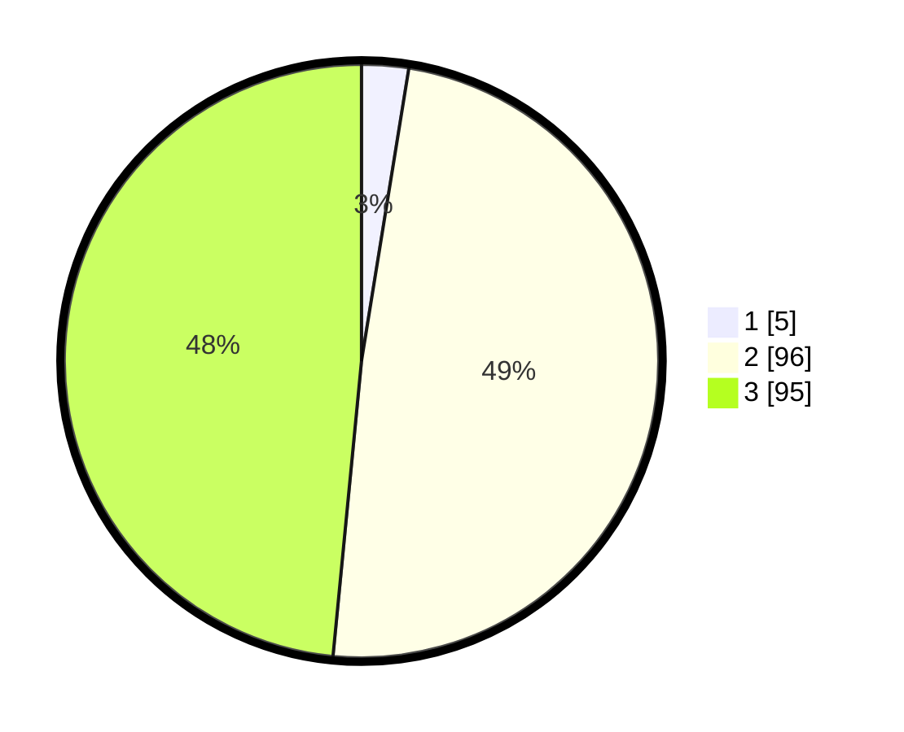

# Hasil

## Grafik

## Tabel

| No. | Nama Paslon    | Suara | Suara (raw) | Persentase |
|:--- |:-------------- | -----:| -----------:| ----------:|
| 1   | ANIES MUHAIMIN | 5     | [5][p-1]    | 2,55       |
| 2   | PRABOWO GIBRAN | 96    | [96][p-2]   | 48,98      |
| 3   | GANJAR MAHFUD  | 95    | [95][p-3]   | 48,47      |

[p-1]: https://github.com/gigit-pemilu/pemilu-2024-51-bali/blob/main/pilpres/hitung-suara/sub/51-bali/sub/71-kota-denpasar/sub/02-denpasar-timur/sub/2002-sumerta-kelod/sub/029-tps/sub/paslon-1.txt
[p-2]: https://github.com/gigit-pemilu/pemilu-2024-51-bali/blob/main/pilpres/hitung-suara/sub/51-bali/sub/71-kota-denpasar/sub/02-denpasar-timur/sub/2002-sumerta-kelod/sub/029-tps/sub/paslon-2.txt
[p-3]: https://github.com/gigit-pemilu/pemilu-2024-51-bali/blob/main/pilpres/hitung-suara/sub/51-bali/sub/71-kota-denpasar/sub/02-denpasar-timur/sub/2002-sumerta-kelod/sub/029-tps/sub/paslon-3.txt

## Foto C Plano

https://sirekap-obj-formc.kpu.go.id/a34e/pemilu/ppwp/51/71/02/20/02/5171022002029-20240217-080111--491a65f7-0c58-4491-896f-a0a2cb9958d8.jpg

https://sirekap-obj-formc.kpu.go.id/a34e/pemilu/ppwp/51/71/02/20/02/5171022002029-20240217-080909--7c26f637-e253-47cf-ab5d-1bf356a8895a.jpg

https://sirekap-obj-formc.kpu.go.id/a34e/pemilu/ppwp/51/71/02/20/02/5171022002029-20240217-081130--0bd6e535-2b05-4046-a3c5-00b6e1a19dd0.jpg

## Metadata

| Key        | Value               |
| ---------- | ------------------- |
| Time Stamp | 2024-02-17 08:30:03 |

## DATA PEMILIH TETAP

Jumlah pemilih dalam DPT: **245**.
 * L: **113**.
 * P: **132**.

## DATA PENGGUNA HAK PILIH

Jumlah pengguna hak pilih dalam DPT: **193**.
 * L: **93**.
 * P: **100**.

Jumlah pengguna hak pilih dalam DPTb: **6**.
 * L: **2**.
 * P: **4**.

Jumlah pengguna hak pilih dalam DPK: **0**.
 * L: **0**.
 * P: **0**.

Jumlah pengguna hak pilih: **199**.
 * L: **95**.
 * P: **104**.

## JUMLAH SUARA SAH DAN TIDAK SAH

JUMLAH SELURUH SUARA SAH: **196**.

JUMLAH SUARA TIDAK SAH: **3**.

JUMLAH SELURUH SUARA SAH DAN SUARA TIDAK SAH: **199**.

