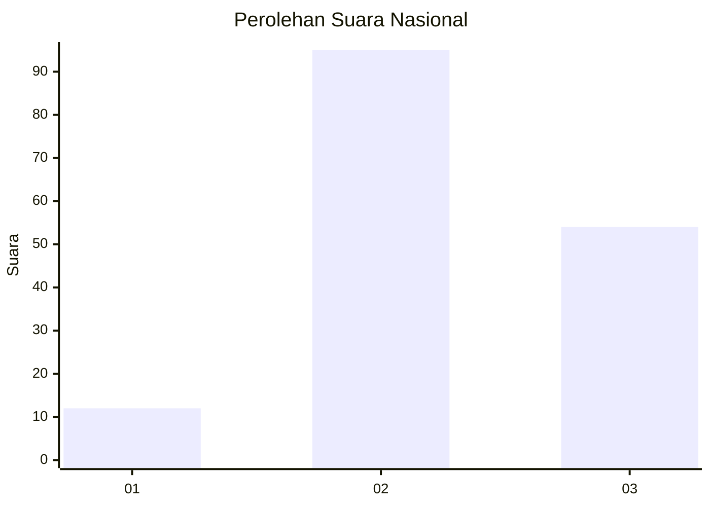
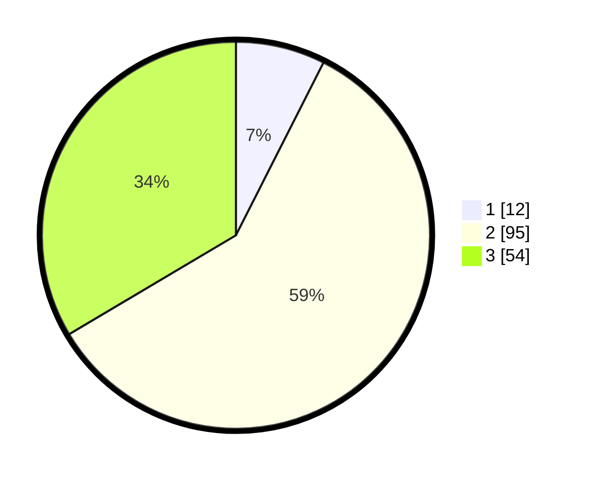

# Hasil

## Grafik

## Tabel

| No. | Nama Paslon    | Suara | Suara (raw) | Persentase |
|:--- |:-------------- | -----:| -----------:| ----------:|
| 1   | ANIES MUHAIMIN | 12    | [12][p-1]   | 7,45       |
| 2   | PRABOWO GIBRAN | 95    | [95][p-2]   | 59,01      |
| 3   | GANJAR MAHFUD  | 54    | [54][p-3]   | 33,54      |

[p-1]: https://github.com/gigit-pemilu/pemilu-2024/blob/main/pilpres/hitung-suara/sub/51-bali/sub/71-kota-denpasar/sub/02-denpasar-timur/sub/2002-sumerta-kelod/sub/032-tps/sub/paslon-1.txt
[p-2]: https://github.com/gigit-pemilu/pemilu-2024/blob/main/pilpres/hitung-suara/sub/51-bali/sub/71-kota-denpasar/sub/02-denpasar-timur/sub/2002-sumerta-kelod/sub/032-tps/sub/paslon-2.txt
[p-3]: https://github.com/gigit-pemilu/pemilu-2024/blob/main/pilpres/hitung-suara/sub/51-bali/sub/71-kota-denpasar/sub/02-denpasar-timur/sub/2002-sumerta-kelod/sub/032-tps/sub/paslon-3.txt

## Foto C Plano

https://sirekap-obj-formc.kpu.go.id/35cf/pemilu/ppwp/51/71/02/20/02/5171022002032-20240214-213208--0209a05d-7e84-44ff-8a6f-d60694b45e74.jpg

https://sirekap-obj-formc.kpu.go.id/35cf/pemilu/ppwp/51/71/02/20/02/5171022002032-20240214-213501--2dc5af48-8987-4f55-af10-961c964498db.jpg

https://sirekap-obj-formc.kpu.go.id/35cf/pemilu/ppwp/51/71/02/20/02/5171022002032-20240214-213642--95f207be-fa50-41fe-91ef-e1c4a1ef0754.jpg

## Metadata

| Key        | Value               |
| ---------- | ------------------- |
| Time Stamp | 2024-02-15 15:30:25 |

