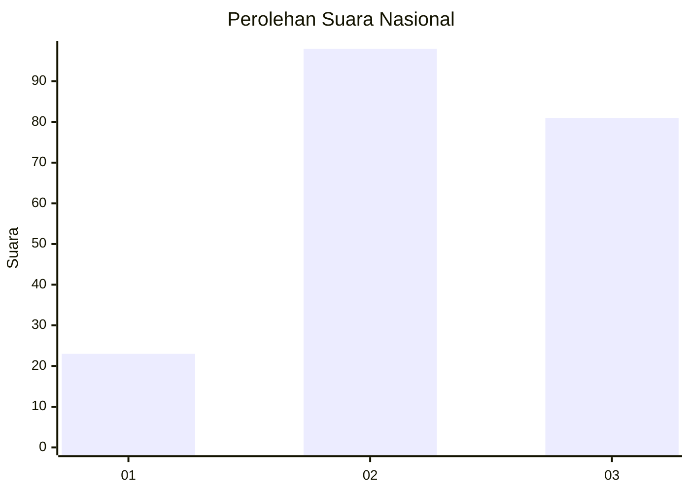
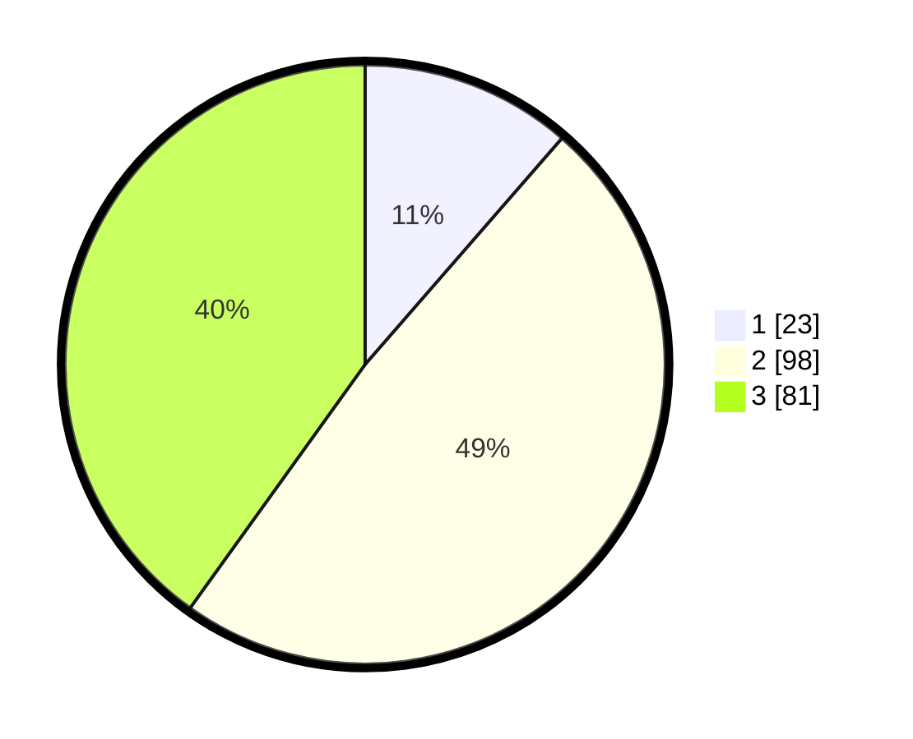

# Hasil

## Grafik

## Tabel

| No. | Nama Paslon    | Suara | Suara (raw) | Persentase |
|:--- |:-------------- | -----:| -----------:| ----------:|
| 1   | ANIES MUHAIMIN | 23    | [23][p-1]   | 11,39      |
| 2   | PRABOWO GIBRAN | 98    | [98][p-2]   | 48,51      |
| 3   | GANJAR MAHFUD  | 81    | [81][p-3]   | 40,10      |

[p-1]: https://github.com/gigit-pemilu/pemilu-2024/blob/main/pilpres/hitung-suara/sub/51-bali/sub/71-kota-denpasar/sub/02-denpasar-timur/sub/2002-sumerta-kelod/sub/035-tps/sub/paslon-1.txt
[p-2]: https://github.com/gigit-pemilu/pemilu-2024/blob/main/pilpres/hitung-suara/sub/51-bali/sub/71-kota-denpasar/sub/02-denpasar-timur/sub/2002-sumerta-kelod/sub/035-tps/sub/paslon-2.txt
[p-3]: https://github.com/gigit-pemilu/pemilu-2024/blob/main/pilpres/hitung-suara/sub/51-bali/sub/71-kota-denpasar/sub/02-denpasar-timur/sub/2002-sumerta-kelod/sub/035-tps/sub/paslon-3.txt

## Foto C Plano

https://sirekap-obj-formc.kpu.go.id/bfbc/pemilu/ppwp/51/71/02/20/02/5171022002035-20240216-180613--abb8dd07-c310-4f89-9472-05df7900d6ab.jpg

https://sirekap-obj-formc.kpu.go.id/bfbc/pemilu/ppwp/51/71/02/20/02/5171022002035-20240216-181416--c28004f9-535b-4f84-8bb8-eea567061598.jpg

https://sirekap-obj-formc.kpu.go.id/bfbc/pemilu/ppwp/51/71/02/20/02/5171022002035-20240219-121920--08015daf-873e-4c9c-a9e7-29d556e6e71b.jpg

## Metadata

| Key        | Value               |
| ---------- | ------------------- |
| Time Stamp | 2024-02-21 17:00:00 |

## DATA PEMILIH TETAP

Jumlah pemilih dalam DPT: **250**.
 * L: **122**.
 * P: **128**.

## DATA PENGGUNA HAK PILIH

Jumlah pengguna hak pilih dalam DPT: **191**.
 * L: **87**.
 * P: **104**.

Jumlah pengguna hak pilih dalam DPTb: **13**.
 * L: **5**.
 * P: **8**.

Jumlah pengguna hak pilih dalam DPK: **1**.
 * L: **0**.
 * P: **1**.

Jumlah pengguna hak pilih: **205**.
 * L: **92**.
 * P: **113**.

## JUMLAH SUARA SAH DAN TIDAK SAH

JUMLAH SELURUH SUARA SAH: **202**.

JUMLAH SUARA TIDAK SAH: **3**.

JUMLAH SELURUH SUARA SAH DAN SUARA TIDAK SAH: **205**.

