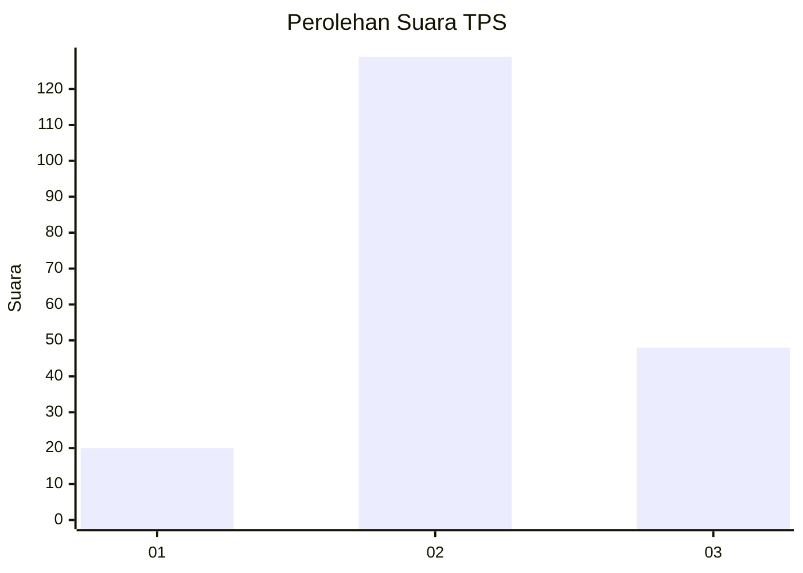
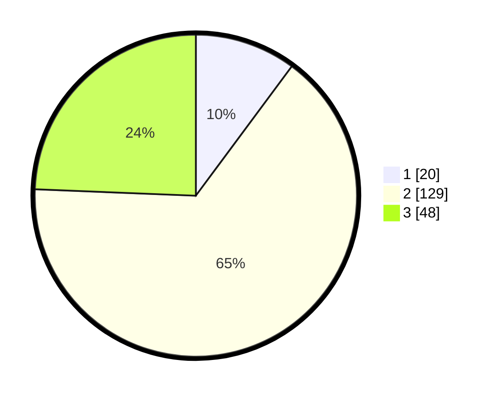

# Hasil

## Grafik

## Tabel

| No. | Nama Paslon    | Suara | Suara (raw) | Persentase |
|:--- |:-------------- | -----:| -----------:| ----------:|
| 1   | ANIES MUHAIMIN | 20    | [20][p-1]   | 10,15      |
| 2   | PRABOWO GIBRAN | 129   | [129][p-2]  | 65,48      |
| 3   | GANJAR MAHFUD  | 48    | [48][p-3]   | 24,37      |

[p-1]: https://github.com/gigit-pemilu/pemilu-2024-51-bali/blob/main/pilpres/hitung-suara/sub/51-bali/sub/71-kota-denpasar/sub/02-denpasar-timur/sub/2002-sumerta-kelod/sub/037-tps/sub/paslon-1.txt
[p-2]: https://github.com/gigit-pemilu/pemilu-2024-51-bali/blob/main/pilpres/hitung-suara/sub/51-bali/sub/71-kota-denpasar/sub/02-denpasar-timur/sub/2002-sumerta-kelod/sub/037-tps/sub/paslon-2.txt
[p-3]: https://github.com/gigit-pemilu/pemilu-2024-51-bali/blob/main/pilpres/hitung-suara/sub/51-bali/sub/71-kota-denpasar/sub/02-denpasar-timur/sub/2002-sumerta-kelod/sub/037-tps/sub/paslon-3.txt

## Foto C Plano

https://sirekap-obj-formc.kpu.go.id/d409/pemilu/ppwp/51/71/02/20/02/5171022002037-20240220-060737--95c750b0-7681-4cd4-8f8c-6ac7b65eff67.jpg

https://sirekap-obj-formc.kpu.go.id/d409/pemilu/ppwp/51/71/02/20/02/5171022002037-20240220-060826--ba6def51-b34a-44cc-9b85-abfc1afda072.jpg

https://sirekap-obj-formc.kpu.go.id/d409/pemilu/ppwp/51/71/02/20/02/5171022002037-20240220-060933--398e9308-e09b-4bc8-8bb4-83693b7f2f6a.jpg

## Metadata

| Key        | Value               |
| ---------- | ------------------- |
| Time Stamp | 2024-02-20 07:00:00 |

## DATA PEMILIH TETAP

Jumlah pemilih dalam DPT: **253**.
 * L: **123**.
 * P: **130**.

## DATA PENGGUNA HAK PILIH

Jumlah pengguna hak pilih dalam DPT: **183**.
 * L: **86**.
 * P: **97**.

Jumlah pengguna hak pilih dalam DPTb: **14**.
 * L: **5**.
 * P: **9**.

Jumlah pengguna hak pilih dalam DPK: **1**.
 * L: **0**.
 * P: **1**.

Jumlah pengguna hak pilih: **198**.
 * L: **91**.
 * P: **107**.

## JUMLAH SUARA SAH DAN TIDAK SAH

JUMLAH SELURUH SUARA SAH: **197**.

JUMLAH SUARA TIDAK SAH: **1**.

JUMLAH SELURUH SUARA SAH DAN SUARA TIDAK SAH: **198**.

