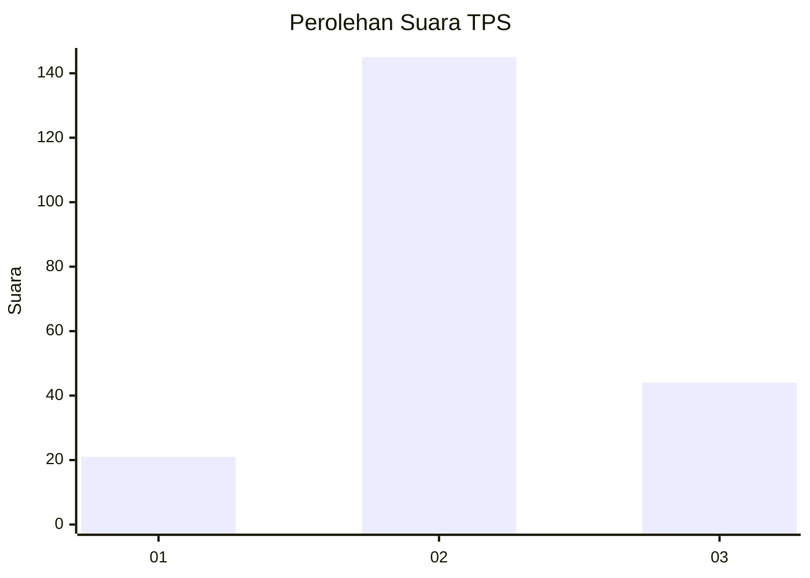
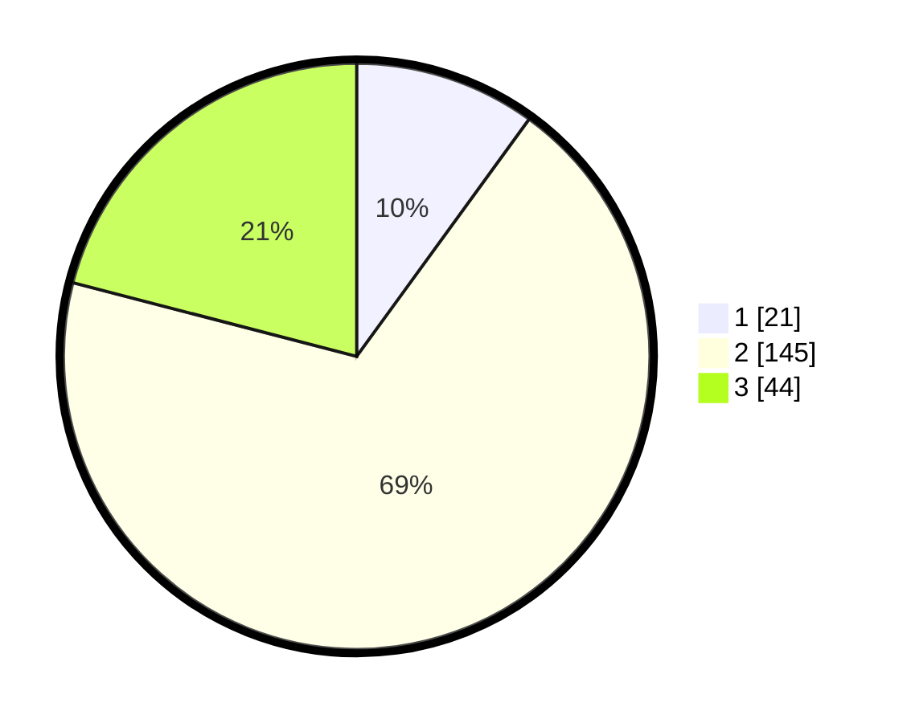

# Hasil

## Grafik

## Tabel

| No. | Nama Paslon    | Suara | Suara (raw) | Persentase |
|:--- |:-------------- | -----:| -----------:| ----------:|
| 1   | ANIES MUHAIMIN | 21    | [21][p-1]   | 10,00      |
| 2   | PRABOWO GIBRAN | 145   | [145][p-2]  | 69,05      |
| 3   | GANJAR MAHFUD  | 44    | [44][p-3]   | 20,95      |

[p-1]: https://github.com/gigit-pemilu/pemilu-2024-51-bali/blob/main/pilpres/hitung-suara/sub/51-bali/sub/71-kota-denpasar/sub/02-denpasar-timur/sub/2002-sumerta-kelod/sub/038-tps/sub/paslon-1.txt
[p-2]: https://github.com/gigit-pemilu/pemilu-2024-51-bali/blob/main/pilpres/hitung-suara/sub/51-bali/sub/71-kota-denpasar/sub/02-denpasar-timur/sub/2002-sumerta-kelod/sub/038-tps/sub/paslon-2.txt
[p-3]: https://github.com/gigit-pemilu/pemilu-2024-51-bali/blob/main/pilpres/hitung-suara/sub/51-bali/sub/71-kota-denpasar/sub/02-denpasar-timur/sub/2002-sumerta-kelod/sub/038-tps/sub/paslon-3.txt

## Foto C Plano

https://sirekap-obj-formc.kpu.go.id/a8e4/pemilu/ppwp/51/71/02/20/02/5171022002038-20240218-171428--329ad5b8-4bfb-490a-b3b2-a7c2b0a0c410.jpg

https://sirekap-obj-formc.kpu.go.id/a8e4/pemilu/ppwp/51/71/02/20/02/5171022002038-20240214-221840--bb366e7d-c659-4aef-b982-805cfbc0c55a.jpg

https://sirekap-obj-formc.kpu.go.id/a8e4/pemilu/ppwp/51/71/02/20/02/5171022002038-20240214-221624--1e103707-06fc-40b5-b614-d270e9354cb1.jpg

## Metadata

| Key        | Value               |
| ---------- | ------------------- |
| Time Stamp | 2024-02-24 22:31:28 |

