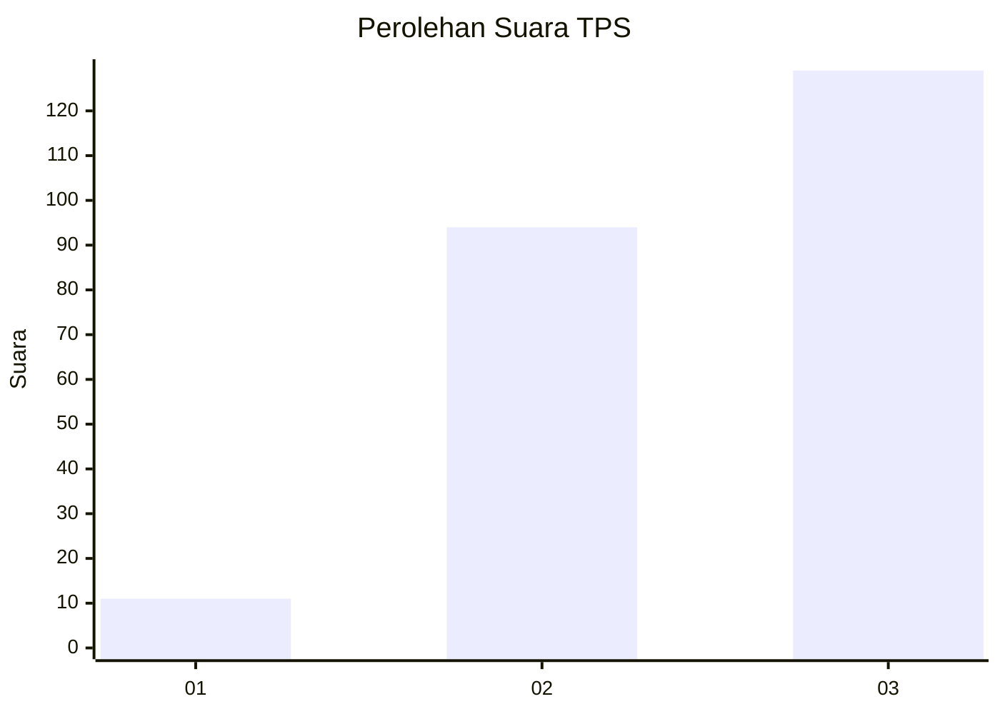
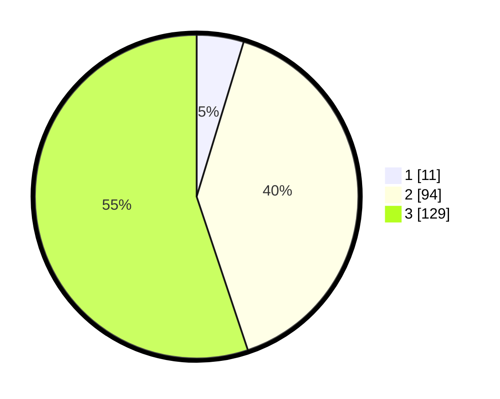

# Hasil

## Grafik

## Tabel

| No. | Nama Paslon    | Suara | Suara (raw) | Persentase |
|:--- |:-------------- | -----:| -----------:| ----------:|
| 1   | ANIES MUHAIMIN | 11    | [11][p-1]   | 4,70       |
| 2   | PRABOWO GIBRAN | 94    | [94][p-2]   | 40,17      |
| 3   | GANJAR MAHFUD  | 129   | [129][p-3]  | 55,13      |

[p-1]: https://github.com/gigit-pemilu/pemilu-2024-51-bali/blob/main/pilpres/hitung-suara/sub/51-bali/sub/71-kota-denpasar/sub/02-denpasar-timur/sub/2004-kesiman-petilan/sub/002-tps/sub/paslon-1.txt
[p-2]: https://github.com/gigit-pemilu/pemilu-2024-51-bali/blob/main/pilpres/hitung-suara/sub/51-bali/sub/71-kota-denpasar/sub/02-denpasar-timur/sub/2004-kesiman-petilan/sub/002-tps/sub/paslon-2.txt
[p-3]: https://github.com/gigit-pemilu/pemilu-2024-51-bali/blob/main/pilpres/hitung-suara/sub/51-bali/sub/71-kota-denpasar/sub/02-denpasar-timur/sub/2004-kesiman-petilan/sub/002-tps/sub/paslon-3.txt

## Foto C Plano

https://sirekap-obj-formc.kpu.go.id/8dbc/pemilu/ppwp/51/71/02/20/04/5171022004002-20240214-191619--b3545c2f-5f84-4883-8310-85a3bc15a285.jpg

https://sirekap-obj-formc.kpu.go.id/8dbc/pemilu/ppwp/51/71/02/20/04/5171022004002-20240214-191929--03f35498-0f85-4d9b-8262-4c9d8f6121c4.jpg

## Metadata

| Key        | Value               |
| ---------- | ------------------- |
| Time Stamp | 2024-02-24 22:31:28 |

