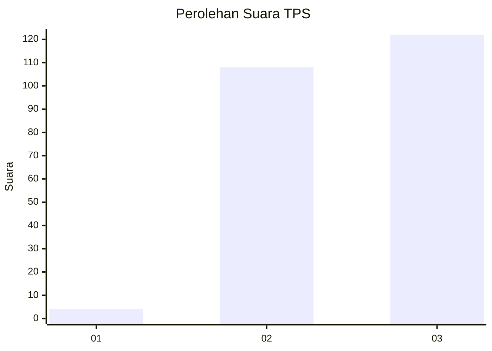
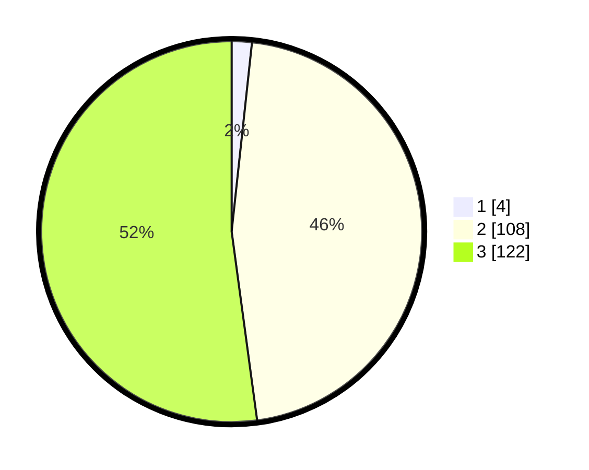

# Hasil

## Grafik

## Tabel

| No. | Nama Paslon    | Suara | Suara (raw) | Persentase |
|:--- |:-------------- | -----:| -----------:| ----------:|
| 1   | ANIES MUHAIMIN | 4     | [4][p-1]    | 1,71       |
| 2   | PRABOWO GIBRAN | 108   | [108][p-2]  | 46,15      |
| 3   | GANJAR MAHFUD  | 122   | [122][p-3]  | 52,14      |

[p-1]: https://github.com/gigit-pemilu/pemilu-2024-51-bali/blob/main/pilpres/hitung-suara/sub/51-bali/sub/71-kota-denpasar/sub/02-denpasar-timur/sub/2004-kesiman-petilan/sub/005-tps/sub/paslon-1.txt
[p-2]: https://github.com/gigit-pemilu/pemilu-2024-51-bali/blob/main/pilpres/hitung-suara/sub/51-bali/sub/71-kota-denpasar/sub/02-denpasar-timur/sub/2004-kesiman-petilan/sub/005-tps/sub/paslon-2.txt
[p-3]: https://github.com/gigit-pemilu/pemilu-2024-51-bali/blob/main/pilpres/hitung-suara/sub/51-bali/sub/71-kota-denpasar/sub/02-denpasar-timur/sub/2004-kesiman-petilan/sub/005-tps/sub/paslon-3.txt

## Foto C Plano

https://sirekap-obj-formc.kpu.go.id/f625/pemilu/ppwp/51/71/02/20/04/5171022004005-20240215-012306--8b2906a4-7f7b-4b5e-af89-6445d08b9726.jpg

https://sirekap-obj-formc.kpu.go.id/f625/pemilu/ppwp/51/71/02/20/04/5171022004005-20240215-012441--be0ad13a-73c5-4c09-babe-5f3ac8332498.jpg

https://sirekap-obj-formc.kpu.go.id/f625/pemilu/ppwp/51/71/02/20/04/5171022004005-20240215-013555--ece8e52e-73da-456c-a3c3-b2a8f29ebce8.jpg

## Metadata

| Key        | Value               |
| ---------- | ------------------- |
| Time Stamp | 2024-02-25 15:00:00 |

