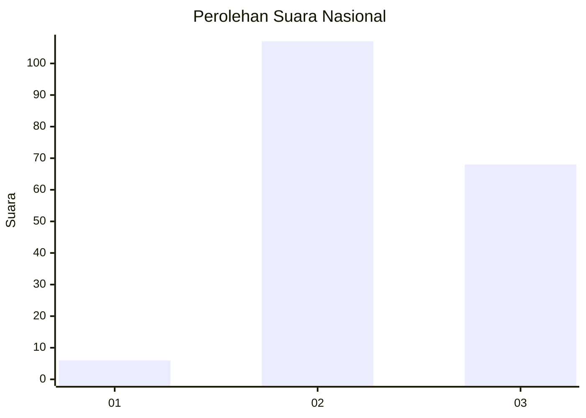
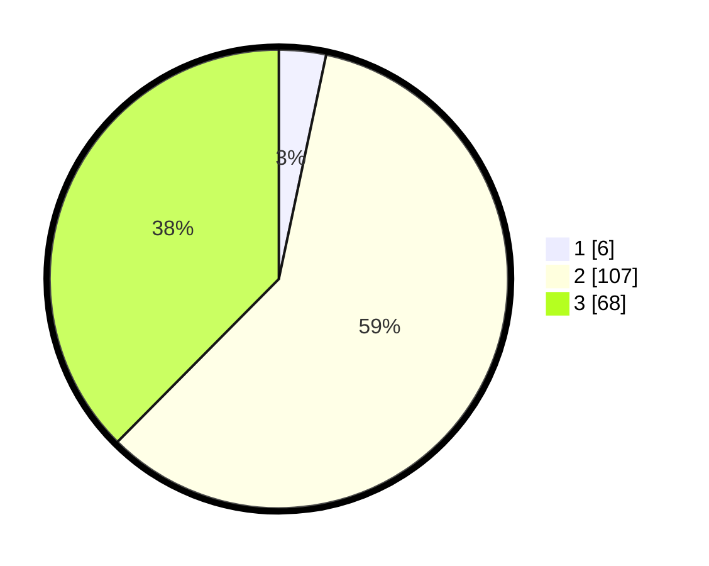

# Hasil

## Grafik

## Tabel

| No. | Nama Paslon    | Suara | Suara (raw) | Persentase |
|:--- |:-------------- | -----:| -----------:| ----------:|
| 1   | ANIES MUHAIMIN | 6     | [6][p-1]    | 3,31       |
| 2   | PRABOWO GIBRAN | 107   | [107][p-2]  | 59,12      |
| 3   | GANJAR MAHFUD  | 68    | [68][p-3]   | 37,57      |

[p-1]: https://github.com/gigit-pemilu/pemilu-2024/blob/main/pilpres/hitung-suara/sub/51-bali/sub/71-kota-denpasar/sub/02-denpasar-timur/sub/2004-kesiman-petilan/sub/008-tps/sub/paslon-1.txt
[p-2]: https://github.com/gigit-pemilu/pemilu-2024/blob/main/pilpres/hitung-suara/sub/51-bali/sub/71-kota-denpasar/sub/02-denpasar-timur/sub/2004-kesiman-petilan/sub/008-tps/sub/paslon-2.txt
[p-3]: https://github.com/gigit-pemilu/pemilu-2024/blob/main/pilpres/hitung-suara/sub/51-bali/sub/71-kota-denpasar/sub/02-denpasar-timur/sub/2004-kesiman-petilan/sub/008-tps/sub/paslon-3.txt

## Foto C Plano

https://sirekap-obj-formc.kpu.go.id/1d93/pemilu/ppwp/51/71/02/20/04/5171022004008-20240214-233019--718a8501-86d5-49ca-84e3-09243463b6fb.jpg

https://sirekap-obj-formc.kpu.go.id/1d93/pemilu/ppwp/51/71/02/20/04/5171022004008-20240214-233138--78810c91-abec-4cdf-89d7-b3e51bd96112.jpg

https://sirekap-obj-formc.kpu.go.id/1d93/pemilu/ppwp/51/71/02/20/04/5171022004008-20240214-233307--90f86c54-7ca0-418f-a14c-b967607d151f.jpg

## Metadata

| Key        | Value               |
| ---------- | ------------------- |
| Time Stamp | 2024-02-24 22:31:28 |

