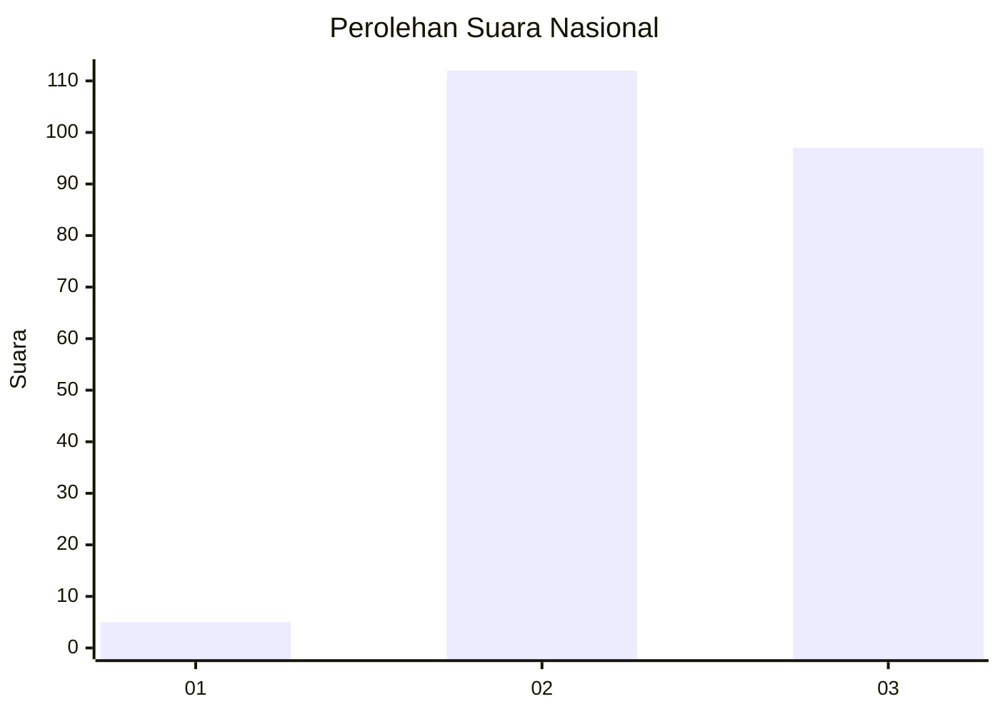
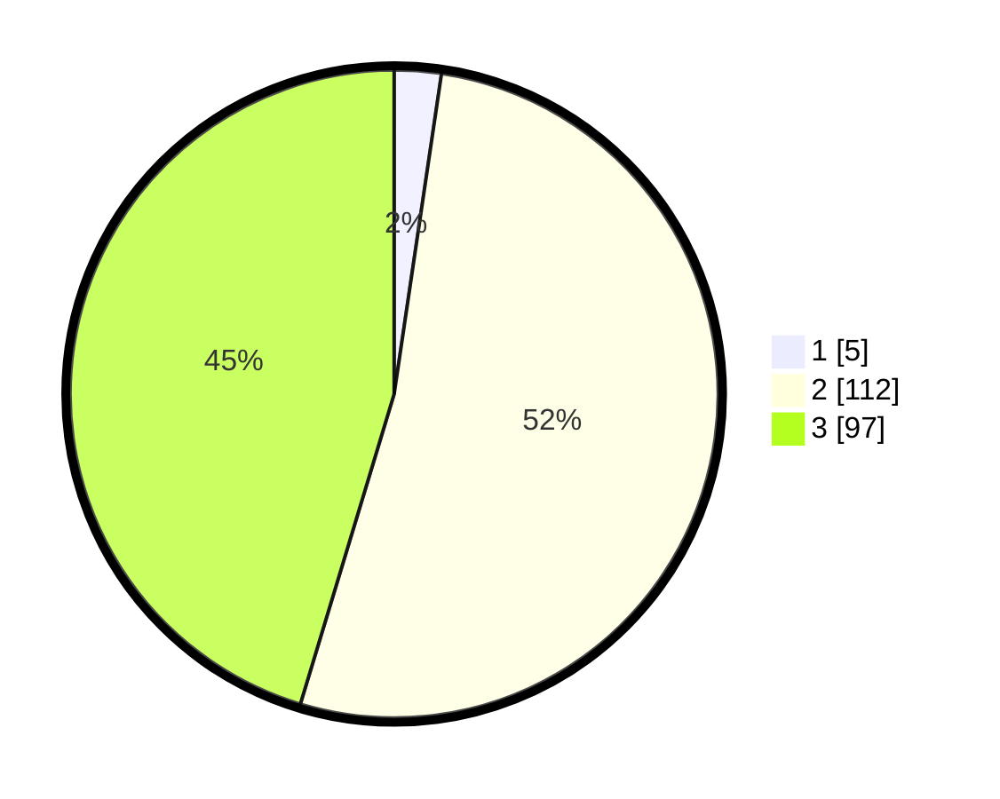

# Hasil

## Grafik

## Tabel

| No. | Nama Paslon    | Suara | Suara (raw) | Persentase |
|:--- |:-------------- | -----:| -----------:| ----------:|
| 1   | ANIES MUHAIMIN | 5     | [5][p-1]    | 2,34       |
| 2   | PRABOWO GIBRAN | 112   | [112][p-2]  | 52,34      |
| 3   | GANJAR MAHFUD  | 97    | [97][p-3]   | 45,33      |

[p-1]: https://github.com/gigit-pemilu/pemilu-2024/blob/main/pilpres/hitung-suara/sub/51-bali/sub/71-kota-denpasar/sub/02-denpasar-timur/sub/2004-kesiman-petilan/sub/026-tps/sub/paslon-1.txt
[p-2]: https://github.com/gigit-pemilu/pemilu-2024/blob/main/pilpres/hitung-suara/sub/51-bali/sub/71-kota-denpasar/sub/02-denpasar-timur/sub/2004-kesiman-petilan/sub/026-tps/sub/paslon-2.txt
[p-3]: https://github.com/gigit-pemilu/pemilu-2024/blob/main/pilpres/hitung-suara/sub/51-bali/sub/71-kota-denpasar/sub/02-denpasar-timur/sub/2004-kesiman-petilan/sub/026-tps/sub/paslon-3.txt

## Foto C Plano

https://sirekap-obj-formc.kpu.go.id/b41f/pemilu/ppwp/51/71/02/20/04/5171022004026-20240214-211854--e82d453f-2228-45f8-9128-223c777e189e.jpg

https://sirekap-obj-formc.kpu.go.id/b41f/pemilu/ppwp/51/71/02/20/04/5171022004026-20240214-212038--e5259761-9c3f-4ed6-8725-4d2cd6598f4c.jpg

https://sirekap-obj-formc.kpu.go.id/b41f/pemilu/ppwp/51/71/02/20/04/5171022004026-20240214-212152--3e22d0cc-a2e2-40dd-99aa-0e1467f0826a.jpg

## Metadata

| Key        | Value               |
| ---------- | ------------------- |
| Time Stamp | 2024-02-24 22:31:28 |

