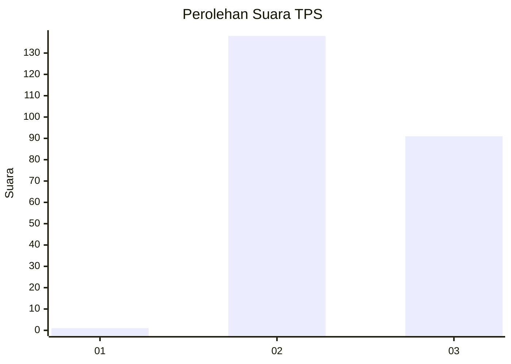
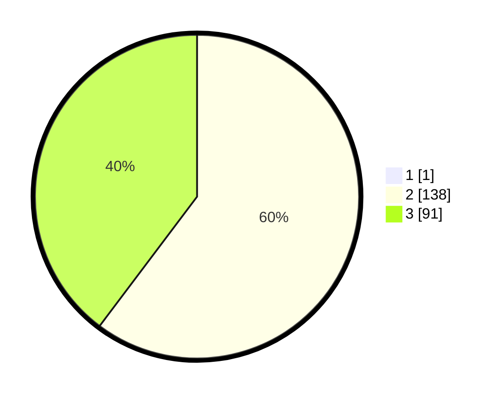

# Hasil

## Grafik

## Tabel

| No. | Nama Paslon    | Suara | Suara (raw) | Persentase |
|:--- |:-------------- | -----:| -----------:| ----------:|
| 1   | ANIES MUHAIMIN | 1     | [1][p-1]    | 0,43       |
| 2   | PRABOWO GIBRAN | 138   | [138][p-2]  | 60,00      |
| 3   | GANJAR MAHFUD  | 91    | [91][p-3]   | 39,57      |

[p-1]: https://github.com/gigit-pemilu/pemilu-2024-51-bali/blob/main/pilpres/hitung-suara/sub/51-bali/sub/71-kota-denpasar/sub/02-denpasar-timur/sub/2004-kesiman-petilan/sub/028-tps/sub/paslon-1.txt
[p-2]: https://github.com/gigit-pemilu/pemilu-2024-51-bali/blob/main/pilpres/hitung-suara/sub/51-bali/sub/71-kota-denpasar/sub/02-denpasar-timur/sub/2004-kesiman-petilan/sub/028-tps/sub/paslon-2.txt
[p-3]: https://github.com/gigit-pemilu/pemilu-2024-51-bali/blob/main/pilpres/hitung-suara/sub/51-bali/sub/71-kota-denpasar/sub/02-denpasar-timur/sub/2004-kesiman-petilan/sub/028-tps/sub/paslon-3.txt

## Foto C Plano

https://sirekap-obj-formc.kpu.go.id/3ea2/pemilu/ppwp/51/71/02/20/04/5171022004028-20240214-214913--608335f6-69f9-4b8a-95ca-b86e11223f12.jpg

https://sirekap-obj-formc.kpu.go.id/3ea2/pemilu/ppwp/51/71/02/20/04/5171022004028-20240214-215025--dee186ee-9ac6-4332-ad97-801540f8486f.jpg

https://sirekap-obj-formc.kpu.go.id/3ea2/pemilu/ppwp/51/71/02/20/04/5171022004028-20240214-215111--cbb55e94-40c4-405c-b348-096bf020204c.jpg

## Metadata

| Key        | Value               |
| ---------- | ------------------- |
| Time Stamp | 2024-02-24 22:31:28 |

