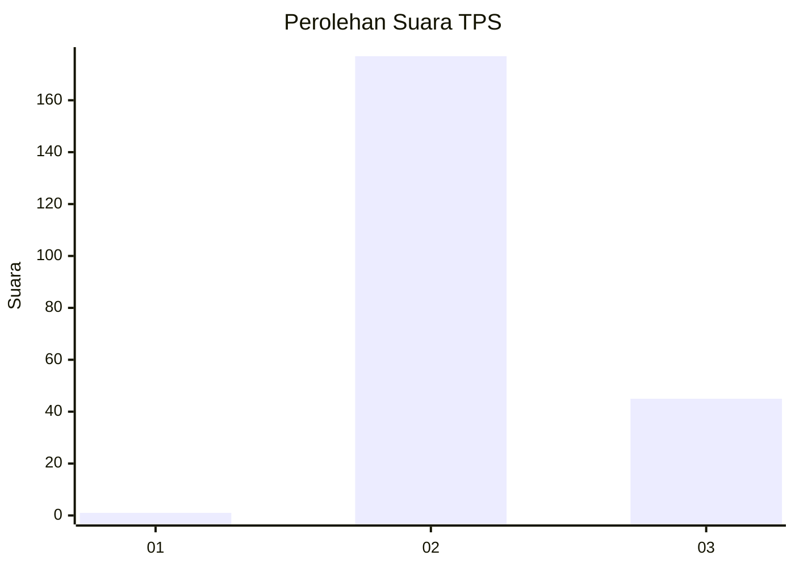
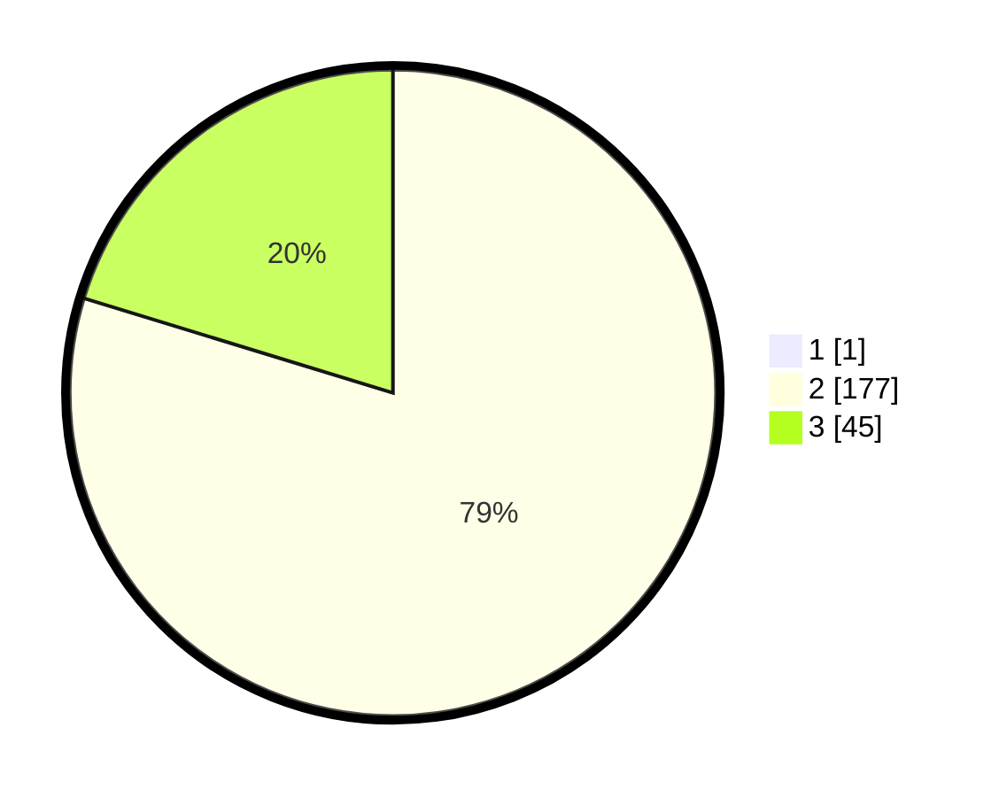

# Hasil

## Grafik

## Tabel

| No. | Nama Paslon    | Suara | Suara (raw) | Persentase |
|:--- |:-------------- | -----:| -----------:| ----------:|
| 1   | ANIES MUHAIMIN | 1     | [1][p-1]    | 0,45       |
| 2   | PRABOWO GIBRAN | 177   | [177][p-2]  | 79,37      |
| 3   | GANJAR MAHFUD  | 45    | [45][p-3]   | 20,18      |

[p-1]: https://github.com/gigit-pemilu/pemilu-2024-51-bali/blob/main/pilpres/hitung-suara/sub/51-bali/sub/71-kota-denpasar/sub/02-denpasar-timur/sub/2005-kesiman-kertalangu/sub/001-tps/sub/paslon-1.txt
[p-2]: https://github.com/gigit-pemilu/pemilu-2024-51-bali/blob/main/pilpres/hitung-suara/sub/51-bali/sub/71-kota-denpasar/sub/02-denpasar-timur/sub/2005-kesiman-kertalangu/sub/001-tps/sub/paslon-2.txt
[p-3]: https://github.com/gigit-pemilu/pemilu-2024-51-bali/blob/main/pilpres/hitung-suara/sub/51-bali/sub/71-kota-denpasar/sub/02-denpasar-timur/sub/2005-kesiman-kertalangu/sub/001-tps/sub/paslon-3.txt

## Foto C Plano

https://sirekap-obj-formc.kpu.go.id/7898/pemilu/ppwp/51/71/02/20/05/5171022005001-20240214-215230--5833894b-cb23-4973-9b8e-241bae585dee.jpg

https://sirekap-obj-formc.kpu.go.id/7898/pemilu/ppwp/51/71/02/20/05/5171022005001-20240214-215316--d7d61cd7-9cba-4c4b-90bb-8d18abb50827.jpg

https://sirekap-obj-formc.kpu.go.id/7898/pemilu/ppwp/51/71/02/20/05/5171022005001-20240214-215406--806df4f0-5d2c-4800-9951-30690e10dca3.jpg

## Metadata

| Key        | Value               |
| ---------- | ------------------- |
| Time Stamp | 2024-02-24 22:31:28 |

