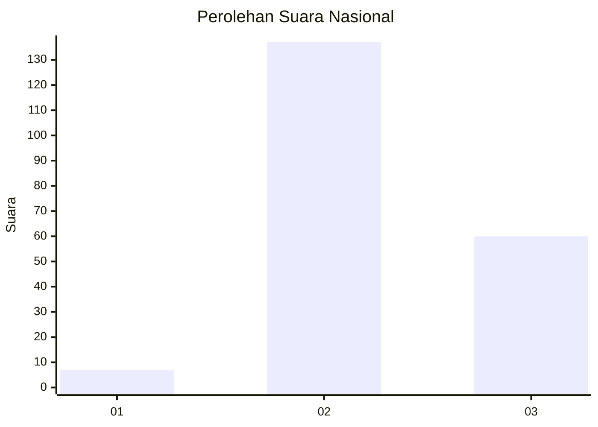

# Hasil

## Grafik

## Tabel

| No. | Nama Paslon    | Suara | Suara (raw) | Persentase |
|:--- |:-------------- | -----:| -----------:| ----------:|
| 1   | ANIES MUHAIMIN | 7     | [7][p-1]    | 3,43       |
| 2   | PRABOWO GIBRAN | 137   | [137][p-2]  | 67,16      |
| 3   | GANJAR MAHFUD  | 60    | [60][p-3]   | 29,41      |

[p-1]: https://github.com/gigit-pemilu/pemilu-2024/blob/main/pilpres/hitung-suara/sub/51-bali/sub/71-kota-denpasar/sub/02-denpasar-timur/sub/2005-kesiman-kertalangu/sub/010-tps/sub/paslon-1.txt
[p-2]: https://github.com/gigit-pemilu/pemilu-2024/blob/main/pilpres/hitung-suara/sub/51-bali/sub/71-kota-denpasar/sub/02-denpasar-timur/sub/2005-kesiman-kertalangu/sub/010-tps/sub/paslon-2.txt
[p-3]: https://github.com/gigit-pemilu/pemilu-2024/blob/main/pilpres/hitung-suara/sub/51-bali/sub/71-kota-denpasar/sub/02-denpasar-timur/sub/2005-kesiman-kertalangu/sub/010-tps/sub/paslon-3.txt

## Foto C Plano

https://sirekap-obj-formc.kpu.go.id/211a/pemilu/ppwp/51/71/02/20/05/5171022005010-20240214-215617--691a2f64-a803-4ddd-961c-6309992cf0ef.jpg

https://sirekap-obj-formc.kpu.go.id/211a/pemilu/ppwp/51/71/02/20/05/5171022005010-20240214-215059--fa2a6726-7ad8-40d5-97db-1a1d971d86d1.jpg

## Metadata

| Key        | Value               |
| ---------- | ------------------- |
| Time Stamp | 2024-02-26 16:00:00 |

