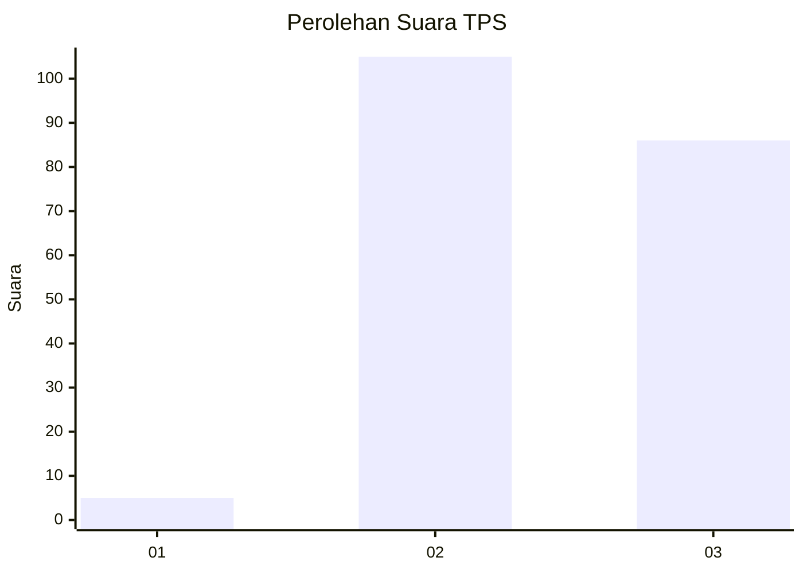
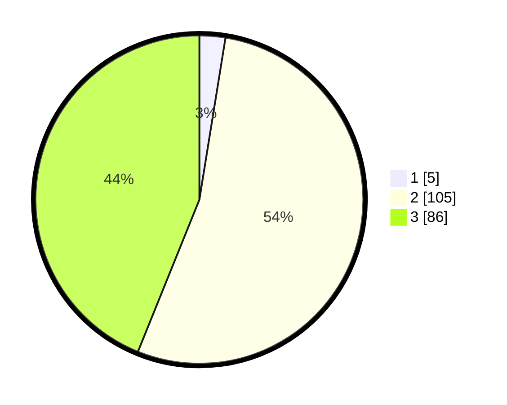

# Hasil

## Grafik

## Tabel

| No. | Nama Paslon    | Suara | Suara (raw) | Persentase |
|:--- |:-------------- | -----:| -----------:| ----------:|
| 1   | ANIES MUHAIMIN | 5     | [5][p-1]    | 2,55       |
| 2   | PRABOWO GIBRAN | 105   | [105][p-2]  | 53,57      |
| 3   | GANJAR MAHFUD  | 86    | [86][p-3]   | 43,88      |

[p-1]: https://github.com/gigit-pemilu/pemilu-2024-51-bali/blob/main/pilpres/hitung-suara/sub/51-bali/sub/71-kota-denpasar/sub/02-denpasar-timur/sub/2005-kesiman-kertalangu/sub/019-tps/sub/paslon-1.txt
[p-2]: https://github.com/gigit-pemilu/pemilu-2024-51-bali/blob/main/pilpres/hitung-suara/sub/51-bali/sub/71-kota-denpasar/sub/02-denpasar-timur/sub/2005-kesiman-kertalangu/sub/019-tps/sub/paslon-2.txt
[p-3]: https://github.com/gigit-pemilu/pemilu-2024-51-bali/blob/main/pilpres/hitung-suara/sub/51-bali/sub/71-kota-denpasar/sub/02-denpasar-timur/sub/2005-kesiman-kertalangu/sub/019-tps/sub/paslon-3.txt

## Foto C Plano

https://sirekap-obj-formc.kpu.go.id/39fd/pemilu/ppwp/51/71/02/20/05/5171022005019-20240216-081823--a6fc7143-e719-4909-a229-1b3afb9eac6b.jpg

https://sirekap-obj-formc.kpu.go.id/39fd/pemilu/ppwp/51/71/02/20/05/5171022005019-20240216-080159--41e64a5b-4fd4-45e7-9706-0eae1b49dbd1.jpg

https://sirekap-obj-formc.kpu.go.id/39fd/pemilu/ppwp/51/71/02/20/05/5171022005019-20240216-082048--c942248e-b12f-4d76-9196-ae3fdba7275f.jpg

## Metadata

| Key        | Value               |
| ---------- | ------------------- |
| Time Stamp | 2024-02-16 08:30:27 |

## DATA PEMILIH TETAP

Jumlah pemilih dalam DPT: **251**.
 * L: **125**.
 * P: **126**.

## DATA PENGGUNA HAK PILIH

Jumlah pengguna hak pilih dalam DPT: **201**.
 * L: **98**.
 * P: **103**.

Jumlah pengguna hak pilih dalam DPTb: **2**.
 * L: **1**.
 * P: **1**.

Jumlah pengguna hak pilih dalam DPK: **0**.
 * L: **0**.
 * P: **0**.

Jumlah pengguna hak pilih: **203**.
 * L: **99**.
 * P: **104**.

## JUMLAH SUARA SAH DAN TIDAK SAH

JUMLAH SELURUH SUARA SAH: **196**.

JUMLAH SUARA TIDAK SAH: **7**.

JUMLAH SELURUH SUARA SAH DAN SUARA TIDAK SAH: **203**.

