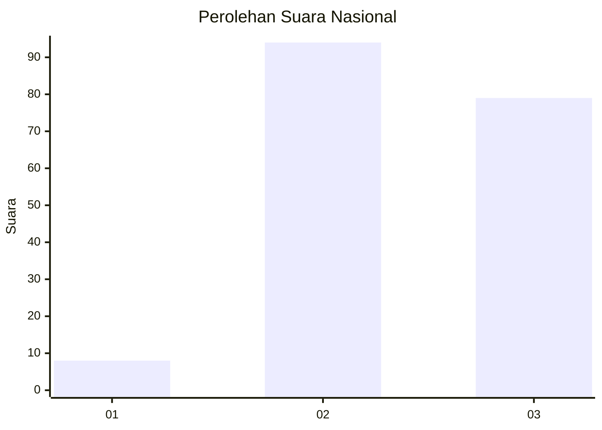
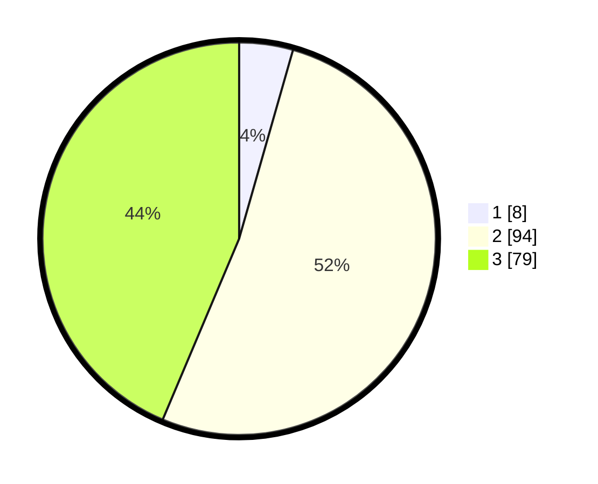

# Hasil

## Grafik

## Tabel

| No. | Nama Paslon    | Suara | Suara (raw) | Persentase |
|:--- |:-------------- | -----:| -----------:| ----------:|
| 1   | ANIES MUHAIMIN | 8     | [8][p-1]    | 4,42       |
| 2   | PRABOWO GIBRAN | 94    | [94][p-2]   | 51,93      |
| 3   | GANJAR MAHFUD  | 79    | [79][p-3]   | 43,65      |

[p-1]: https://github.com/gigit-pemilu/pemilu-2024/blob/main/pilpres/hitung-suara/sub/51-bali/sub/71-kota-denpasar/sub/02-denpasar-timur/sub/2005-kesiman-kertalangu/sub/033-tps/sub/paslon-1.txt
[p-2]: https://github.com/gigit-pemilu/pemilu-2024/blob/main/pilpres/hitung-suara/sub/51-bali/sub/71-kota-denpasar/sub/02-denpasar-timur/sub/2005-kesiman-kertalangu/sub/033-tps/sub/paslon-2.txt
[p-3]: https://github.com/gigit-pemilu/pemilu-2024/blob/main/pilpres/hitung-suara/sub/51-bali/sub/71-kota-denpasar/sub/02-denpasar-timur/sub/2005-kesiman-kertalangu/sub/033-tps/sub/paslon-3.txt

## Foto C Plano

https://sirekap-obj-formc.kpu.go.id/2235/pemilu/ppwp/51/71/02/20/05/5171022005033-20240214-201705--d179bc00-acf8-4612-8e6b-1ebc38d3bef1.jpg

https://sirekap-obj-formc.kpu.go.id/2235/pemilu/ppwp/51/71/02/20/05/5171022005033-20240214-201813--deab8cd5-4e2a-4516-89bf-8daeb6c33c5e.jpg

## Metadata

| Key        | Value               |
| ---------- | ------------------- |
| Time Stamp | 2024-02-24 22:31:28 |

