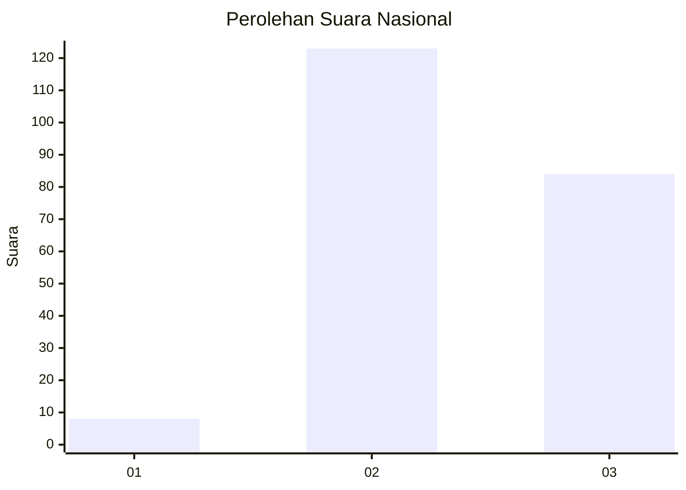
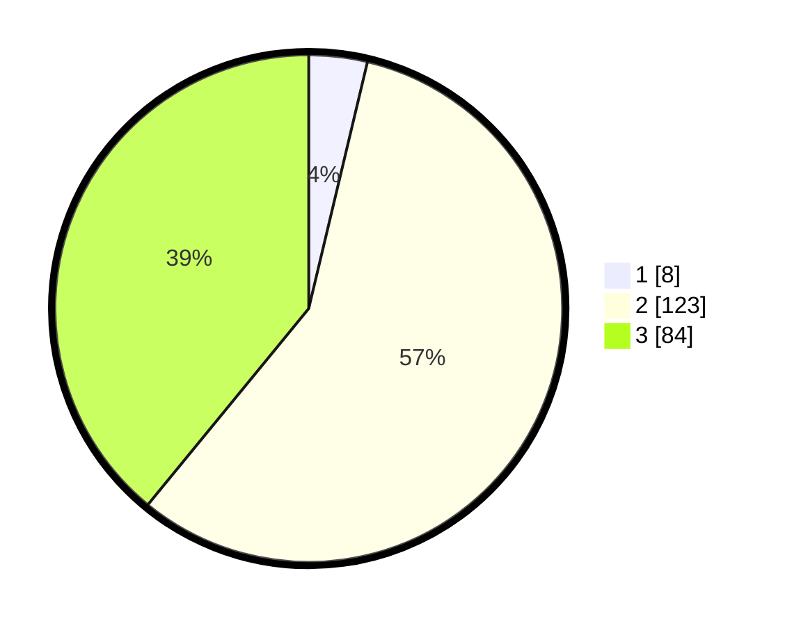

# Hasil

## Grafik

## Tabel

| No. | Nama Paslon    | Suara | Suara (raw) | Persentase |
|:--- |:-------------- | -----:| -----------:| ----------:|
| 1   | ANIES MUHAIMIN | 8     | [8][p-1]    | 3,72       |
| 2   | PRABOWO GIBRAN | 123   | [123][p-2]  | 57,21      |
| 3   | GANJAR MAHFUD  | 84    | [84][p-3]   | 39,07      |

[p-1]: https://github.com/gigit-pemilu/pemilu-2024/blob/main/pilpres/hitung-suara/sub/51-bali/sub/71-kota-denpasar/sub/02-denpasar-timur/sub/2005-kesiman-kertalangu/sub/037-tps/sub/paslon-1.txt
[p-2]: https://github.com/gigit-pemilu/pemilu-2024/blob/main/pilpres/hitung-suara/sub/51-bali/sub/71-kota-denpasar/sub/02-denpasar-timur/sub/2005-kesiman-kertalangu/sub/037-tps/sub/paslon-2.txt
[p-3]: https://github.com/gigit-pemilu/pemilu-2024/blob/main/pilpres/hitung-suara/sub/51-bali/sub/71-kota-denpasar/sub/02-denpasar-timur/sub/2005-kesiman-kertalangu/sub/037-tps/sub/paslon-3.txt

## Foto C Plano

https://sirekap-obj-formc.kpu.go.id/dab0/pemilu/ppwp/51/71/02/20/05/5171022005037-20240216-092348--8b5243e9-fd3d-42e5-a43f-8396044aee07.jpg

https://sirekap-obj-formc.kpu.go.id/dab0/pemilu/ppwp/51/71/02/20/05/5171022005037-20240216-101908--15cc6e8e-db47-41ff-9f54-a8e8174b8fe7.jpg

https://sirekap-obj-formc.kpu.go.id/dab0/pemilu/ppwp/51/71/02/20/05/5171022005037-20240216-100714--4dbabeb2-b9cd-4131-9099-bb459de6c698.jpg

## Metadata

| Key        | Value               |
| ---------- | ------------------- |
| Time Stamp | 2024-02-25 12:00:00 |

