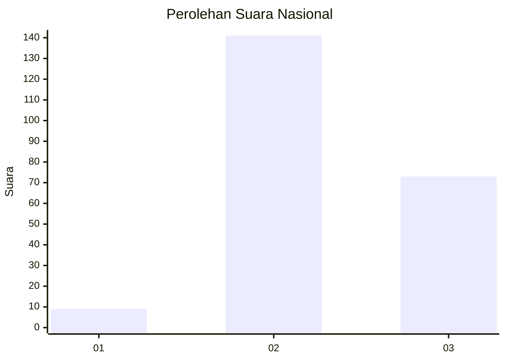
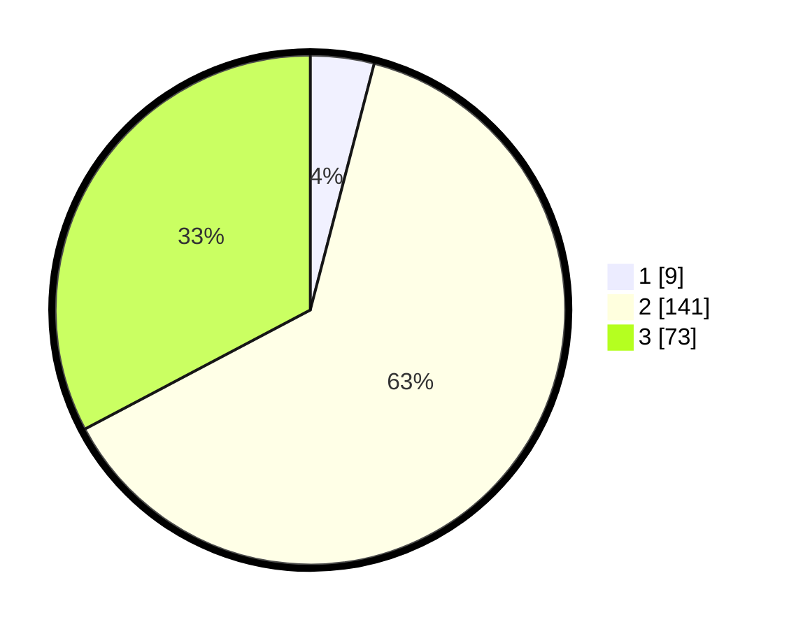

# Hasil

## Grafik

## Tabel

| No. | Nama Paslon    | Suara | Suara (raw) | Persentase |
|:--- |:-------------- | -----:| -----------:| ----------:|
| 1   | ANIES MUHAIMIN | 9     | [9][p-1]    | 4,04       |
| 2   | PRABOWO GIBRAN | 141   | [141][p-2]  | 63,23      |
| 3   | GANJAR MAHFUD  | 73    | [73][p-3]   | 32,74      |

[p-1]: https://github.com/gigit-pemilu/pemilu-2024/blob/main/pilpres/hitung-suara/sub/51-bali/sub/71-kota-denpasar/sub/02-denpasar-timur/sub/2005-kesiman-kertalangu/sub/039-tps/sub/paslon-1.txt
[p-2]: https://github.com/gigit-pemilu/pemilu-2024/blob/main/pilpres/hitung-suara/sub/51-bali/sub/71-kota-denpasar/sub/02-denpasar-timur/sub/2005-kesiman-kertalangu/sub/039-tps/sub/paslon-2.txt
[p-3]: https://github.com/gigit-pemilu/pemilu-2024/blob/main/pilpres/hitung-suara/sub/51-bali/sub/71-kota-denpasar/sub/02-denpasar-timur/sub/2005-kesiman-kertalangu/sub/039-tps/sub/paslon-3.txt

## Foto C Plano

https://sirekap-obj-formc.kpu.go.id/962c/pemilu/ppwp/51/71/02/20/05/5171022005039-20240214-220434--2ca80975-c2e0-4bc6-9c89-01dc4712237f.jpg

https://sirekap-obj-formc.kpu.go.id/962c/pemilu/ppwp/51/71/02/20/05/5171022005039-20240214-220443--49a5d886-45e6-4849-9fc4-e819ae73cba8.jpg

https://sirekap-obj-formc.kpu.go.id/962c/pemilu/ppwp/51/71/02/20/05/5171022005039-20240214-220450--03aeff06-fcf2-4032-a086-35de6399c677.jpg

## Metadata

| Key        | Value               |
| ---------- | ------------------- |
| Time Stamp | 2024-02-24 22:31:28 |

