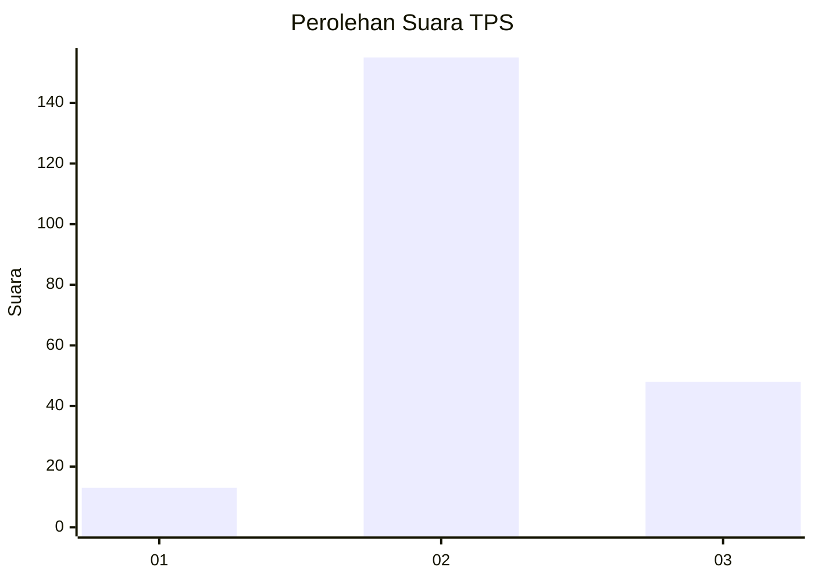
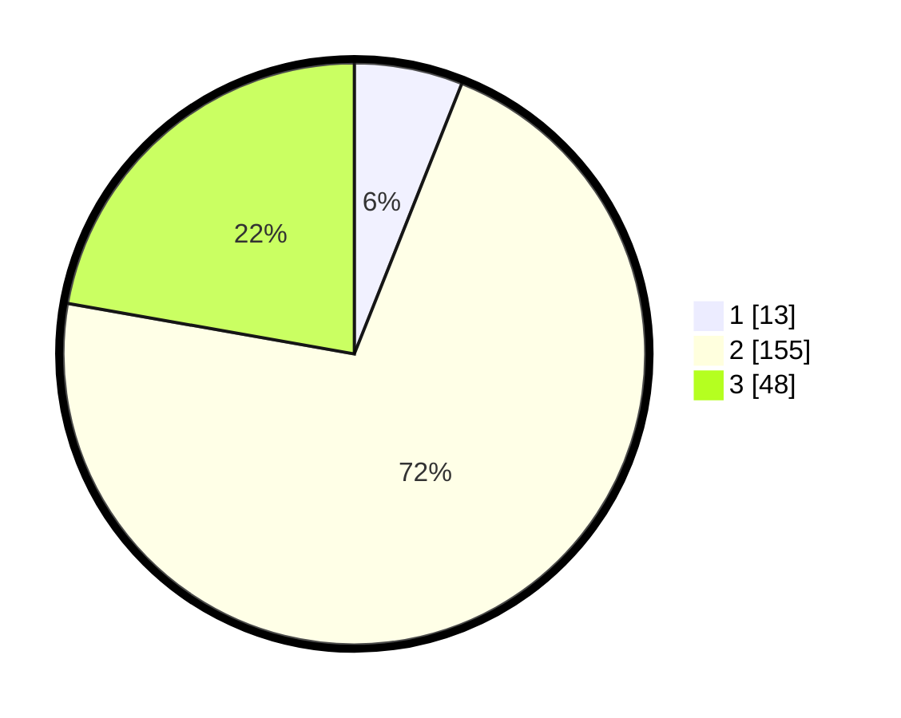

# Hasil

## Grafik

## Tabel

| No. | Nama Paslon    | Suara | Suara (raw) | Persentase |
|:--- |:-------------- | -----:| -----------:| ----------:|
| 1   | ANIES MUHAIMIN | 13    | [13][p-1]   | 6,02       |
| 2   | PRABOWO GIBRAN | 155   | [155][p-2]  | 71,76      |
| 3   | GANJAR MAHFUD  | 48    | [48][p-3]   | 22,22      |

[p-1]: https://github.com/gigit-pemilu/pemilu-2024-51-bali/blob/main/pilpres/hitung-suara/sub/51-bali/sub/71-kota-denpasar/sub/02-denpasar-timur/sub/2005-kesiman-kertalangu/sub/042-tps/sub/paslon-1.txt
[p-2]: https://github.com/gigit-pemilu/pemilu-2024-51-bali/blob/main/pilpres/hitung-suara/sub/51-bali/sub/71-kota-denpasar/sub/02-denpasar-timur/sub/2005-kesiman-kertalangu/sub/042-tps/sub/paslon-2.txt
[p-3]: https://github.com/gigit-pemilu/pemilu-2024-51-bali/blob/main/pilpres/hitung-suara/sub/51-bali/sub/71-kota-denpasar/sub/02-denpasar-timur/sub/2005-kesiman-kertalangu/sub/042-tps/sub/paslon-3.txt

## Foto C Plano

https://sirekap-obj-formc.kpu.go.id/b8cf/pemilu/ppwp/51/71/02/20/05/5171022005042-20240214-214930--098211fa-f620-4036-bc39-af00e1295809.jpg

https://sirekap-obj-formc.kpu.go.id/b8cf/pemilu/ppwp/51/71/02/20/05/5171022005042-20240214-215040--396ecba4-8845-4d03-afc8-ff15b6ac0729.jpg

https://sirekap-obj-formc.kpu.go.id/b8cf/pemilu/ppwp/51/71/02/20/05/5171022005042-20240214-215135--39798459-786c-4a40-a518-40ffec03a3b8.jpg

## Metadata

| Key        | Value               |
| ---------- | ------------------- |
| Time Stamp | 2024-02-24 22:31:28 |

