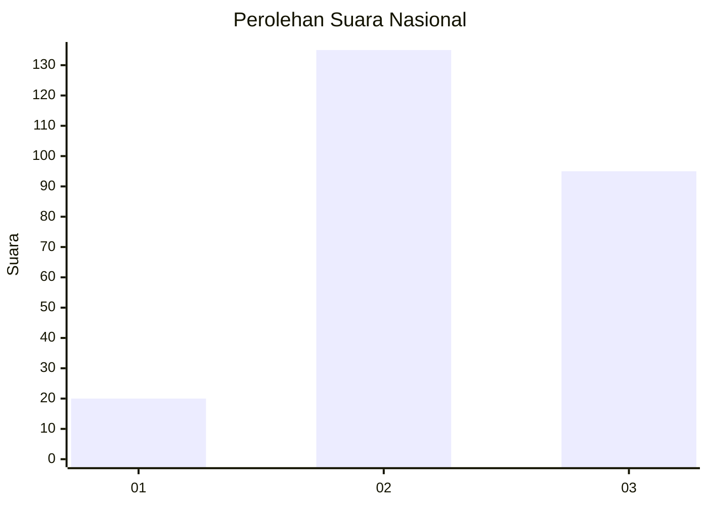
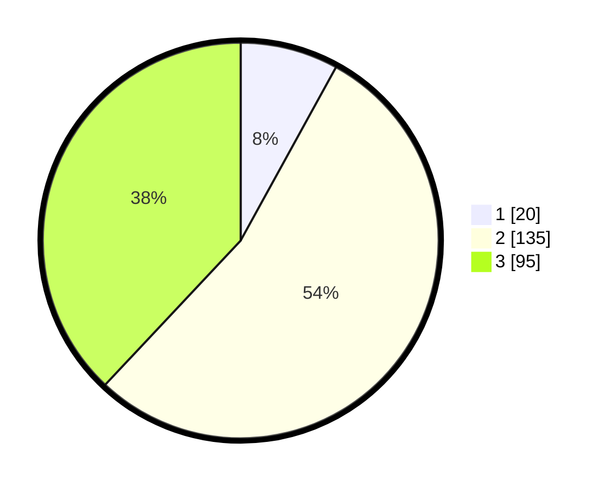

# Hasil

## Grafik

## Tabel

| No. | Nama Paslon    | Suara | Suara (raw) | Persentase |
|:--- |:-------------- | -----:| -----------:| ----------:|
| 1   | ANIES MUHAIMIN | 20    | [20][p-1]   | 8,00       |
| 2   | PRABOWO GIBRAN | 135   | [135][p-2]  | 54,00      |
| 3   | GANJAR MAHFUD  | 95    | [95][p-3]   | 38,00      |

[p-1]: https://github.com/gigit-pemilu/pemilu-2024/blob/main/pilpres/hitung-suara/sub/51-bali/sub/71-kota-denpasar/sub/02-denpasar-timur/sub/2005-kesiman-kertalangu/sub/043-tps/sub/paslon-1.txt
[p-2]: https://github.com/gigit-pemilu/pemilu-2024/blob/main/pilpres/hitung-suara/sub/51-bali/sub/71-kota-denpasar/sub/02-denpasar-timur/sub/2005-kesiman-kertalangu/sub/043-tps/sub/paslon-2.txt
[p-3]: https://github.com/gigit-pemilu/pemilu-2024/blob/main/pilpres/hitung-suara/sub/51-bali/sub/71-kota-denpasar/sub/02-denpasar-timur/sub/2005-kesiman-kertalangu/sub/043-tps/sub/paslon-3.txt

## Foto C Plano

https://sirekap-obj-formc.kpu.go.id/9736/pemilu/ppwp/51/71/02/20/05/5171022005043-20240215-205356--0f3fb34d-5b6b-4238-9260-14e7da6bdfed.jpg

https://sirekap-obj-formc.kpu.go.id/9736/pemilu/ppwp/51/71/02/20/05/5171022005043-20240215-205403--6175d197-5bc5-4213-8ab0-c91f7f351b57.jpg

https://sirekap-obj-formc.kpu.go.id/9736/pemilu/ppwp/51/71/02/20/05/5171022005043-20240215-205409--30ee21c0-e93d-4e3f-8db8-54119f9028de.jpg

## Metadata

| Key        | Value               |
| ---------- | ------------------- |
| Time Stamp | 2024-02-24 22:31:28 |

