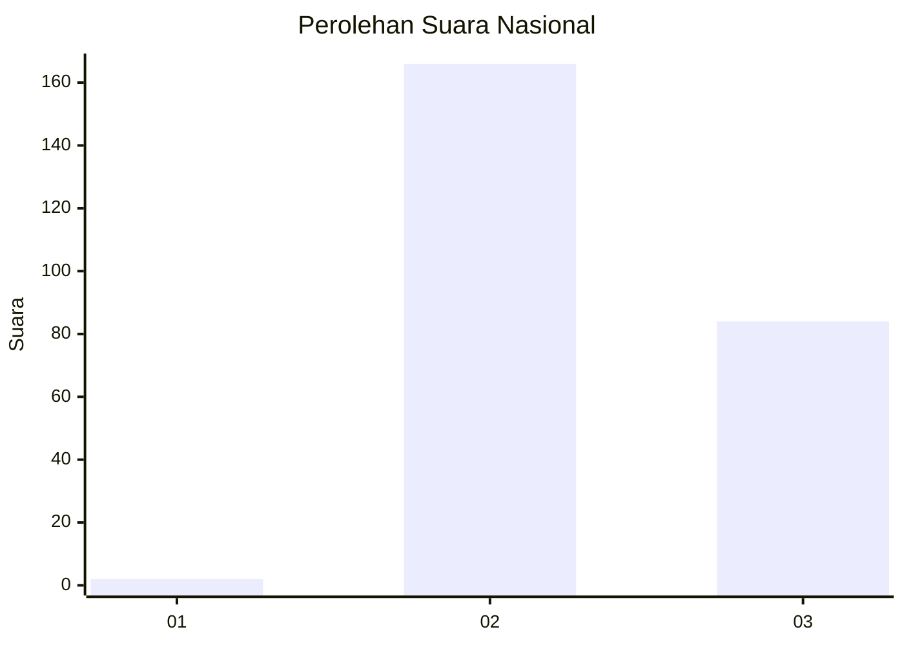
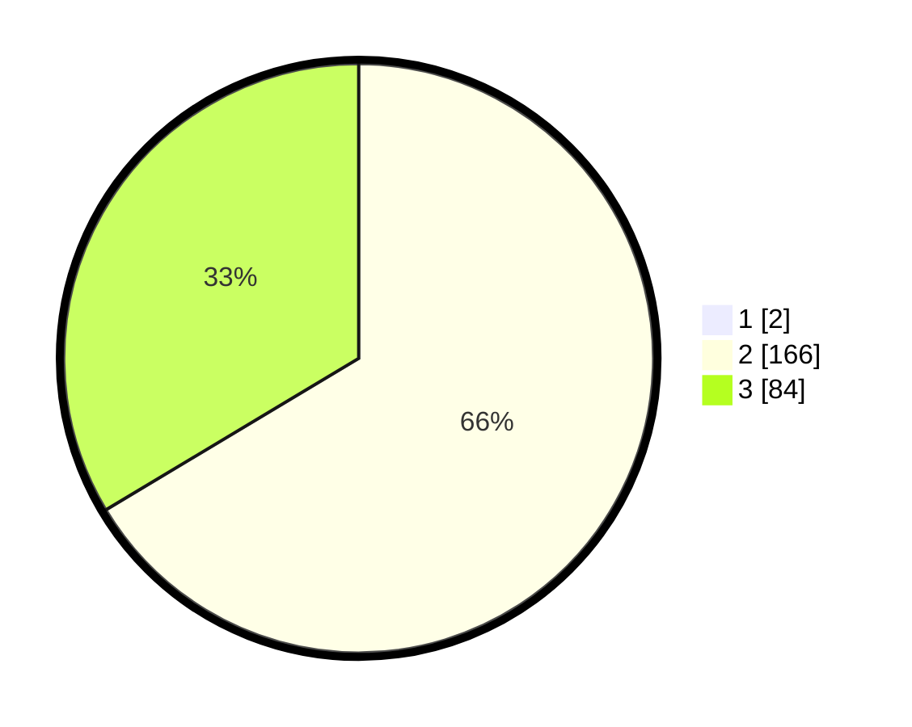

# Hasil

## Grafik

## Tabel

| No. | Nama Paslon    | Suara | Suara (raw) | Persentase |
|:--- |:-------------- | -----:| -----------:| ----------:|
| 1   | ANIES MUHAIMIN | 2     | [2][p-1]    | 0,79       |
| 2   | PRABOWO GIBRAN | 166   | [166][p-2]  | 65,87      |
| 3   | GANJAR MAHFUD  | 84    | [84][p-3]   | 33,33      |

[p-1]: https://github.com/gigit-pemilu/pemilu-2024/blob/main/pilpres/hitung-suara/sub/51-bali/sub/71-kota-denpasar/sub/02-denpasar-timur/sub/2007-sumerta-kaja/sub/005-tps/sub/paslon-1.txt
[p-2]: https://github.com/gigit-pemilu/pemilu-2024/blob/main/pilpres/hitung-suara/sub/51-bali/sub/71-kota-denpasar/sub/02-denpasar-timur/sub/2007-sumerta-kaja/sub/005-tps/sub/paslon-2.txt
[p-3]: https://github.com/gigit-pemilu/pemilu-2024/blob/main/pilpres/hitung-suara/sub/51-bali/sub/71-kota-denpasar/sub/02-denpasar-timur/sub/2007-sumerta-kaja/sub/005-tps/sub/paslon-3.txt

## Foto C Plano

https://sirekap-obj-formc.kpu.go.id/2f0e/pemilu/ppwp/51/71/02/20/07/5171022007005-20240214-141233--3dbc3b96-64b4-4db8-b70a-4d42da089c3a.jpg

https://sirekap-obj-formc.kpu.go.id/2f0e/pemilu/ppwp/51/71/02/20/07/5171022007005-20240214-141127--60e6a027-c244-4640-a000-50d400f810a4.jpg

https://sirekap-obj-formc.kpu.go.id/2f0e/pemilu/ppwp/51/71/02/20/07/5171022007005-20240214-141159--0d4d0293-5802-4354-8957-0ad03a125643.jpg

## Metadata

| Key        | Value               |
| ---------- | ------------------- |
| Time Stamp | 2024-02-24 22:31:28 |

