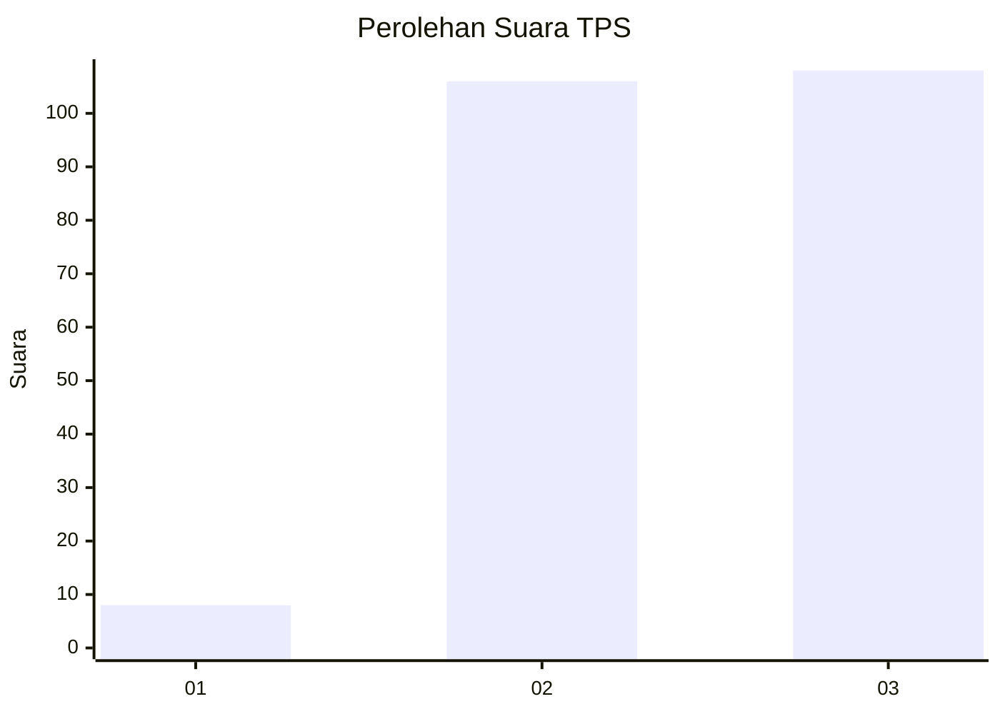
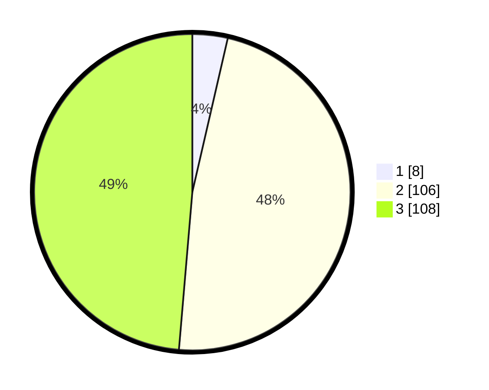

# Hasil

## Grafik

## Tabel

| No. | Nama Paslon    | Suara | Suara (raw) | Persentase |
|:--- |:-------------- | -----:| -----------:| ----------:|
| 1   | ANIES MUHAIMIN | 8     | [8][p-1]    | 3,60       |
| 2   | PRABOWO GIBRAN | 106   | [106][p-2]  | 47,75      |
| 3   | GANJAR MAHFUD  | 108   | [108][p-3]  | 48,65      |

[p-1]: https://github.com/gigit-pemilu/pemilu-2024-51-bali/blob/main/pilpres/hitung-suara/sub/51-bali/sub/71-kota-denpasar/sub/02-denpasar-timur/sub/2007-sumerta-kaja/sub/020-tps/sub/paslon-1.txt
[p-2]: https://github.com/gigit-pemilu/pemilu-2024-51-bali/blob/main/pilpres/hitung-suara/sub/51-bali/sub/71-kota-denpasar/sub/02-denpasar-timur/sub/2007-sumerta-kaja/sub/020-tps/sub/paslon-2.txt
[p-3]: https://github.com/gigit-pemilu/pemilu-2024-51-bali/blob/main/pilpres/hitung-suara/sub/51-bali/sub/71-kota-denpasar/sub/02-denpasar-timur/sub/2007-sumerta-kaja/sub/020-tps/sub/paslon-3.txt

## Foto C Plano

https://sirekap-obj-formc.kpu.go.id/7a21/pemilu/ppwp/51/71/02/20/07/5171022007020-20240214-141524--c65f55e8-3d26-43da-ac2b-b8a0c59db393.jpg

https://sirekap-obj-formc.kpu.go.id/7a21/pemilu/ppwp/51/71/02/20/07/5171022007020-20240214-141724--c5131786-0462-4b5a-b83d-14bad7fa4ed5.jpg

https://sirekap-obj-formc.kpu.go.id/7a21/pemilu/ppwp/51/71/02/20/07/5171022007020-20240214-141916--64543a1d-10da-43f5-b857-eb3556833a5a.jpg

## Metadata

| Key        | Value               |
| ---------- | ------------------- |
| Time Stamp | 2024-02-24 22:31:28 |

