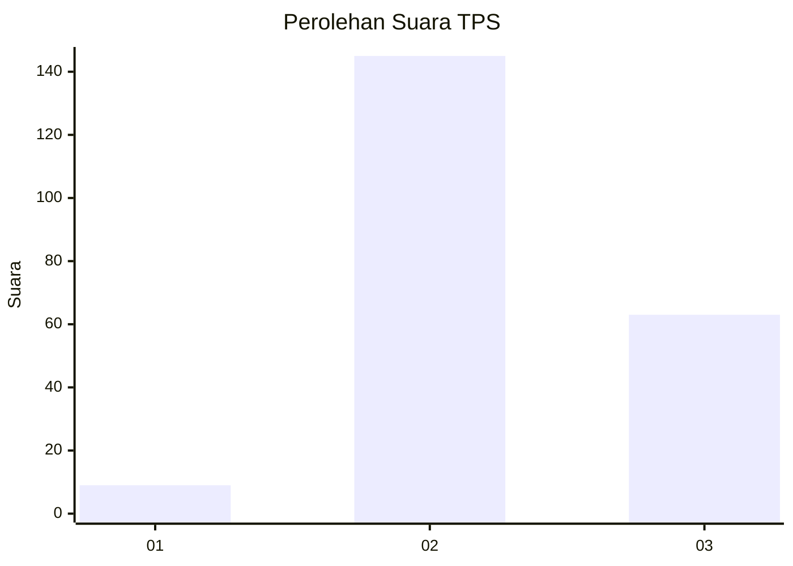

# Hasil

## Grafik

## Tabel

| No. | Nama Paslon    | Suara | Suara (raw) | Persentase |
|:--- |:-------------- | -----:| -----------:| ----------:|
| 1   | ANIES MUHAIMIN | 9     | [9][p-1]    | 4,15       |
| 2   | PRABOWO GIBRAN | 145   | [145][p-2]  | 66,82      |
| 3   | GANJAR MAHFUD  | 63    | [63][p-3]   | 29,03      |

[p-1]: https://github.com/gigit-pemilu/pemilu-2024-51-bali/blob/main/pilpres/hitung-suara/sub/51-bali/sub/71-kota-denpasar/sub/02-denpasar-timur/sub/2008-sumerta-kauh/sub/007-tps/sub/paslon-1.txt
[p-2]: https://github.com/gigit-pemilu/pemilu-2024-51-bali/blob/main/pilpres/hitung-suara/sub/51-bali/sub/71-kota-denpasar/sub/02-denpasar-timur/sub/2008-sumerta-kauh/sub/007-tps/sub/paslon-2.txt
[p-3]: https://github.com/gigit-pemilu/pemilu-2024-51-bali/blob/main/pilpres/hitung-suara/sub/51-bali/sub/71-kota-denpasar/sub/02-denpasar-timur/sub/2008-sumerta-kauh/sub/007-tps/sub/paslon-3.txt

## Foto C Plano

https://sirekap-obj-formc.kpu.go.id/1e13/pemilu/ppwp/51/71/02/20/08/5171022008007-20240214-235939--3e248349-3374-4b78-97a9-42c85b09b21d.jpg

https://sirekap-obj-formc.kpu.go.id/1e13/pemilu/ppwp/51/71/02/20/08/5171022008007-20240214-235242--45cbacfa-1bcb-4a10-83ea-a9f7ebeaee76.jpg

https://sirekap-obj-formc.kpu.go.id/1e13/pemilu/ppwp/51/71/02/20/08/5171022008007-20240214-235713--155c3a14-70e8-452a-8c67-36c4cf699b04.jpg

## Metadata

| Key        | Value               |
| ---------- | ------------------- |
| Time Stamp | 2024-02-15 16:30:25 |

## DATA PEMILIH TETAP

Jumlah pemilih dalam DPT: **286**.
 * L: **146**.
 * P: **140**.

## DATA PENGGUNA HAK PILIH

Jumlah pengguna hak pilih dalam DPT: **210**.
 * L: **111**.
 * P: **99**.

Jumlah pengguna hak pilih dalam DPTb: **2**.
 * L: **2**.
 * P: **0**.

Jumlah pengguna hak pilih dalam DPK: **9**.
 * L: **7**.
 * P: **2**.

Jumlah pengguna hak pilih: **221**.
 * L: **120**.
 * P: **101**.

## JUMLAH SUARA SAH DAN TIDAK SAH

JUMLAH SELURUH SUARA SAH: **217**.

JUMLAH SUARA TIDAK SAH: **4**.

JUMLAH SELURUH SUARA SAH DAN SUARA TIDAK SAH: **221**.

