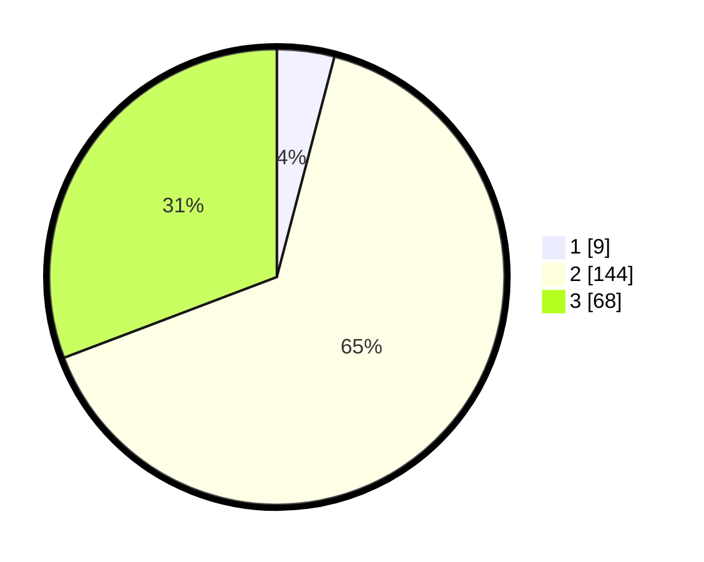

# Hasil

## Grafik

## Tabel

| No. | Nama Paslon    | Suara | Suara (raw) | Persentase |
|:--- |:-------------- | -----:| -----------:| ----------:|
| 1   | ANIES MUHAIMIN | 9     | [9][p-1]    | 4,07       |
| 2   | PRABOWO GIBRAN | 144   | [144][p-2]  | 65,16      |
| 3   | GANJAR MAHFUD  | 68    | [68][p-3]   | 30,77      |

[p-1]: https://github.com/gigit-pemilu/pemilu-2024-51-bali/blob/main/pilpres/hitung-suara/sub/51-bali/sub/71-kota-denpasar/sub/02-denpasar-timur/sub/2008-sumerta-kauh/sub/012-tps/sub/paslon-1.txt
[p-2]: https://github.com/gigit-pemilu/pemilu-2024-51-bali/blob/main/pilpres/hitung-suara/sub/51-bali/sub/71-kota-denpasar/sub/02-denpasar-timur/sub/2008-sumerta-kauh/sub/012-tps/sub/paslon-2.txt
[p-3]: https://github.com/gigit-pemilu/pemilu-2024-51-bali/blob/main/pilpres/hitung-suara/sub/51-bali/sub/71-kota-denpasar/sub/02-denpasar-timur/sub/2008-sumerta-kauh/sub/012-tps/sub/paslon-3.txt

## Foto C Plano

https://sirekap-obj-formc.kpu.go.id/2cf7/pemilu/ppwp/51/71/02/20/08/5171022008012-20240216-022451--9d203c8d-3109-4ec3-865b-015b0b07b28d.jpg

https://sirekap-obj-formc.kpu.go.id/2cf7/pemilu/ppwp/51/71/02/20/08/5171022008012-20240216-022453--d1fd8f57-5930-4a27-a3f4-33205f1302b8.jpg

https://sirekap-obj-formc.kpu.go.id/2cf7/pemilu/ppwp/51/71/02/20/08/5171022008012-20240216-022452--44df791e-6a46-49e5-831e-f50c9e515e56.jpg

## Metadata

| Key        | Value               |
| ---------- | ------------------- |
| Time Stamp | 2024-02-16 14:30:33 |

## DATA PEMILIH TETAP

Jumlah pemilih dalam DPT: **293**.
 * L: **139**.
 * P: **154**.

## DATA PENGGUNA HAK PILIH

Jumlah pengguna hak pilih dalam DPT: **211**.
 * L: **101**.
 * P: **110**.

Jumlah pengguna hak pilih dalam DPTb: **6**.
 * L: **1**.
 * P: **5**.

Jumlah pengguna hak pilih dalam DPK: **6**.
 * L: **2**.
 * P: **4**.

Jumlah pengguna hak pilih: **223**.
 * L: **104**.
 * P: **119**.

## JUMLAH SUARA SAH DAN TIDAK SAH

JUMLAH SELURUH SUARA SAH: **221**.

JUMLAH SUARA TIDAK SAH: **2**.

JUMLAH SELURUH SUARA SAH DAN SUARA TIDAK SAH: **223**.

