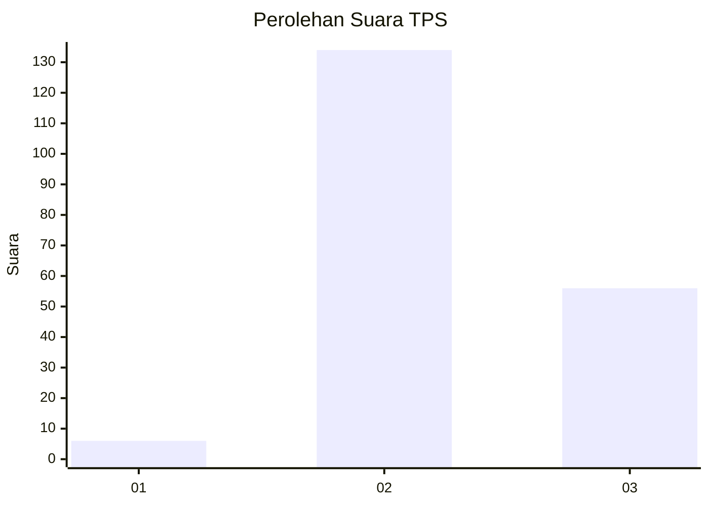
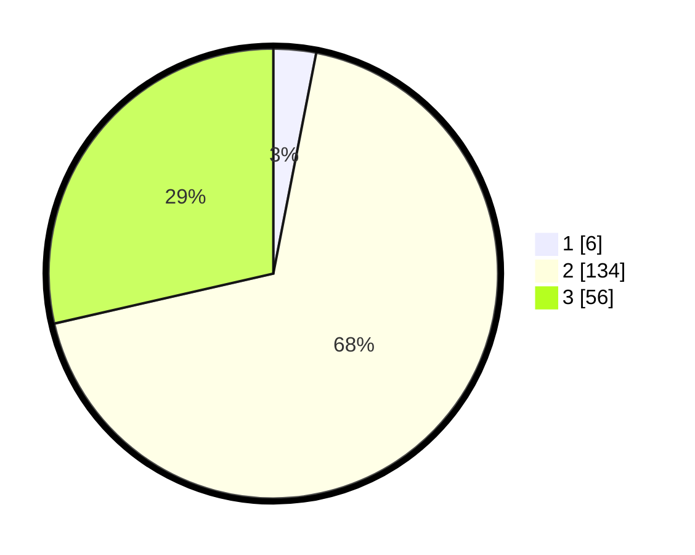

# Hasil

## Grafik

## Tabel

| No. | Nama Paslon    | Suara | Suara (raw) | Persentase |
|:--- |:-------------- | -----:| -----------:| ----------:|
| 1   | ANIES MUHAIMIN | 6     | [6][p-1]    | 3,06       |
| 2   | PRABOWO GIBRAN | 134   | [134][p-2]  | 68,37      |
| 3   | GANJAR MAHFUD  | 56    | [56][p-3]   | 28,57      |

[p-1]: https://github.com/gigit-pemilu/pemilu-2024-51-bali/blob/main/pilpres/hitung-suara/sub/51-bali/sub/71-kota-denpasar/sub/02-denpasar-timur/sub/2008-sumerta-kauh/sub/020-tps/sub/paslon-1.txt
[p-2]: https://github.com/gigit-pemilu/pemilu-2024-51-bali/blob/main/pilpres/hitung-suara/sub/51-bali/sub/71-kota-denpasar/sub/02-denpasar-timur/sub/2008-sumerta-kauh/sub/020-tps/sub/paslon-2.txt
[p-3]: https://github.com/gigit-pemilu/pemilu-2024-51-bali/blob/main/pilpres/hitung-suara/sub/51-bali/sub/71-kota-denpasar/sub/02-denpasar-timur/sub/2008-sumerta-kauh/sub/020-tps/sub/paslon-3.txt

## Foto C Plano

https://sirekap-obj-formc.kpu.go.id/503a/pemilu/ppwp/51/71/02/20/08/5171022008020-20240214-210037--f4151dd3-bb97-4ba8-8b28-6264e6544a3d.jpg

https://sirekap-obj-formc.kpu.go.id/503a/pemilu/ppwp/51/71/02/20/08/5171022008020-20240214-210124--8806ff99-d1bf-4726-96fb-27fd56f0eba4.jpg

https://sirekap-obj-formc.kpu.go.id/503a/pemilu/ppwp/51/71/02/20/08/5171022008020-20240214-210215--0c87bb3c-8e5f-46a6-b770-929664d49e60.jpg

## Metadata

| Key        | Value               |
| ---------- | ------------------- |
| Time Stamp | 2024-02-24 22:31:28 |

