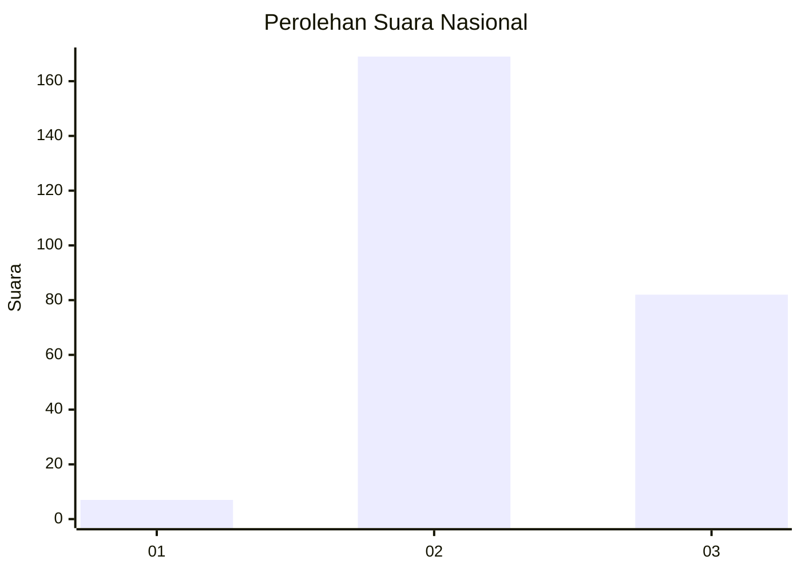
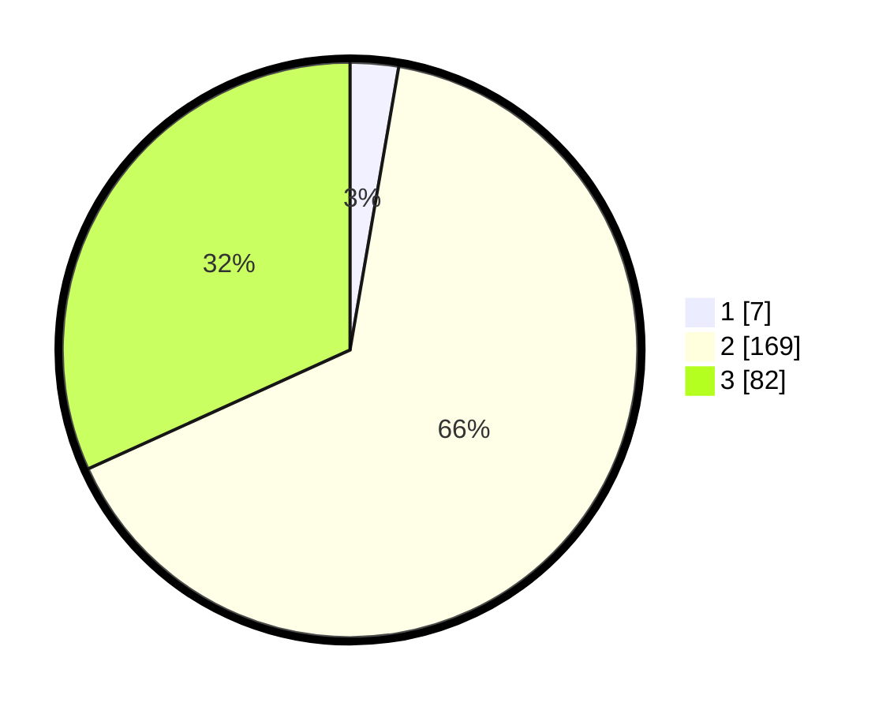

# Hasil

## Grafik

## Tabel

| No. | Nama Paslon    | Suara | Suara (raw) | Persentase |
|:--- |:-------------- | -----:| -----------:| ----------:|
| 1   | ANIES MUHAIMIN | 7     | [7][p-1]    | 2,71       |
| 2   | PRABOWO GIBRAN | 169   | [169][p-2]  | 65,50      |
| 3   | GANJAR MAHFUD  | 82    | [82][p-3]   | 31,78      |

[p-1]: https://github.com/gigit-pemilu/pemilu-2024/blob/main/pilpres/hitung-suara/sub/51-bali/sub/71-kota-denpasar/sub/02-denpasar-timur/sub/2015-penatih-dangin-puri/sub/001-tps/sub/paslon-1.txt
[p-2]: https://github.com/gigit-pemilu/pemilu-2024/blob/main/pilpres/hitung-suara/sub/51-bali/sub/71-kota-denpasar/sub/02-denpasar-timur/sub/2015-penatih-dangin-puri/sub/001-tps/sub/paslon-2.txt
[p-3]: https://github.com/gigit-pemilu/pemilu-2024/blob/main/pilpres/hitung-suara/sub/51-bali/sub/71-kota-denpasar/sub/02-denpasar-timur/sub/2015-penatih-dangin-puri/sub/001-tps/sub/paslon-3.txt

## Foto C Plano

https://sirekap-obj-formc.kpu.go.id/5f0f/pemilu/ppwp/51/71/02/20/15/5171022015001-20240215-012101--88f175f7-b33e-49d1-86d8-fafda93c81b1.jpg

https://sirekap-obj-formc.kpu.go.id/5f0f/pemilu/ppwp/51/71/02/20/15/5171022015001-20240215-012202--cbbf3d25-8541-487f-a776-efa603ebfa42.jpg

https://sirekap-obj-formc.kpu.go.id/5f0f/pemilu/ppwp/51/71/02/20/15/5171022015001-20240215-012302--70f6e0ad-ea49-4609-837c-4b7d3f9d93e0.jpg

## Metadata

| Key        | Value               |
| ---------- | ------------------- |
| Time Stamp | 2024-02-24 22:31:28 |

