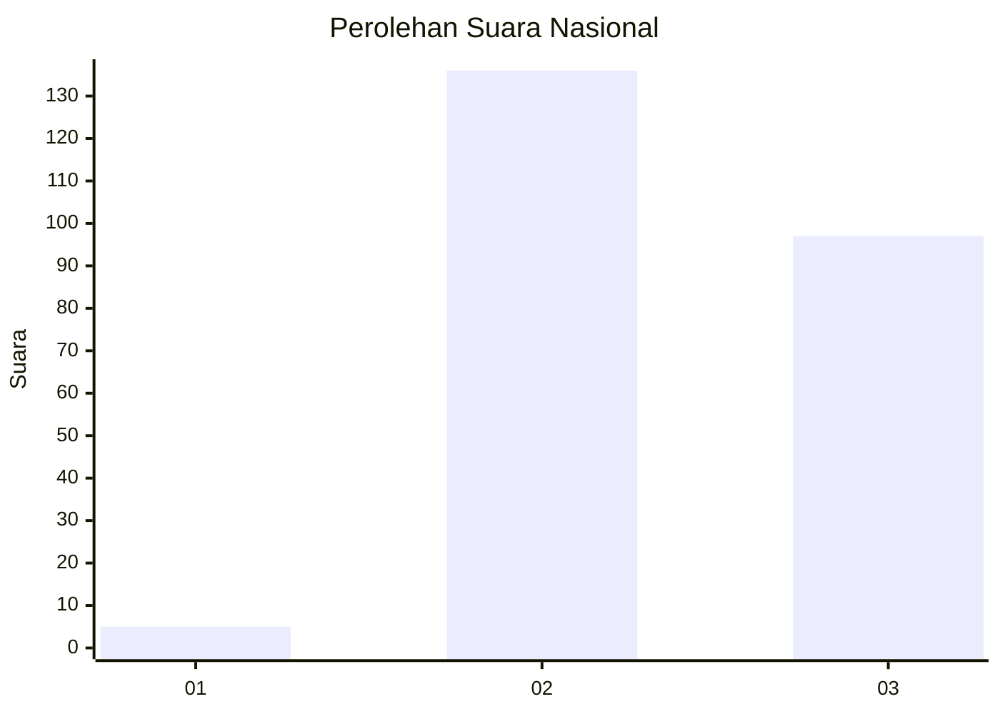
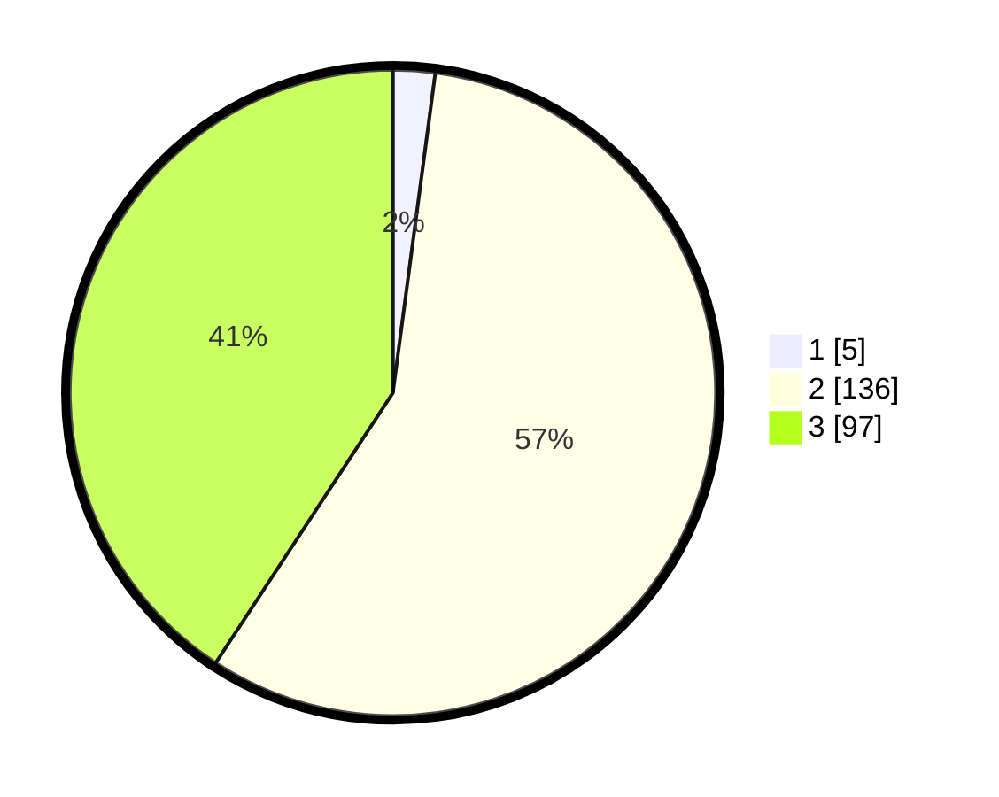

# Hasil

## Grafik

## Tabel

| No. | Nama Paslon    | Suara | Suara (raw) | Persentase |
|:--- |:-------------- | -----:| -----------:| ----------:|
| 1   | ANIES MUHAIMIN | 5     | [5][p-1]    | 2,10       |
| 2   | PRABOWO GIBRAN | 136   | [136][p-2]  | 57,14      |
| 3   | GANJAR MAHFUD  | 97    | [97][p-3]   | 40,76      |

[p-1]: https://github.com/gigit-pemilu/pemilu-2024/blob/main/pilpres/hitung-suara/sub/51-bali/sub/71-kota-denpasar/sub/02-denpasar-timur/sub/2015-penatih-dangin-puri/sub/007-tps/sub/paslon-1.txt
[p-2]: https://github.com/gigit-pemilu/pemilu-2024/blob/main/pilpres/hitung-suara/sub/51-bali/sub/71-kota-denpasar/sub/02-denpasar-timur/sub/2015-penatih-dangin-puri/sub/007-tps/sub/paslon-2.txt
[p-3]: https://github.com/gigit-pemilu/pemilu-2024/blob/main/pilpres/hitung-suara/sub/51-bali/sub/71-kota-denpasar/sub/02-denpasar-timur/sub/2015-penatih-dangin-puri/sub/007-tps/sub/paslon-3.txt

## Foto C Plano

https://sirekap-obj-formc.kpu.go.id/983d/pemilu/ppwp/51/71/02/20/15/5171022015007-20240214-141209--30f516fb-f6b5-48e2-865a-a2f31f088df0.jpg

https://sirekap-obj-formc.kpu.go.id/983d/pemilu/ppwp/51/71/02/20/15/5171022015007-20240214-141219--195bcfe7-76b3-4542-af3b-5dbb1df687ba.jpg

https://sirekap-obj-formc.kpu.go.id/983d/pemilu/ppwp/51/71/02/20/15/5171022015007-20240214-141155--2bbab850-7e47-4105-8aff-1075fa39fc8f.jpg

## Metadata

| Key        | Value               |
| ---------- | ------------------- |
| Time Stamp | 2024-02-24 22:31:28 |

