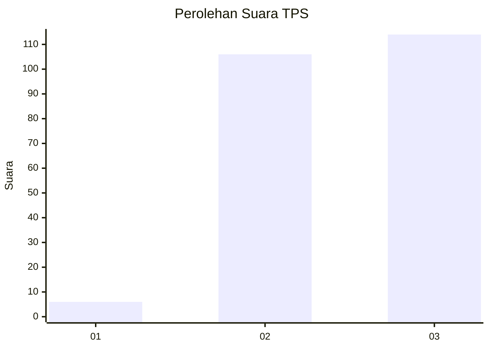
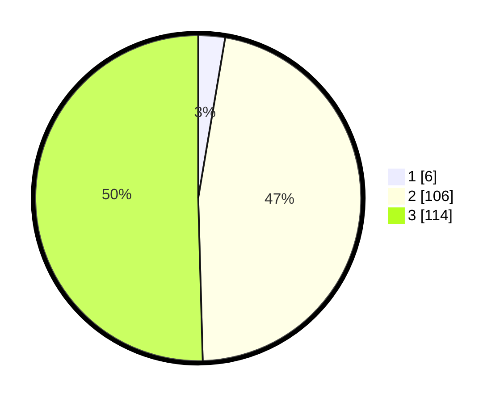

# Hasil

## Grafik

## Tabel

| No. | Nama Paslon    | Suara | Suara (raw) | Persentase |
|:--- |:-------------- | -----:| -----------:| ----------:|
| 1   | ANIES MUHAIMIN | 6     | [6][p-1]    | 2,65       |
| 2   | PRABOWO GIBRAN | 106   | [106][p-2]  | 46,90      |
| 3   | GANJAR MAHFUD  | 114   | [114][p-3]  | 50,44      |

[p-1]: https://github.com/gigit-pemilu/pemilu-2024-51-bali/blob/main/pilpres/hitung-suara/sub/51-bali/sub/71-kota-denpasar/sub/02-denpasar-timur/sub/2015-penatih-dangin-puri/sub/014-tps/sub/paslon-1.txt
[p-2]: https://github.com/gigit-pemilu/pemilu-2024-51-bali/blob/main/pilpres/hitung-suara/sub/51-bali/sub/71-kota-denpasar/sub/02-denpasar-timur/sub/2015-penatih-dangin-puri/sub/014-tps/sub/paslon-2.txt
[p-3]: https://github.com/gigit-pemilu/pemilu-2024-51-bali/blob/main/pilpres/hitung-suara/sub/51-bali/sub/71-kota-denpasar/sub/02-denpasar-timur/sub/2015-penatih-dangin-puri/sub/014-tps/sub/paslon-3.txt

## Foto C Plano

https://sirekap-obj-formc.kpu.go.id/77bf/pemilu/ppwp/51/71/02/20/15/5171022015014-20240214-224449--15a1f455-19bd-43a0-9ced-f889b9f5b517.jpg

https://sirekap-obj-formc.kpu.go.id/77bf/pemilu/ppwp/51/71/02/20/15/5171022015014-20240214-224559--5af7d62e-fb90-4942-a7b3-f1c56423f30e.jpg

https://sirekap-obj-formc.kpu.go.id/77bf/pemilu/ppwp/51/71/02/20/15/5171022015014-20240214-224714--835d8880-688e-4e96-ba15-ade4dacebb46.jpg

## Metadata

| Key        | Value               |
| ---------- | ------------------- |
| Time Stamp | 2024-02-24 22:31:28 |

