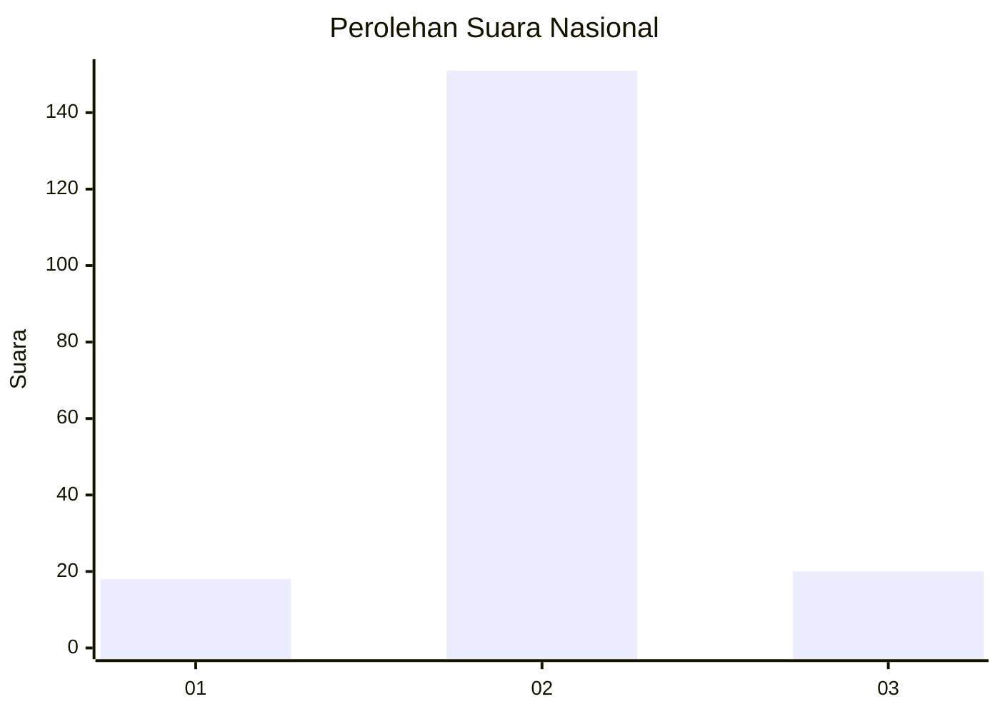
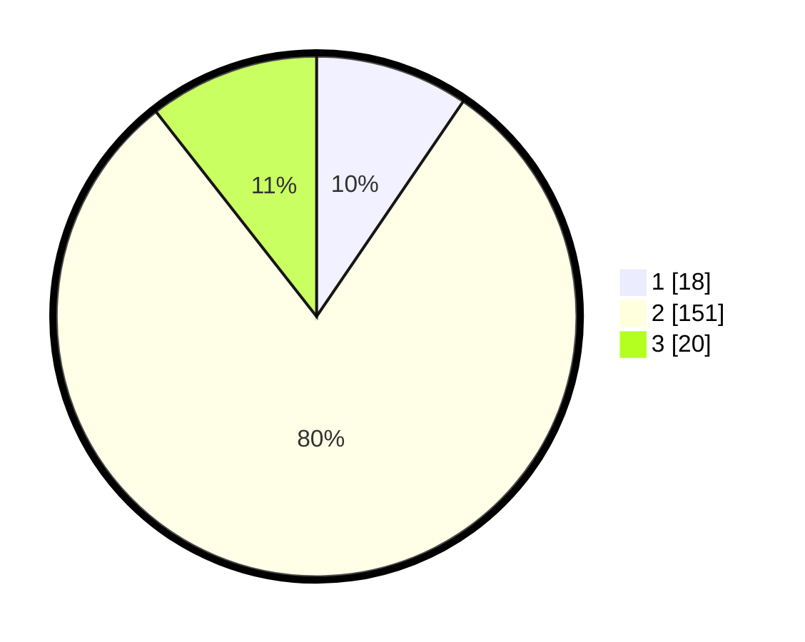

# Hasil

## Grafik

## Tabel

| No. | Nama Paslon    | Suara | Suara (raw) | Persentase |
|:--- |:-------------- | -----:| -----------:| ----------:|
| 1   | ANIES MUHAIMIN | 18    | [18][p-1]   | 9,52       |
| 2   | PRABOWO GIBRAN | 151   | [151][p-2]  | 79,89      |
| 3   | GANJAR MAHFUD  | 20    | [20][p-3]   | 10,58      |

[p-1]: https://github.com/gigit-pemilu/pemilu-2024/blob/main/pilpres/hitung-suara/sub/51-bali/sub/71-kota-denpasar/sub/03-denpasar-barat/sub/1005-dauh-puri/sub/003-tps/sub/paslon-1.txt
[p-2]: https://github.com/gigit-pemilu/pemilu-2024/blob/main/pilpres/hitung-suara/sub/51-bali/sub/71-kota-denpasar/sub/03-denpasar-barat/sub/1005-dauh-puri/sub/003-tps/sub/paslon-2.txt
[p-3]: https://github.com/gigit-pemilu/pemilu-2024/blob/main/pilpres/hitung-suara/sub/51-bali/sub/71-kota-denpasar/sub/03-denpasar-barat/sub/1005-dauh-puri/sub/003-tps/sub/paslon-3.txt

## Foto C Plano

https://sirekap-obj-formc.kpu.go.id/9041/pemilu/ppwp/51/71/03/10/05/5171031005003-20240214-232754--e7ac3f74-22ba-418b-8a4f-f2a2a97ba09b.jpg

https://sirekap-obj-formc.kpu.go.id/9041/pemilu/ppwp/51/71/03/10/05/5171031005003-20240214-220130--5152d4c4-9279-4072-9b3e-0785ab731f75.jpg

https://sirekap-obj-formc.kpu.go.id/9041/pemilu/ppwp/51/71/03/10/05/5171031005003-20240214-220211--dda2cb19-abe4-4be0-9807-ce7e2dfb5831.jpg

## Metadata

| Key        | Value               |
| ---------- | ------------------- |
| Time Stamp | 2024-02-16 21:01:00 |

## DATA PEMILIH TETAP

Jumlah pemilih dalam DPT: **229**.
 * L: **102**.
 * P: **132**.

## DATA PENGGUNA HAK PILIH

Jumlah pengguna hak pilih dalam DPT: **175**.
 * L: **71**.
 * P: **104**.

Jumlah pengguna hak pilih dalam DPTb: **13**.
 * L: **7**.
 * P: **6**.

Jumlah pengguna hak pilih dalam DPK: **2**.
 * L: **0**.
 * P: **2**.

Jumlah pengguna hak pilih: **190**.
 * L: **78**.
 * P: **112**.

## JUMLAH SUARA SAH DAN TIDAK SAH

JUMLAH SELURUH SUARA SAH: **189**.

JUMLAH SUARA TIDAK SAH: **1**.

JUMLAH SELURUH SUARA SAH DAN SUARA TIDAK SAH: **190**.

