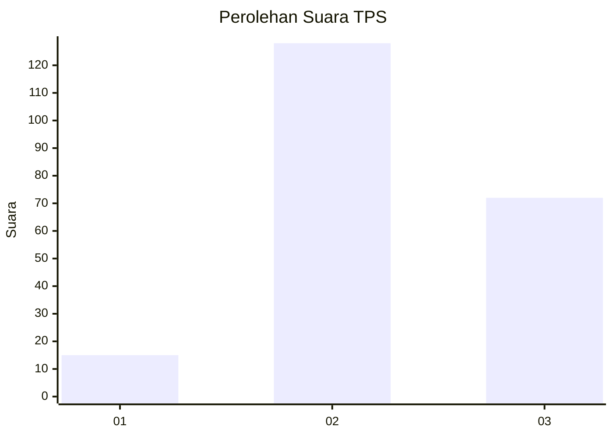
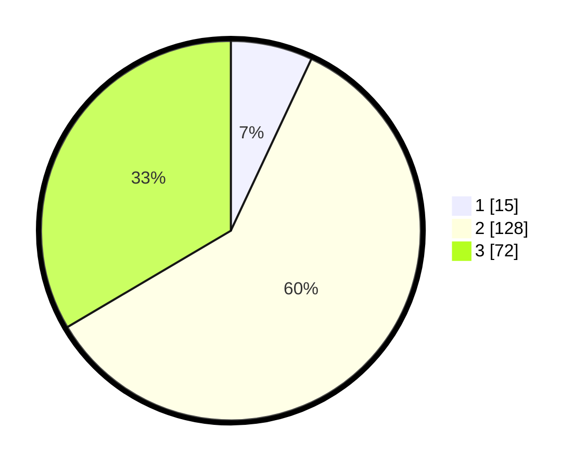

# Hasil

## Grafik

## Tabel

| No. | Nama Paslon    | Suara | Suara (raw) | Persentase |
|:--- |:-------------- | -----:| -----------:| ----------:|
| 1   | ANIES MUHAIMIN | 15    | [15][p-1]   | 6,98       |
| 2   | PRABOWO GIBRAN | 128   | [128][p-2]  | 59,53      |
| 3   | GANJAR MAHFUD  | 72    | [72][p-3]   | 33,49      |

[p-1]: https://github.com/gigit-pemilu/pemilu-2024-51-bali/blob/main/pilpres/hitung-suara/sub/51-bali/sub/71-kota-denpasar/sub/03-denpasar-barat/sub/1005-dauh-puri/sub/019-tps/sub/paslon-1.txt
[p-2]: https://github.com/gigit-pemilu/pemilu-2024-51-bali/blob/main/pilpres/hitung-suara/sub/51-bali/sub/71-kota-denpasar/sub/03-denpasar-barat/sub/1005-dauh-puri/sub/019-tps/sub/paslon-2.txt
[p-3]: https://github.com/gigit-pemilu/pemilu-2024-51-bali/blob/main/pilpres/hitung-suara/sub/51-bali/sub/71-kota-denpasar/sub/03-denpasar-barat/sub/1005-dauh-puri/sub/019-tps/sub/paslon-3.txt

## Foto C Plano

https://sirekap-obj-formc.kpu.go.id/0abe/pemilu/ppwp/51/71/03/10/05/5171031005019-20240214-141756--c7967f85-9065-4c78-a675-dc4c32761f08.jpg

https://sirekap-obj-formc.kpu.go.id/0abe/pemilu/ppwp/51/71/03/10/05/5171031005019-20240214-155152--48660c8a-e776-4ec1-b101-8fc96bcd2b33.jpg

https://sirekap-obj-formc.kpu.go.id/0abe/pemilu/ppwp/51/71/03/10/05/5171031005019-20240214-155155--8395252b-9aa8-464c-ac34-248fb136d85f.jpg

## Metadata

| Key        | Value               |
| ---------- | ------------------- |
| Time Stamp | 2024-02-15 18:00:26 |

## DATA PEMILIH TETAP

Jumlah pemilih dalam DPT: **262**.
 * L: **133**.
 * P: **129**.

## DATA PENGGUNA HAK PILIH

Jumlah pengguna hak pilih dalam DPT: **213**.
 * L: **109**.
 * P: **104**.

Jumlah pengguna hak pilih dalam DPTb: **4**.
 * L: **2**.
 * P: **2**.

Jumlah pengguna hak pilih dalam DPK: **2**.
 * L: **0**.
 * P: **2**.

Jumlah pengguna hak pilih: **219**.
 * L: **111**.
 * P: **108**.

## JUMLAH SUARA SAH DAN TIDAK SAH

JUMLAH SELURUH SUARA SAH: **215**.

JUMLAH SUARA TIDAK SAH: **4**.

JUMLAH SELURUH SUARA SAH DAN SUARA TIDAK SAH: **219**.

