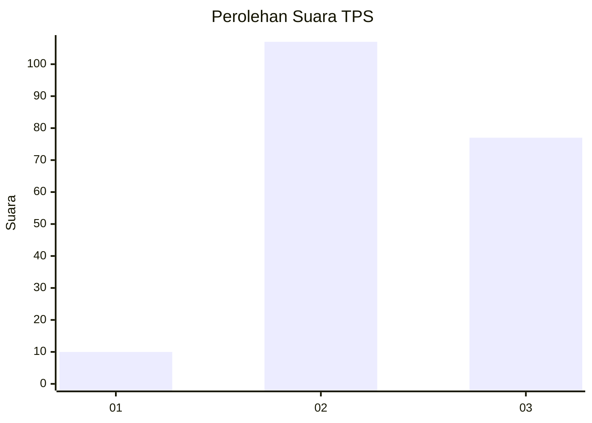
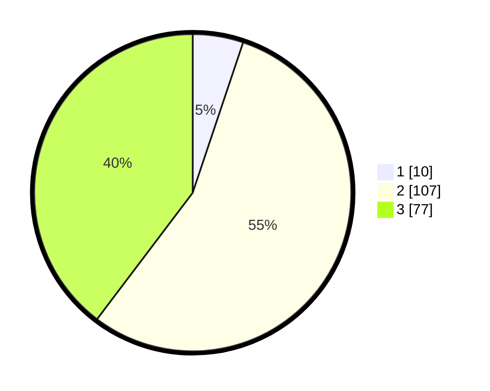

# Hasil

## Grafik

## Tabel

| No. | Nama Paslon    | Suara | Suara (raw) | Persentase |
|:--- |:-------------- | -----:| -----------:| ----------:|
| 1   | ANIES MUHAIMIN | 10    | [10][p-1]   | 5,15       |
| 2   | PRABOWO GIBRAN | 107   | [107][p-2]  | 55,15      |
| 3   | GANJAR MAHFUD  | 77    | [77][p-3]   | 39,69      |

[p-1]: https://github.com/gigit-pemilu/pemilu-2024-51-bali/blob/main/pilpres/hitung-suara/sub/51-bali/sub/71-kota-denpasar/sub/03-denpasar-barat/sub/1005-dauh-puri/sub/020-tps/sub/paslon-1.txt
[p-2]: https://github.com/gigit-pemilu/pemilu-2024-51-bali/blob/main/pilpres/hitung-suara/sub/51-bali/sub/71-kota-denpasar/sub/03-denpasar-barat/sub/1005-dauh-puri/sub/020-tps/sub/paslon-2.txt
[p-3]: https://github.com/gigit-pemilu/pemilu-2024-51-bali/blob/main/pilpres/hitung-suara/sub/51-bali/sub/71-kota-denpasar/sub/03-denpasar-barat/sub/1005-dauh-puri/sub/020-tps/sub/paslon-3.txt

## Foto C Plano

https://sirekap-obj-formc.kpu.go.id/4f54/pemilu/ppwp/51/71/03/10/05/5171031005020-20240214-141213--537968a5-2f91-4158-b354-bc6000253342.jpg

https://sirekap-obj-formc.kpu.go.id/4f54/pemilu/ppwp/51/71/03/10/05/5171031005020-20240214-141341--176e88e5-49a6-48e1-8ce1-289e5c4642a5.jpg

https://sirekap-obj-formc.kpu.go.id/4f54/pemilu/ppwp/51/71/03/10/05/5171031005020-20240214-141541--711fcf9c-b390-4f4f-9970-8f7b69214e12.jpg

## Metadata

| Key        | Value               |
| ---------- | ------------------- |
| Time Stamp | 2024-02-16 12:51:22 |

