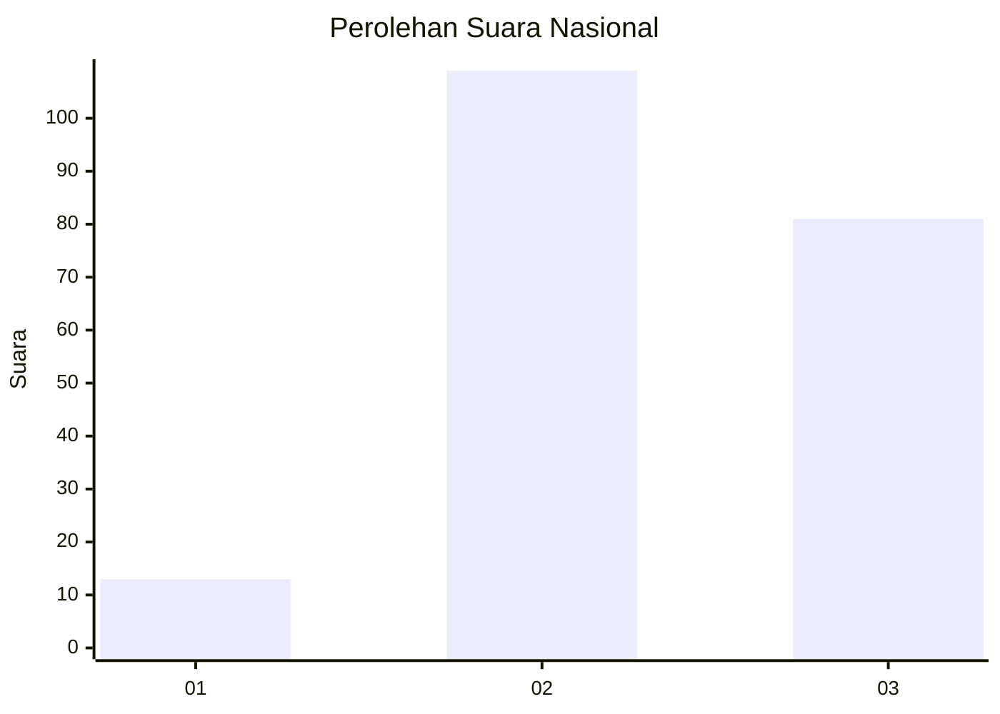
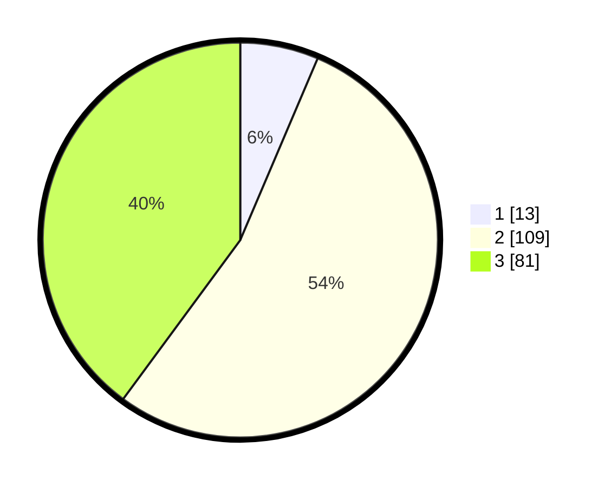

# Hasil

## Grafik

## Tabel

| No. | Nama Paslon    | Suara | Suara (raw) | Persentase |
|:--- |:-------------- | -----:| -----------:| ----------:|
| 1   | ANIES MUHAIMIN | 13    | [13][p-1]   | 6,40       |
| 2   | PRABOWO GIBRAN | 109   | [109][p-2]  | 53,69      |
| 3   | GANJAR MAHFUD  | 81    | [81][p-3]   | 39,90      |

[p-1]: https://github.com/gigit-pemilu/pemilu-2024/blob/main/pilpres/hitung-suara/sub/51-bali/sub/71-kota-denpasar/sub/03-denpasar-barat/sub/1005-dauh-puri/sub/021-tps/sub/paslon-1.txt
[p-2]: https://github.com/gigit-pemilu/pemilu-2024/blob/main/pilpres/hitung-suara/sub/51-bali/sub/71-kota-denpasar/sub/03-denpasar-barat/sub/1005-dauh-puri/sub/021-tps/sub/paslon-2.txt
[p-3]: https://github.com/gigit-pemilu/pemilu-2024/blob/main/pilpres/hitung-suara/sub/51-bali/sub/71-kota-denpasar/sub/03-denpasar-barat/sub/1005-dauh-puri/sub/021-tps/sub/paslon-3.txt

## Foto C Plano

https://sirekap-obj-formc.kpu.go.id/af45/pemilu/ppwp/51/71/03/10/05/5171031005021-20240214-141416--6896c685-49fc-4449-b69a-83eb5937df37.jpg

https://sirekap-obj-formc.kpu.go.id/af45/pemilu/ppwp/51/71/03/10/05/5171031005021-20240214-141506--d2da3380-5239-496f-bc34-4948afc2f736.jpg

https://sirekap-obj-formc.kpu.go.id/af45/pemilu/ppwp/51/71/03/10/05/5171031005021-20240214-141604--c895d97e-65b3-41de-80ae-b9f2316175bc.jpg

## Metadata

| Key        | Value               |
| ---------- | ------------------- |
| Time Stamp | 2024-02-16 12:51:22 |

