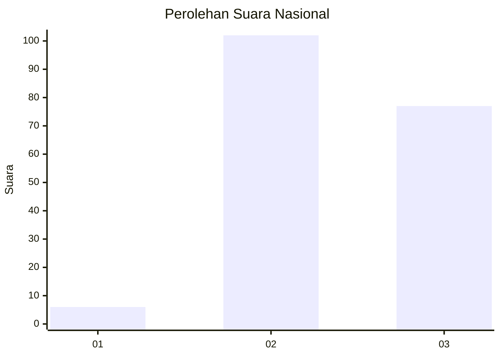
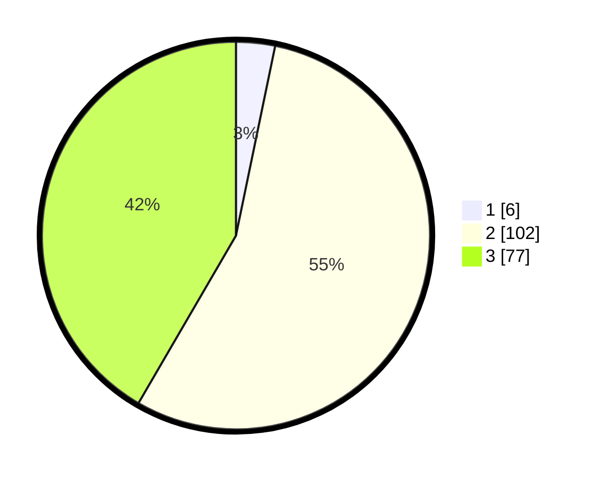

# Hasil

## Grafik

## Tabel

| No. | Nama Paslon    | Suara | Suara (raw) | Persentase |
|:--- |:-------------- | -----:| -----------:| ----------:|
| 1   | ANIES MUHAIMIN | 6     | [6][p-1]    | 3,24       |
| 2   | PRABOWO GIBRAN | 102   | [102][p-2]  | 55,14      |
| 3   | GANJAR MAHFUD  | 77    | [77][p-3]   | 41,62      |

[p-1]: https://github.com/gigit-pemilu/pemilu-2024/blob/main/pilpres/hitung-suara/sub/51-bali/sub/71-kota-denpasar/sub/03-denpasar-barat/sub/1007-pemecutan/sub/001-tps/sub/paslon-1.txt
[p-2]: https://github.com/gigit-pemilu/pemilu-2024/blob/main/pilpres/hitung-suara/sub/51-bali/sub/71-kota-denpasar/sub/03-denpasar-barat/sub/1007-pemecutan/sub/001-tps/sub/paslon-2.txt
[p-3]: https://github.com/gigit-pemilu/pemilu-2024/blob/main/pilpres/hitung-suara/sub/51-bali/sub/71-kota-denpasar/sub/03-denpasar-barat/sub/1007-pemecutan/sub/001-tps/sub/paslon-3.txt

## Foto C Plano

https://sirekap-obj-formc.kpu.go.id/0f15/pemilu/ppwp/51/71/03/10/07/5171031007001-20240214-191812--b50ed3c8-06c9-478d-9ec3-b27d7ddec6a7.jpg

https://sirekap-obj-formc.kpu.go.id/0f15/pemilu/ppwp/51/71/03/10/07/5171031007001-20240214-191711--9a139190-e003-40b7-b9ca-15814c666406.jpg

https://sirekap-obj-formc.kpu.go.id/0f15/pemilu/ppwp/51/71/03/10/07/5171031007001-20240214-191908--d1a54575-bb51-436c-ac89-ddc3c5946ac4.jpg

## Metadata

| Key        | Value               |
| ---------- | ------------------- |
| Time Stamp | 2024-02-16 12:51:22 |

