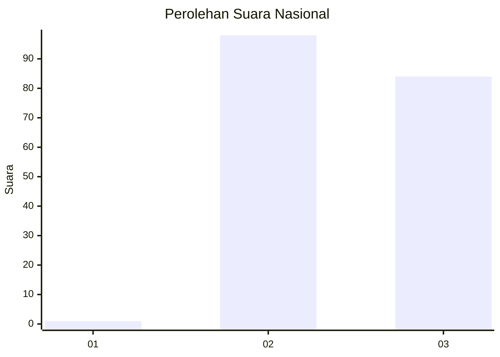
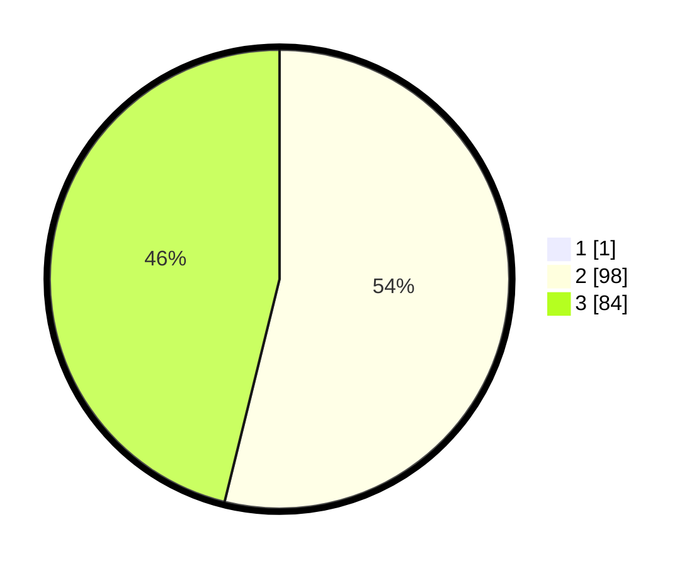

# Hasil

## Grafik

## Tabel

| No. | Nama Paslon    | Suara | Suara (raw) | Persentase |
|:--- |:-------------- | -----:| -----------:| ----------:|
| 1   | ANIES MUHAIMIN | 1     | [1][p-1]    | 0,55       |
| 2   | PRABOWO GIBRAN | 98    | [98][p-2]   | 53,55      |
| 3   | GANJAR MAHFUD  | 84    | [84][p-3]   | 45,90      |

[p-1]: https://github.com/gigit-pemilu/pemilu-2024/blob/main/pilpres/hitung-suara/sub/51-bali/sub/71-kota-denpasar/sub/03-denpasar-barat/sub/1007-pemecutan/sub/008-tps/sub/paslon-1.txt
[p-2]: https://github.com/gigit-pemilu/pemilu-2024/blob/main/pilpres/hitung-suara/sub/51-bali/sub/71-kota-denpasar/sub/03-denpasar-barat/sub/1007-pemecutan/sub/008-tps/sub/paslon-2.txt
[p-3]: https://github.com/gigit-pemilu/pemilu-2024/blob/main/pilpres/hitung-suara/sub/51-bali/sub/71-kota-denpasar/sub/03-denpasar-barat/sub/1007-pemecutan/sub/008-tps/sub/paslon-3.txt

## Foto C Plano

https://sirekap-obj-formc.kpu.go.id/56b4/pemilu/ppwp/51/71/03/10/07/5171031007008-20240214-203632--4659393d-21c9-46bd-b074-736b8f9d2b49.jpg

https://sirekap-obj-formc.kpu.go.id/56b4/pemilu/ppwp/51/71/03/10/07/5171031007008-20240214-204147--56629144-7450-41be-8c25-8f02100a97a0.jpg

https://sirekap-obj-formc.kpu.go.id/56b4/pemilu/ppwp/51/71/03/10/07/5171031007008-20240214-204555--db385f58-5273-4687-92aa-c38ccc47d2a5.jpg

## Metadata

| Key        | Value               |
| ---------- | ------------------- |
| Time Stamp | 2024-02-16 12:51:22 |

