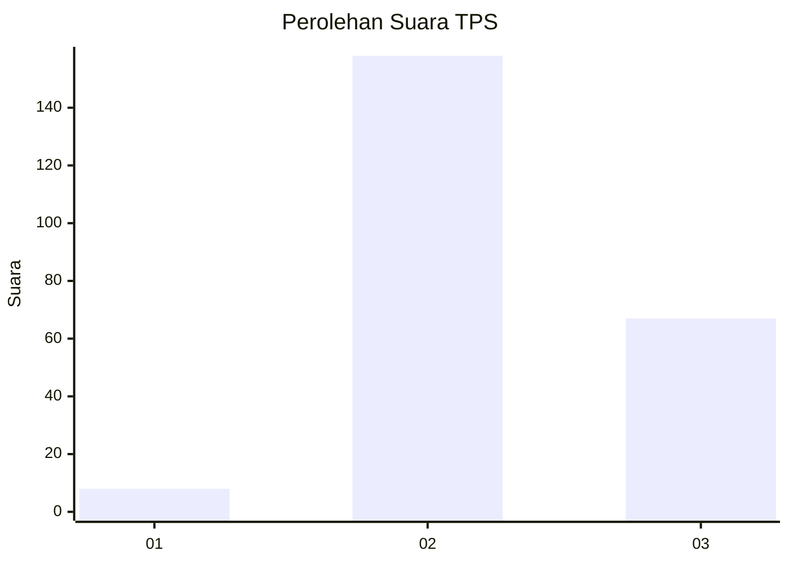
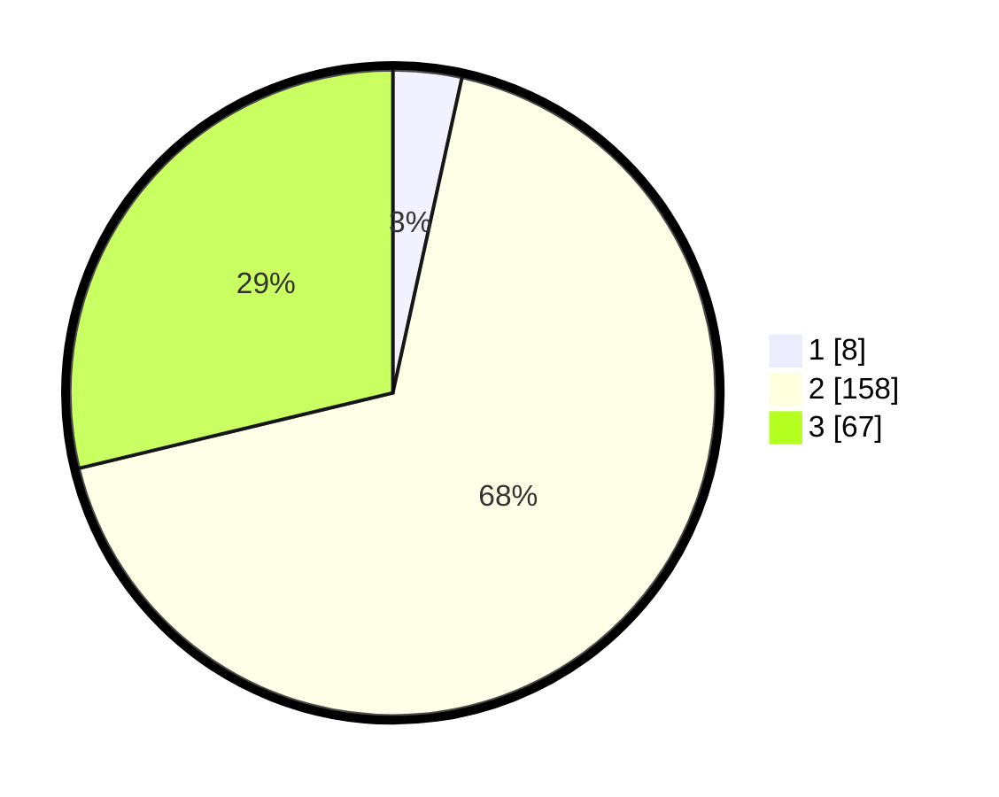

# Hasil

## Grafik

## Tabel

| No. | Nama Paslon    | Suara | Suara (raw) | Persentase |
|:--- |:-------------- | -----:| -----------:| ----------:|
| 1   | ANIES MUHAIMIN | 8     | [8][p-1]    | 3,43       |
| 2   | PRABOWO GIBRAN | 158   | [158][p-2]  | 67,81      |
| 3   | GANJAR MAHFUD  | 67    | [67][p-3]   | 28,76      |

[p-1]: https://github.com/gigit-pemilu/pemilu-2024-51-bali/blob/main/pilpres/hitung-suara/sub/51-bali/sub/71-kota-denpasar/sub/03-denpasar-barat/sub/1007-pemecutan/sub/010-tps/sub/paslon-1.txt
[p-2]: https://github.com/gigit-pemilu/pemilu-2024-51-bali/blob/main/pilpres/hitung-suara/sub/51-bali/sub/71-kota-denpasar/sub/03-denpasar-barat/sub/1007-pemecutan/sub/010-tps/sub/paslon-2.txt
[p-3]: https://github.com/gigit-pemilu/pemilu-2024-51-bali/blob/main/pilpres/hitung-suara/sub/51-bali/sub/71-kota-denpasar/sub/03-denpasar-barat/sub/1007-pemecutan/sub/010-tps/sub/paslon-3.txt

## Foto C Plano

https://sirekap-obj-formc.kpu.go.id/9eff/pemilu/ppwp/51/71/03/10/07/5171031007010-20240214-155255--6d72c3eb-305c-4eb7-895f-b3db7f155a7c.jpg

https://sirekap-obj-formc.kpu.go.id/9eff/pemilu/ppwp/51/71/03/10/07/5171031007010-20240214-155630--eb294f60-2e69-410b-9082-e39950cfd704.jpg

## Metadata

| Key        | Value               |
| ---------- | ------------------- |
| Time Stamp | 2024-02-16 12:51:22 |

