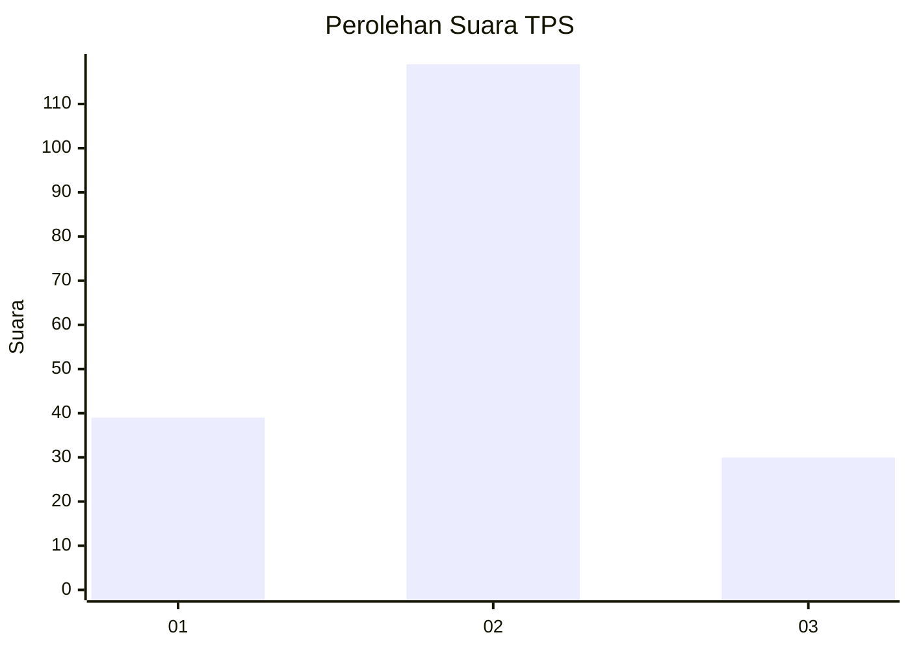

# Hasil

## Grafik

## Tabel

| No. | Nama Paslon    | Suara | Suara (raw) | Persentase |
|:--- |:-------------- | -----:| -----------:| ----------:|
| 1   | ANIES MUHAIMIN | 39    | [39][p-1]   | 20,74      |
| 2   | PRABOWO GIBRAN | 119   | [119][p-2]  | 63,30      |
| 3   | GANJAR MAHFUD  | 30    | [30][p-3]   | 15,96      |

[p-1]: https://github.com/gigit-pemilu/pemilu-2024-51-bali/blob/main/pilpres/hitung-suara/sub/51-bali/sub/71-kota-denpasar/sub/03-denpasar-barat/sub/1007-pemecutan/sub/037-tps/sub/paslon-1.txt
[p-2]: https://github.com/gigit-pemilu/pemilu-2024-51-bali/blob/main/pilpres/hitung-suara/sub/51-bali/sub/71-kota-denpasar/sub/03-denpasar-barat/sub/1007-pemecutan/sub/037-tps/sub/paslon-2.txt
[p-3]: https://github.com/gigit-pemilu/pemilu-2024-51-bali/blob/main/pilpres/hitung-suara/sub/51-bali/sub/71-kota-denpasar/sub/03-denpasar-barat/sub/1007-pemecutan/sub/037-tps/sub/paslon-3.txt

## Foto C Plano

https://sirekap-obj-formc.kpu.go.id/0078/pemilu/ppwp/51/71/03/10/07/5171031007037-20240214-141225--be2931c1-1562-408a-89f6-db1df2646e3d.jpg

https://sirekap-obj-formc.kpu.go.id/0078/pemilu/ppwp/51/71/03/10/07/5171031007037-20240214-141509--5d590a94-7f6a-455e-a33f-883bbd581a76.jpg

https://sirekap-obj-formc.kpu.go.id/0078/pemilu/ppwp/51/71/03/10/07/5171031007037-20240214-141543--9a01f467-356e-4c79-a2b9-438a1c1cc231.jpg

## Metadata

| Key        | Value               |
| ---------- | ------------------- |
| Time Stamp | 2024-02-25 12:00:00 |

## DATA PEMILIH TETAP

Jumlah pemilih dalam DPT: **246**.
 * L: **123**.
 * P: **123**.

## DATA PENGGUNA HAK PILIH

Jumlah pengguna hak pilih dalam DPT: **183**.
 * L: **82**.
 * P: **101**.

Jumlah pengguna hak pilih dalam DPTb: **2**.
 * L: **0**.
 * P: **2**.

Jumlah pengguna hak pilih dalam DPK: **4**.
 * L: **2**.
 * P: **2**.

Jumlah pengguna hak pilih: **189**.
 * L: **84**.
 * P: **105**.

## JUMLAH SUARA SAH DAN TIDAK SAH

JUMLAH SELURUH SUARA SAH: **188**.

JUMLAH SUARA TIDAK SAH: **1**.

JUMLAH SELURUH SUARA SAH DAN SUARA TIDAK SAH: **189**.

