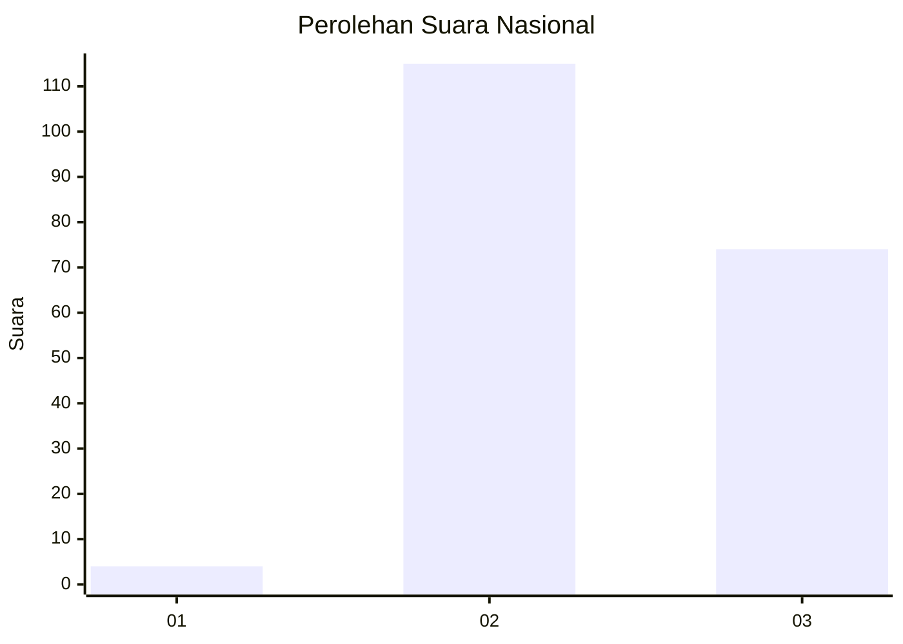
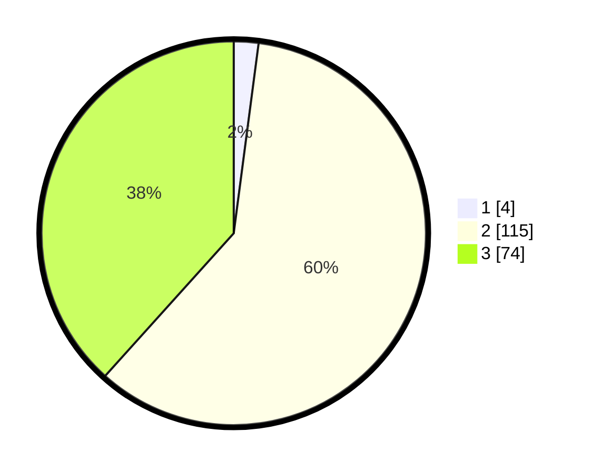

# Hasil

## Grafik

## Tabel

| No. | Nama Paslon    | Suara | Suara (raw) | Persentase |
|:--- |:-------------- | -----:| -----------:| ----------:|
| 1   | ANIES MUHAIMIN | 4     | [4][p-1]    | 2,07       |
| 2   | PRABOWO GIBRAN | 115   | [115][p-2]  | 59,59      |
| 3   | GANJAR MAHFUD  | 74    | [74][p-3]   | 38,34      |

[p-1]: https://github.com/gigit-pemilu/pemilu-2024/blob/main/pilpres/hitung-suara/sub/51-bali/sub/71-kota-denpasar/sub/03-denpasar-barat/sub/1007-pemecutan/sub/058-tps/sub/paslon-1.txt
[p-2]: https://github.com/gigit-pemilu/pemilu-2024/blob/main/pilpres/hitung-suara/sub/51-bali/sub/71-kota-denpasar/sub/03-denpasar-barat/sub/1007-pemecutan/sub/058-tps/sub/paslon-2.txt
[p-3]: https://github.com/gigit-pemilu/pemilu-2024/blob/main/pilpres/hitung-suara/sub/51-bali/sub/71-kota-denpasar/sub/03-denpasar-barat/sub/1007-pemecutan/sub/058-tps/sub/paslon-3.txt

## Foto C Plano

https://sirekap-obj-formc.kpu.go.id/5aa6/pemilu/ppwp/51/71/03/10/07/5171031007058-20240214-225842--34254474-3326-4034-bd53-5be1bcdee21b.jpg

https://sirekap-obj-formc.kpu.go.id/5aa6/pemilu/ppwp/51/71/03/10/07/5171031007058-20240214-230022--13243409-1594-402f-a059-dfbcafa1a6d0.jpg

https://sirekap-obj-formc.kpu.go.id/5aa6/pemilu/ppwp/51/71/03/10/07/5171031007058-20240214-230123--d58eb38c-c913-4803-bf08-289e42c3e298.jpg

## Metadata

| Key        | Value               |
| ---------- | ------------------- |
| Time Stamp | 2024-02-24 22:31:28 |

