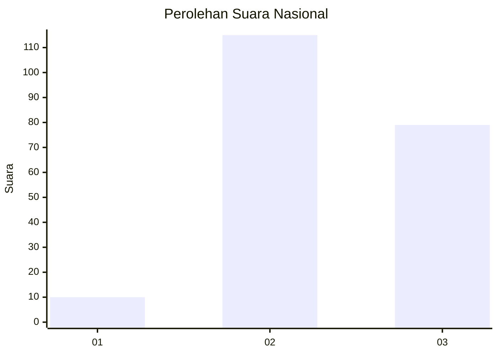
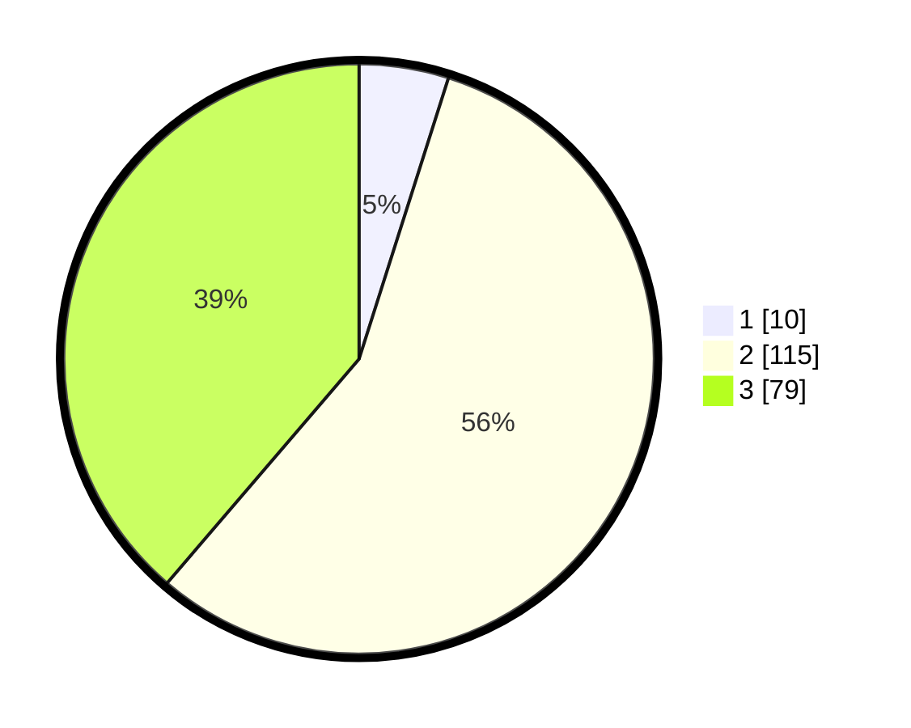

# Hasil

## Grafik

## Tabel

| No. | Nama Paslon    | Suara | Suara (raw) | Persentase |
|:--- |:-------------- | -----:| -----------:| ----------:|
| 1   | ANIES MUHAIMIN | 10    | [10][p-1]   | 4,90       |
| 2   | PRABOWO GIBRAN | 115   | [115][p-2]  | 56,37      |
| 3   | GANJAR MAHFUD  | 79    | [79][p-3]   | 38,73      |

[p-1]: https://github.com/gigit-pemilu/pemilu-2024/blob/main/pilpres/hitung-suara/sub/51-bali/sub/71-kota-denpasar/sub/03-denpasar-barat/sub/1007-pemecutan/sub/062-tps/sub/paslon-1.txt
[p-2]: https://github.com/gigit-pemilu/pemilu-2024/blob/main/pilpres/hitung-suara/sub/51-bali/sub/71-kota-denpasar/sub/03-denpasar-barat/sub/1007-pemecutan/sub/062-tps/sub/paslon-2.txt
[p-3]: https://github.com/gigit-pemilu/pemilu-2024/blob/main/pilpres/hitung-suara/sub/51-bali/sub/71-kota-denpasar/sub/03-denpasar-barat/sub/1007-pemecutan/sub/062-tps/sub/paslon-3.txt

## Foto C Plano

https://sirekap-obj-formc.kpu.go.id/9c8b/pemilu/ppwp/51/71/03/10/07/5171031007062-20240214-190816--e3535662-d52e-46be-9dfc-a573a00e0126.jpg

https://sirekap-obj-formc.kpu.go.id/9c8b/pemilu/ppwp/51/71/03/10/07/5171031007062-20240214-190908--f2cb1abe-205c-4812-b27d-ea22544f759d.jpg

https://sirekap-obj-formc.kpu.go.id/9c8b/pemilu/ppwp/51/71/03/10/07/5171031007062-20240214-190950--b4b1c2eb-c00b-41b9-ba8c-7022c7df634f.jpg

## Metadata

| Key        | Value               |
| ---------- | ------------------- |
| Time Stamp | 2024-02-24 22:31:28 |

