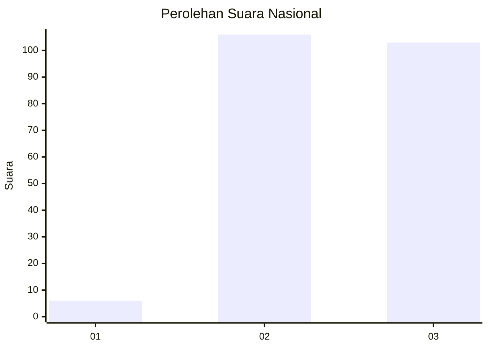
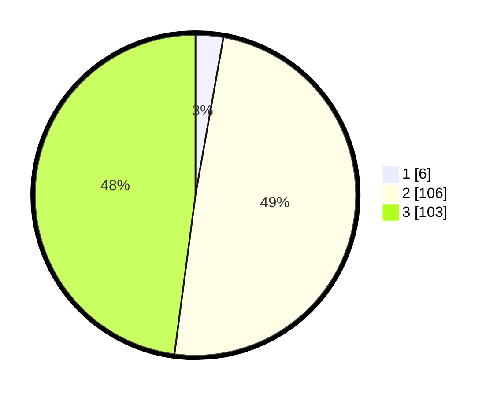

# Hasil

## Grafik

## Tabel

| No. | Nama Paslon    | Suara | Suara (raw) | Persentase |
|:--- |:-------------- | -----:| -----------:| ----------:|
| 1   | ANIES MUHAIMIN | 6     | [6][p-1]    | 2,79       |
| 2   | PRABOWO GIBRAN | 106   | [106][p-2]  | 49,30      |
| 3   | GANJAR MAHFUD  | 103   | [103][p-3]  | 47,91      |

[p-1]: https://github.com/gigit-pemilu/pemilu-2024/blob/main/pilpres/hitung-suara/sub/51-bali/sub/71-kota-denpasar/sub/03-denpasar-barat/sub/1010-padangsambian/sub/008-tps/sub/paslon-1.txt
[p-2]: https://github.com/gigit-pemilu/pemilu-2024/blob/main/pilpres/hitung-suara/sub/51-bali/sub/71-kota-denpasar/sub/03-denpasar-barat/sub/1010-padangsambian/sub/008-tps/sub/paslon-2.txt
[p-3]: https://github.com/gigit-pemilu/pemilu-2024/blob/main/pilpres/hitung-suara/sub/51-bali/sub/71-kota-denpasar/sub/03-denpasar-barat/sub/1010-padangsambian/sub/008-tps/sub/paslon-3.txt

## Foto C Plano

https://sirekap-obj-formc.kpu.go.id/2cbf/pemilu/ppwp/51/71/03/10/10/5171031010008-20240214-184519--489a69d7-f1af-4301-8acc-9a3cfa0a0da6.jpg

https://sirekap-obj-formc.kpu.go.id/2cbf/pemilu/ppwp/51/71/03/10/10/5171031010008-20240214-185205--7c72aeb2-6dc1-4f30-8401-578eb51c2fc0.jpg

https://sirekap-obj-formc.kpu.go.id/2cbf/pemilu/ppwp/51/71/03/10/10/5171031010008-20240214-184536--c9906c8e-e83c-4451-85f0-e331fcf70ccf.jpg

## Metadata

| Key        | Value               |
| ---------- | ------------------- |
| Time Stamp | 2024-02-24 22:31:28 |

