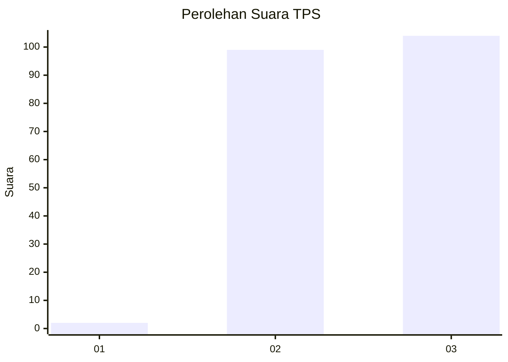
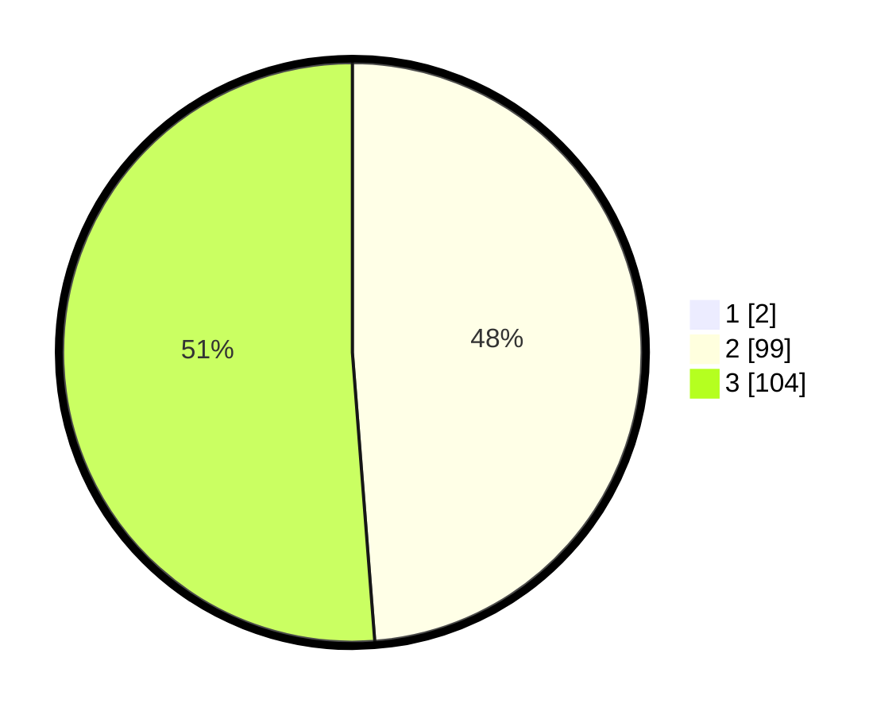

# Hasil

## Grafik

## Tabel

| No. | Nama Paslon    | Suara | Suara (raw) | Persentase |
|:--- |:-------------- | -----:| -----------:| ----------:|
| 1   | ANIES MUHAIMIN | 2     | [2][p-1]    | 0,98       |
| 2   | PRABOWO GIBRAN | 99    | [99][p-2]   | 48,29      |
| 3   | GANJAR MAHFUD  | 104   | [104][p-3]  | 50,73      |

[p-1]: https://github.com/gigit-pemilu/pemilu-2024-51-bali/blob/main/pilpres/hitung-suara/sub/51-bali/sub/71-kota-denpasar/sub/03-denpasar-barat/sub/1010-padangsambian/sub/010-tps/sub/paslon-1.txt
[p-2]: https://github.com/gigit-pemilu/pemilu-2024-51-bali/blob/main/pilpres/hitung-suara/sub/51-bali/sub/71-kota-denpasar/sub/03-denpasar-barat/sub/1010-padangsambian/sub/010-tps/sub/paslon-2.txt
[p-3]: https://github.com/gigit-pemilu/pemilu-2024-51-bali/blob/main/pilpres/hitung-suara/sub/51-bali/sub/71-kota-denpasar/sub/03-denpasar-barat/sub/1010-padangsambian/sub/010-tps/sub/paslon-3.txt

## Foto C Plano

https://sirekap-obj-formc.kpu.go.id/5910/pemilu/ppwp/51/71/03/10/10/5171031010010-20240214-215528--a7750f8f-6507-4695-8cc4-fdf97e64f4bf.jpg

https://sirekap-obj-formc.kpu.go.id/5910/pemilu/ppwp/51/71/03/10/10/5171031010010-20240214-215652--93b66cab-4653-4d17-843a-46a1ed408db7.jpg

https://sirekap-obj-formc.kpu.go.id/5910/pemilu/ppwp/51/71/03/10/10/5171031010010-20240214-215752--b97d10fb-ff51-42c8-a69f-bd6b27fb519d.jpg

## Metadata

| Key        | Value               |
| ---------- | ------------------- |
| Time Stamp | 2024-02-24 22:31:28 |

