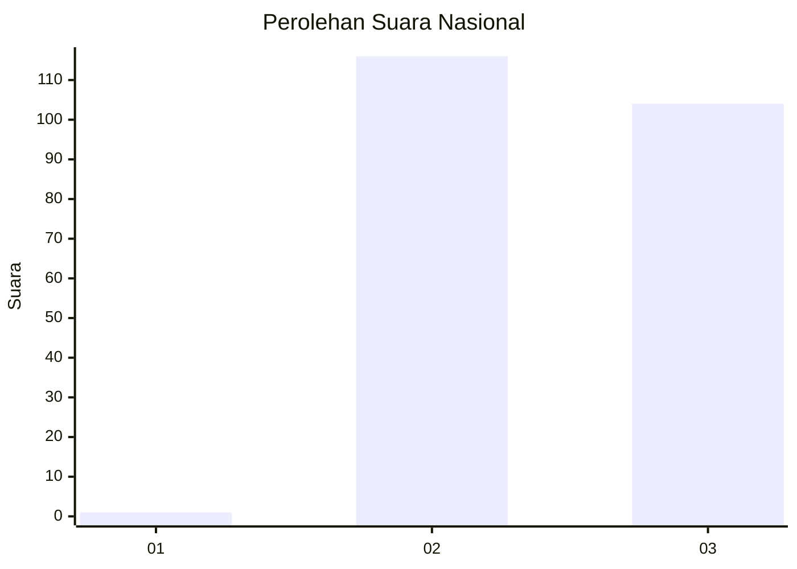
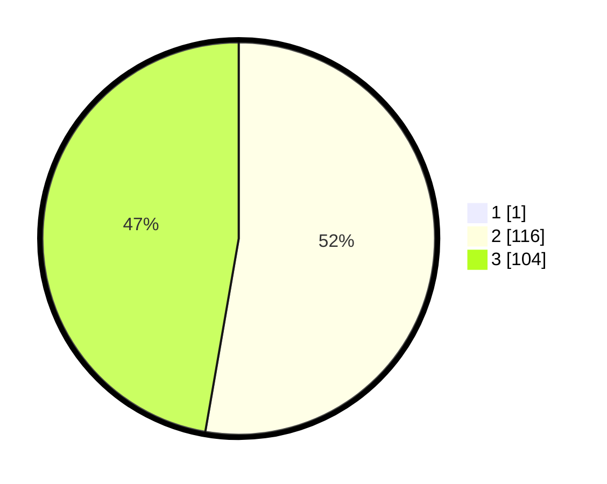

# Hasil

## Grafik

## Tabel

| No. | Nama Paslon    | Suara | Suara (raw) | Persentase |
|:--- |:-------------- | -----:| -----------:| ----------:|
| 1   | ANIES MUHAIMIN | 1     | [1][p-1]    | 0,45       |
| 2   | PRABOWO GIBRAN | 116   | [116][p-2]  | 52,49      |
| 3   | GANJAR MAHFUD  | 104   | [104][p-3]  | 47,06      |

[p-1]: https://github.com/gigit-pemilu/pemilu-2024/blob/main/pilpres/hitung-suara/sub/51-bali/sub/71-kota-denpasar/sub/03-denpasar-barat/sub/1010-padangsambian/sub/011-tps/sub/paslon-1.txt
[p-2]: https://github.com/gigit-pemilu/pemilu-2024/blob/main/pilpres/hitung-suara/sub/51-bali/sub/71-kota-denpasar/sub/03-denpasar-barat/sub/1010-padangsambian/sub/011-tps/sub/paslon-2.txt
[p-3]: https://github.com/gigit-pemilu/pemilu-2024/blob/main/pilpres/hitung-suara/sub/51-bali/sub/71-kota-denpasar/sub/03-denpasar-barat/sub/1010-padangsambian/sub/011-tps/sub/paslon-3.txt

## Foto C Plano

https://sirekap-obj-formc.kpu.go.id/e729/pemilu/ppwp/51/71/03/10/10/5171031010011-20240214-185613--8aed3f23-da5f-4c2f-855a-3c350bb04c79.jpg

https://sirekap-obj-formc.kpu.go.id/e729/pemilu/ppwp/51/71/03/10/10/5171031010011-20240214-190936--f15025ac-a9a2-41a7-82c6-b0fc5beb0e6d.jpg

https://sirekap-obj-formc.kpu.go.id/e729/pemilu/ppwp/51/71/03/10/10/5171031010011-20240214-234630--b57abb13-bdd5-4904-a530-82bd9ed8f02c.jpg

## Metadata

| Key        | Value               |
| ---------- | ------------------- |
| Time Stamp | 2024-02-15 20:00:44 |

