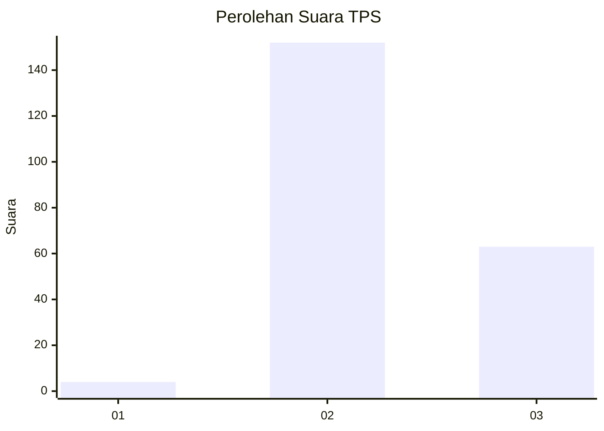

# Hasil

## Grafik

## Tabel

| No. | Nama Paslon    | Suara | Suara (raw) | Persentase |
|:--- |:-------------- | -----:| -----------:| ----------:|
| 1   | ANIES MUHAIMIN | 4     | [4][p-1]    | 1,83       |
| 2   | PRABOWO GIBRAN | 152   | [152][p-2]  | 69,41      |
| 3   | GANJAR MAHFUD  | 63    | [63][p-3]   | 28,77      |

[p-1]: https://github.com/gigit-pemilu/pemilu-2024-51-bali/blob/main/pilpres/hitung-suara/sub/51-bali/sub/71-kota-denpasar/sub/03-denpasar-barat/sub/1010-padangsambian/sub/034-tps/sub/paslon-1.txt
[p-2]: https://github.com/gigit-pemilu/pemilu-2024-51-bali/blob/main/pilpres/hitung-suara/sub/51-bali/sub/71-kota-denpasar/sub/03-denpasar-barat/sub/1010-padangsambian/sub/034-tps/sub/paslon-2.txt
[p-3]: https://github.com/gigit-pemilu/pemilu-2024-51-bali/blob/main/pilpres/hitung-suara/sub/51-bali/sub/71-kota-denpasar/sub/03-denpasar-barat/sub/1010-padangsambian/sub/034-tps/sub/paslon-3.txt

## Foto C Plano

https://sirekap-obj-formc.kpu.go.id/fee6/pemilu/ppwp/51/71/03/10/10/5171031010034-20240214-215316--474359e8-c796-4437-9afd-9e090ffae8c0.jpg

https://sirekap-obj-formc.kpu.go.id/fee6/pemilu/ppwp/51/71/03/10/10/5171031010034-20240214-214606--b6317a4f-9cb5-473f-a188-fe9f9a13cebc.jpg

https://sirekap-obj-formc.kpu.go.id/fee6/pemilu/ppwp/51/71/03/10/10/5171031010034-20240214-214622--6cf9d52b-60f9-4e2f-8e9f-256999fe3dcd.jpg

## Metadata

| Key        | Value               |
| ---------- | ------------------- |
| Time Stamp | 2024-02-26 12:00:00 |

