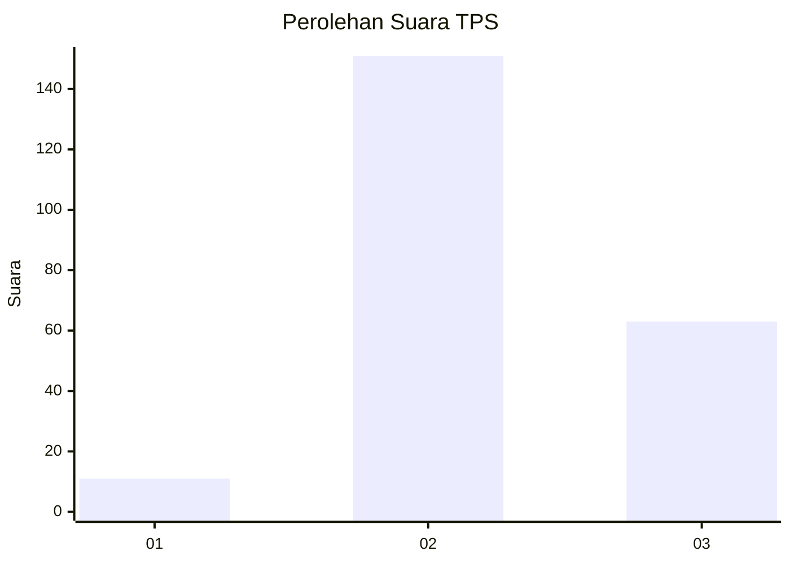
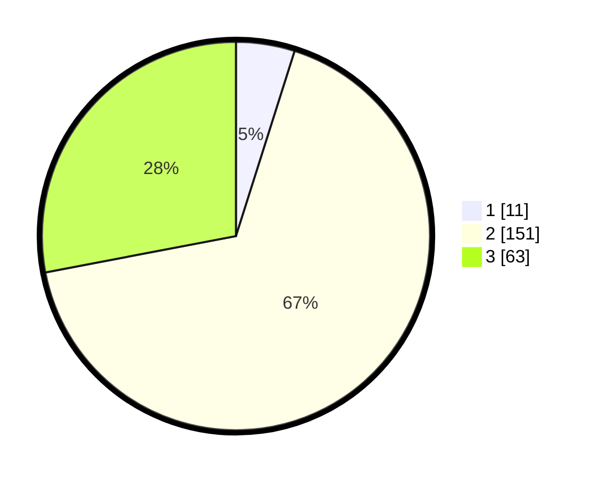

# Hasil

## Grafik

## Tabel

| No. | Nama Paslon    | Suara | Suara (raw) | Persentase |
|:--- |:-------------- | -----:| -----------:| ----------:|
| 1   | ANIES MUHAIMIN | 11    | [11][p-1]   | 4,89       |
| 2   | PRABOWO GIBRAN | 151   | [151][p-2]  | 67,11      |
| 3   | GANJAR MAHFUD  | 63    | [63][p-3]   | 28,00      |

[p-1]: https://github.com/gigit-pemilu/pemilu-2024-51-bali/blob/main/pilpres/hitung-suara/sub/51-bali/sub/71-kota-denpasar/sub/03-denpasar-barat/sub/1010-padangsambian/sub/039-tps/sub/paslon-1.txt
[p-2]: https://github.com/gigit-pemilu/pemilu-2024-51-bali/blob/main/pilpres/hitung-suara/sub/51-bali/sub/71-kota-denpasar/sub/03-denpasar-barat/sub/1010-padangsambian/sub/039-tps/sub/paslon-2.txt
[p-3]: https://github.com/gigit-pemilu/pemilu-2024-51-bali/blob/main/pilpres/hitung-suara/sub/51-bali/sub/71-kota-denpasar/sub/03-denpasar-barat/sub/1010-padangsambian/sub/039-tps/sub/paslon-3.txt

## Foto C Plano

https://sirekap-obj-formc.kpu.go.id/9c71/pemilu/ppwp/51/71/03/10/10/5171031010039-20240215-190820--865fb106-fc01-4b76-81a0-450509c991c9.jpg

https://sirekap-obj-formc.kpu.go.id/9c71/pemilu/ppwp/51/71/03/10/10/5171031010039-20240215-190718--853b36c2-d68b-4c1e-9296-5fd42361d403.jpg

https://sirekap-obj-formc.kpu.go.id/9c71/pemilu/ppwp/51/71/03/10/10/5171031010039-20240215-190749--a97319ce-c2bf-4cbf-b9cf-8790680fc33f.jpg

## Metadata

| Key        | Value               |
| ---------- | ------------------- |
| Time Stamp | 2024-02-24 22:31:28 |

