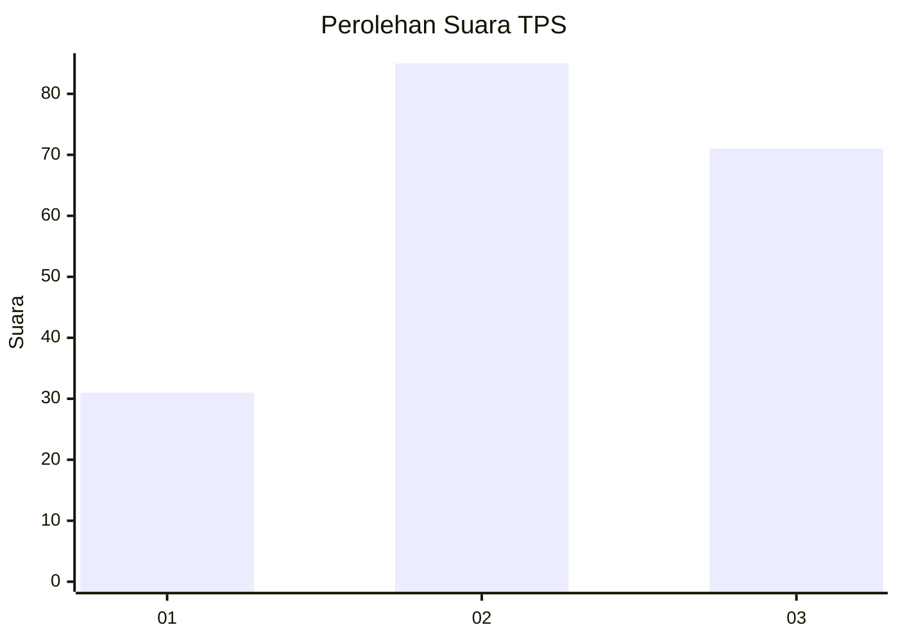
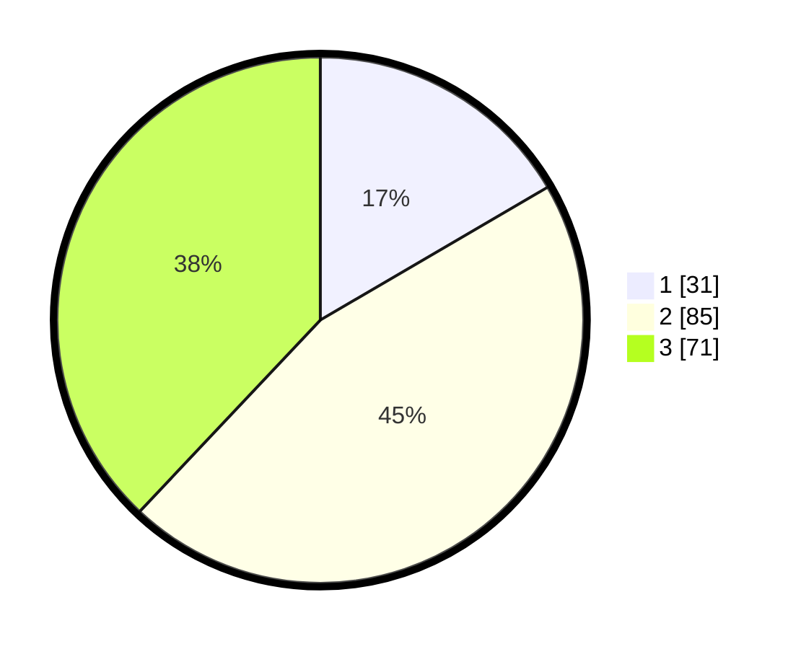

# Hasil

## Grafik

## Tabel

| No. | Nama Paslon    | Suara | Suara (raw) | Persentase |
|:--- |:-------------- | -----:| -----------:| ----------:|
| 1   | ANIES MUHAIMIN | 31    | [31][p-1]   | 16,58      |
| 2   | PRABOWO GIBRAN | 85    | [85][p-2]   | 45,45      |
| 3   | GANJAR MAHFUD  | 71    | [71][p-3]   | 37,97      |

[p-1]: https://github.com/gigit-pemilu/pemilu-2024-51-bali/blob/main/pilpres/hitung-suara/sub/51-bali/sub/71-kota-denpasar/sub/03-denpasar-barat/sub/1010-padangsambian/sub/056-tps/sub/paslon-1.txt
[p-2]: https://github.com/gigit-pemilu/pemilu-2024-51-bali/blob/main/pilpres/hitung-suara/sub/51-bali/sub/71-kota-denpasar/sub/03-denpasar-barat/sub/1010-padangsambian/sub/056-tps/sub/paslon-2.txt
[p-3]: https://github.com/gigit-pemilu/pemilu-2024-51-bali/blob/main/pilpres/hitung-suara/sub/51-bali/sub/71-kota-denpasar/sub/03-denpasar-barat/sub/1010-padangsambian/sub/056-tps/sub/paslon-3.txt

## Foto C Plano

https://sirekap-obj-formc.kpu.go.id/0b3f/pemilu/ppwp/51/71/03/10/10/5171031010056-20240214-141944--87b44d8a-e6c6-40da-a224-877440059df9.jpg

https://sirekap-obj-formc.kpu.go.id/0b3f/pemilu/ppwp/51/71/03/10/10/5171031010056-20240214-141315--01c2b5d4-48b8-4e22-adb9-c647414b2902.jpg

https://sirekap-obj-formc.kpu.go.id/0b3f/pemilu/ppwp/51/71/03/10/10/5171031010056-20240214-141553--9d672e72-63a4-4957-9cb1-9ccc4b5eb431.jpg

## Metadata

| Key        | Value               |
| ---------- | ------------------- |
| Time Stamp | 2024-02-24 22:31:28 |

