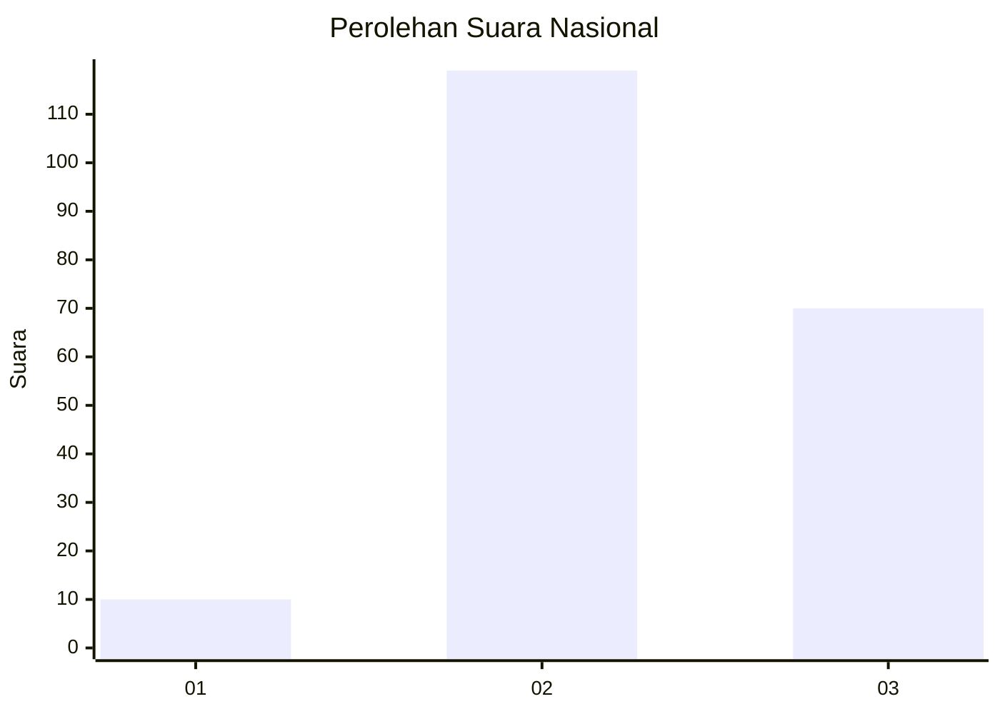
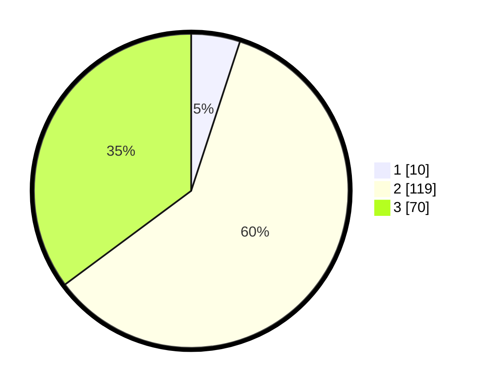

# Hasil

## Grafik

## Tabel

| No. | Nama Paslon    | Suara | Suara (raw) | Persentase |
|:--- |:-------------- | -----:| -----------:| ----------:|
| 1   | ANIES MUHAIMIN | 10    | [10][p-1]   | 5,03       |
| 2   | PRABOWO GIBRAN | 119   | [119][p-2]  | 59,80      |
| 3   | GANJAR MAHFUD  | 70    | [70][p-3]   | 35,18      |

[p-1]: https://github.com/gigit-pemilu/pemilu-2024/blob/main/pilpres/hitung-suara/sub/51-bali/sub/71-kota-denpasar/sub/03-denpasar-barat/sub/1010-padangsambian/sub/066-tps/sub/paslon-1.txt
[p-2]: https://github.com/gigit-pemilu/pemilu-2024/blob/main/pilpres/hitung-suara/sub/51-bali/sub/71-kota-denpasar/sub/03-denpasar-barat/sub/1010-padangsambian/sub/066-tps/sub/paslon-2.txt
[p-3]: https://github.com/gigit-pemilu/pemilu-2024/blob/main/pilpres/hitung-suara/sub/51-bali/sub/71-kota-denpasar/sub/03-denpasar-barat/sub/1010-padangsambian/sub/066-tps/sub/paslon-3.txt

## Foto C Plano

https://sirekap-obj-formc.kpu.go.id/5aa4/pemilu/ppwp/51/71/03/10/10/5171031010066-20240214-231501--017a8ba0-366b-46d5-b765-3e9e5d778d34.jpg

https://sirekap-obj-formc.kpu.go.id/5aa4/pemilu/ppwp/51/71/03/10/10/5171031010066-20240214-231656--1e4fdf97-88c8-439c-90fd-686b7e5da1cf.jpg

https://sirekap-obj-formc.kpu.go.id/5aa4/pemilu/ppwp/51/71/03/10/10/5171031010066-20240214-233102--54970236-38a9-46d1-b5d3-0dbbaa9a334b.jpg

## Metadata

| Key        | Value               |
| ---------- | ------------------- |
| Time Stamp | 2024-02-24 22:31:28 |

