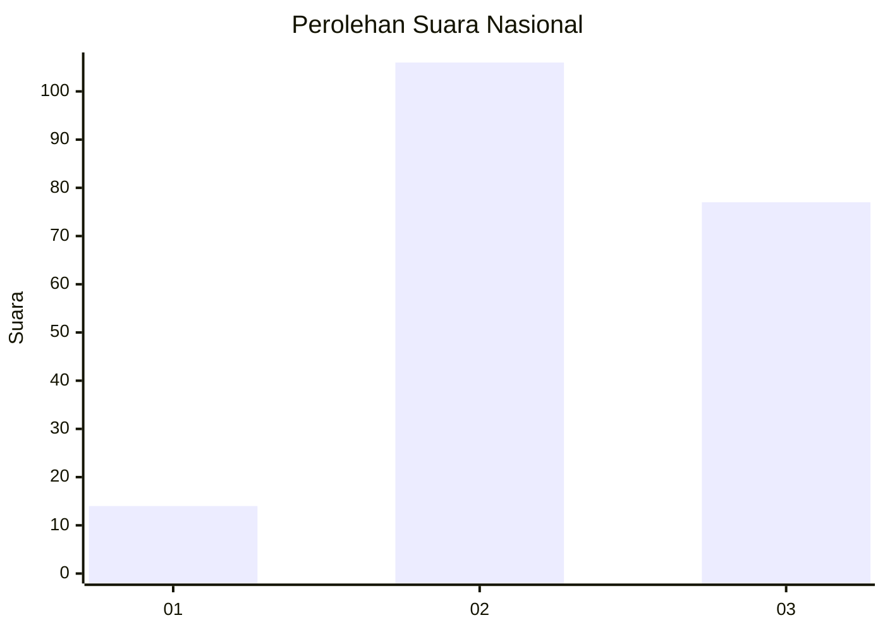
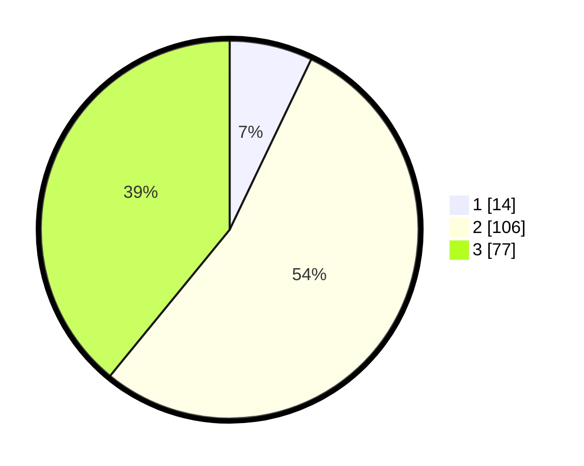

# Hasil

## Grafik

## Tabel

| No. | Nama Paslon    | Suara | Suara (raw) | Persentase |
|:--- |:-------------- | -----:| -----------:| ----------:|
| 1   | ANIES MUHAIMIN | 14    | [14][p-1]   | 7,11       |
| 2   | PRABOWO GIBRAN | 106   | [106][p-2]  | 53,81      |
| 3   | GANJAR MAHFUD  | 77    | [77][p-3]   | 39,09      |

[p-1]: https://github.com/gigit-pemilu/pemilu-2024/blob/main/pilpres/hitung-suara/sub/51-bali/sub/71-kota-denpasar/sub/03-denpasar-barat/sub/1010-padangsambian/sub/070-tps/sub/paslon-1.txt
[p-2]: https://github.com/gigit-pemilu/pemilu-2024/blob/main/pilpres/hitung-suara/sub/51-bali/sub/71-kota-denpasar/sub/03-denpasar-barat/sub/1010-padangsambian/sub/070-tps/sub/paslon-2.txt
[p-3]: https://github.com/gigit-pemilu/pemilu-2024/blob/main/pilpres/hitung-suara/sub/51-bali/sub/71-kota-denpasar/sub/03-denpasar-barat/sub/1010-padangsambian/sub/070-tps/sub/paslon-3.txt

## Foto C Plano

https://sirekap-obj-formc.kpu.go.id/a0c7/pemilu/ppwp/51/71/03/10/10/5171031010070-20240214-212225--fa4bbb08-dbde-4c5d-903d-da1233db89cb.jpg

https://sirekap-obj-formc.kpu.go.id/a0c7/pemilu/ppwp/51/71/03/10/10/5171031010070-20240214-212228--57719528-1304-4b14-85dc-0cf18ab63940.jpg

https://sirekap-obj-formc.kpu.go.id/a0c7/pemilu/ppwp/51/71/03/10/10/5171031010070-20240214-212233--69120129-944c-42a1-88a2-ef0a3391de7c.jpg

## Metadata

| Key        | Value               |
| ---------- | ------------------- |
| Time Stamp | 2024-02-24 22:31:28 |

