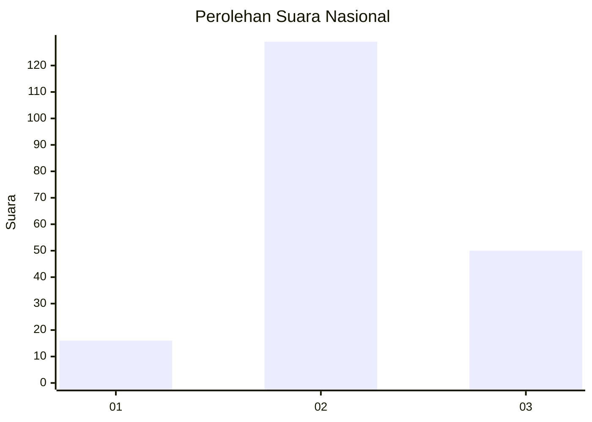
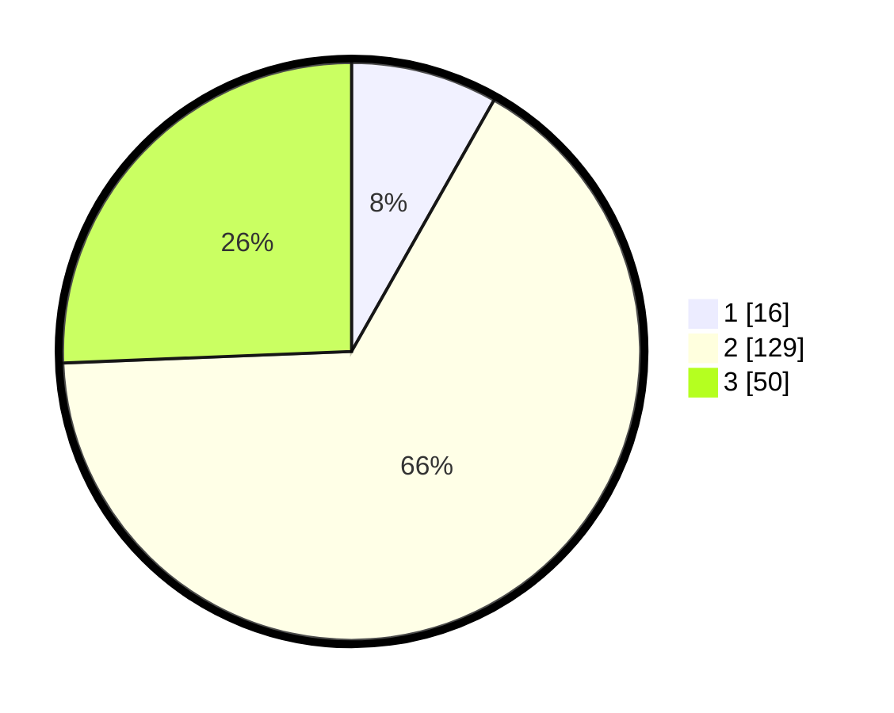

# Hasil

## Grafik

## Tabel

| No. | Nama Paslon    | Suara | Suara (raw) | Persentase |
|:--- |:-------------- | -----:| -----------:| ----------:|
| 1   | ANIES MUHAIMIN | 16    | [16][p-1]   | 8,21       |
| 2   | PRABOWO GIBRAN | 129   | [129][p-2]  | 66,15      |
| 3   | GANJAR MAHFUD  | 50    | [50][p-3]   | 25,64      |

[p-1]: https://github.com/gigit-pemilu/pemilu-2024/blob/main/pilpres/hitung-suara/sub/51-bali/sub/71-kota-denpasar/sub/03-denpasar-barat/sub/1010-padangsambian/sub/071-tps/sub/paslon-1.txt
[p-2]: https://github.com/gigit-pemilu/pemilu-2024/blob/main/pilpres/hitung-suara/sub/51-bali/sub/71-kota-denpasar/sub/03-denpasar-barat/sub/1010-padangsambian/sub/071-tps/sub/paslon-2.txt
[p-3]: https://github.com/gigit-pemilu/pemilu-2024/blob/main/pilpres/hitung-suara/sub/51-bali/sub/71-kota-denpasar/sub/03-denpasar-barat/sub/1010-padangsambian/sub/071-tps/sub/paslon-3.txt

## Foto C Plano

https://sirekap-obj-formc.kpu.go.id/f3c8/pemilu/ppwp/51/71/03/10/10/5171031010071-20240214-205136--e38da8dd-1101-4932-8457-cee68b8658a6.jpg

https://sirekap-obj-formc.kpu.go.id/f3c8/pemilu/ppwp/51/71/03/10/10/5171031010071-20240214-210010--78691549-34a5-4bbd-9f38-c2678e37f870.jpg

https://sirekap-obj-formc.kpu.go.id/f3c8/pemilu/ppwp/51/71/03/10/10/5171031010071-20240214-210143--92c0026e-7616-4716-ab50-4737f37b5f49.jpg

## Metadata

| Key        | Value               |
| ---------- | ------------------- |
| Time Stamp | 2024-02-24 22:31:28 |

