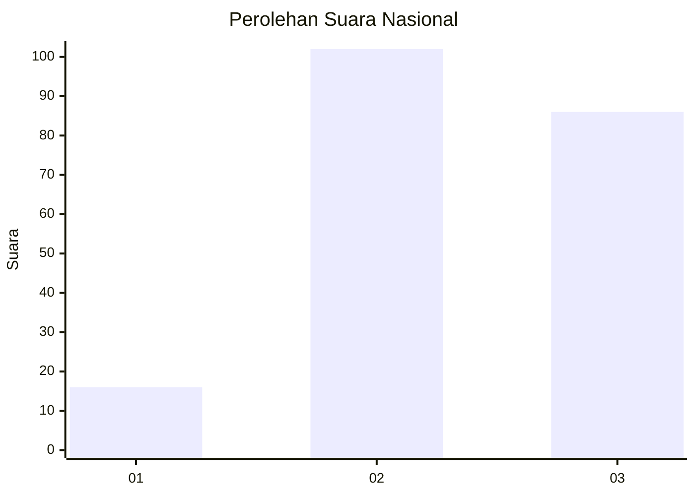
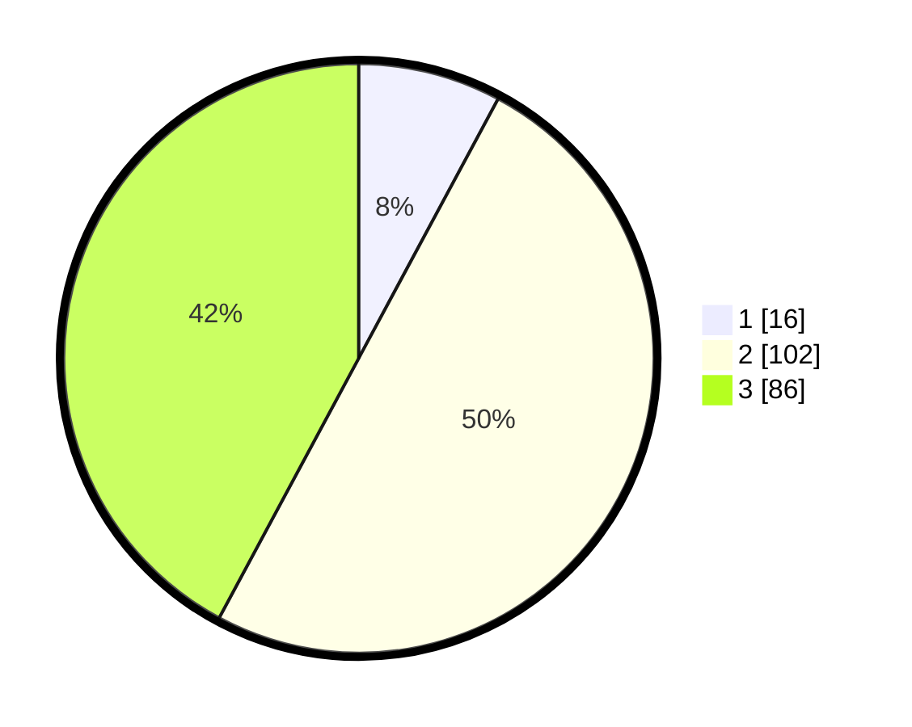

# Hasil

## Grafik

## Tabel

| No. | Nama Paslon    | Suara | Suara (raw) | Persentase |
|:--- |:-------------- | -----:| -----------:| ----------:|
| 1   | ANIES MUHAIMIN | 16    | [16][p-1]   | 7,84       |
| 2   | PRABOWO GIBRAN | 102   | [102][p-2]  | 50,00      |
| 3   | GANJAR MAHFUD  | 86    | [86][p-3]   | 42,16      |

[p-1]: https://github.com/gigit-pemilu/pemilu-2024/blob/main/pilpres/hitung-suara/sub/51-bali/sub/71-kota-denpasar/sub/03-denpasar-barat/sub/1010-padangsambian/sub/075-tps/sub/paslon-1.txt
[p-2]: https://github.com/gigit-pemilu/pemilu-2024/blob/main/pilpres/hitung-suara/sub/51-bali/sub/71-kota-denpasar/sub/03-denpasar-barat/sub/1010-padangsambian/sub/075-tps/sub/paslon-2.txt
[p-3]: https://github.com/gigit-pemilu/pemilu-2024/blob/main/pilpres/hitung-suara/sub/51-bali/sub/71-kota-denpasar/sub/03-denpasar-barat/sub/1010-padangsambian/sub/075-tps/sub/paslon-3.txt

## Foto C Plano

https://sirekap-obj-formc.kpu.go.id/8358/pemilu/ppwp/51/71/03/10/10/5171031010075-20240215-074441--a51b5ff2-4963-49ea-aa17-d5980b2a133e.jpg

https://sirekap-obj-formc.kpu.go.id/8358/pemilu/ppwp/51/71/03/10/10/5171031010075-20240215-074458--7a25683a-7558-4e63-8df3-9e6d2eba934a.jpg

https://sirekap-obj-formc.kpu.go.id/8358/pemilu/ppwp/51/71/03/10/10/5171031010075-20240215-074506--f1dd54dd-6d3f-45ef-8a49-be831411af5d.jpg

## Metadata

| Key        | Value               |
| ---------- | ------------------- |
| Time Stamp | 2024-02-24 22:31:28 |

