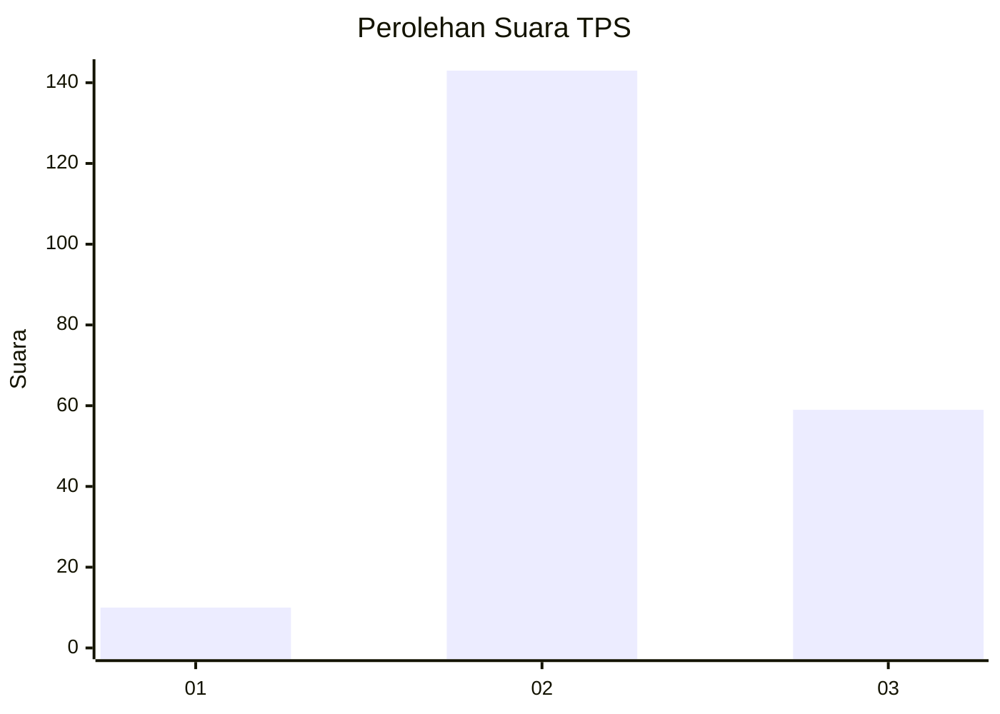
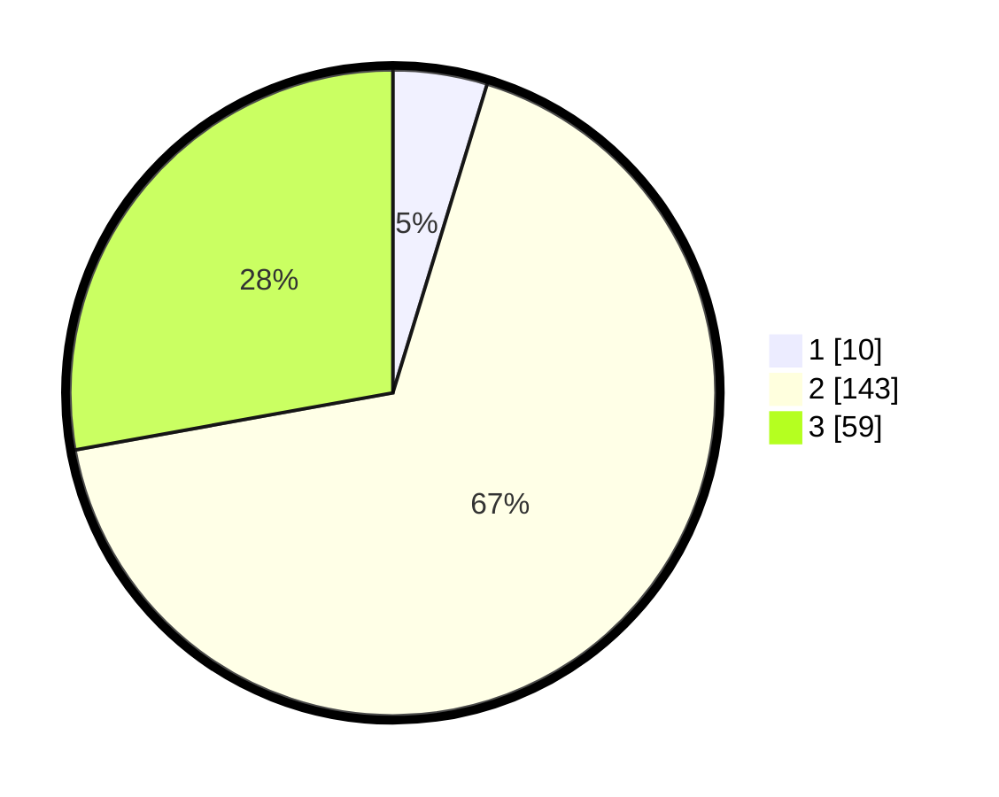

# Hasil

## Grafik

## Tabel

| No. | Nama Paslon    | Suara | Suara (raw) | Persentase |
|:--- |:-------------- | -----:| -----------:| ----------:|
| 1   | ANIES MUHAIMIN | 10    | [10][p-1]   | 4,72       |
| 2   | PRABOWO GIBRAN | 143   | [143][p-2]  | 67,45      |
| 3   | GANJAR MAHFUD  | 59    | [59][p-3]   | 27,83      |

[p-1]: https://github.com/gigit-pemilu/pemilu-2024-51-bali/blob/main/pilpres/hitung-suara/sub/51-bali/sub/71-kota-denpasar/sub/03-denpasar-barat/sub/1010-padangsambian/sub/076-tps/sub/paslon-1.txt
[p-2]: https://github.com/gigit-pemilu/pemilu-2024-51-bali/blob/main/pilpres/hitung-suara/sub/51-bali/sub/71-kota-denpasar/sub/03-denpasar-barat/sub/1010-padangsambian/sub/076-tps/sub/paslon-2.txt
[p-3]: https://github.com/gigit-pemilu/pemilu-2024-51-bali/blob/main/pilpres/hitung-suara/sub/51-bali/sub/71-kota-denpasar/sub/03-denpasar-barat/sub/1010-padangsambian/sub/076-tps/sub/paslon-3.txt

## Foto C Plano

https://sirekap-obj-formc.kpu.go.id/3599/pemilu/ppwp/51/71/03/10/10/5171031010076-20240215-070922--fbd2048d-272f-4912-a0b8-06b6f96c5769.jpg

https://sirekap-obj-formc.kpu.go.id/3599/pemilu/ppwp/51/71/03/10/10/5171031010076-20240215-071021--737bd308-cd6c-46ac-adab-221cf5235b5b.jpg

https://sirekap-obj-formc.kpu.go.id/3599/pemilu/ppwp/51/71/03/10/10/5171031010076-20240215-071041--2567e982-b433-4065-9e7a-1f330694d7ff.jpg

## Metadata

| Key        | Value               |
| ---------- | ------------------- |
| Time Stamp | 2024-02-15 15:30:25 |

## DATA PEMILIH TETAP

Jumlah pemilih dalam DPT: **282**.
 * L: **136**.
 * P: **146**.

## DATA PENGGUNA HAK PILIH

Jumlah pengguna hak pilih dalam DPT: **196**.
 * L: **83**.
 * P: **108**.

Jumlah pengguna hak pilih dalam DPTb: **5**.
 * L: **2**.
 * P: **3**.

Jumlah pengguna hak pilih dalam DPK: **12**.
 * L: **7**.
 * P: **5**.

Jumlah pengguna hak pilih: **213**.
 * L: **97**.
 * P: **116**.

## JUMLAH SUARA SAH DAN TIDAK SAH

JUMLAH SELURUH SUARA SAH: **212**.

JUMLAH SUARA TIDAK SAH: **1**.

JUMLAH SELURUH SUARA SAH DAN SUARA TIDAK SAH: **213**.

