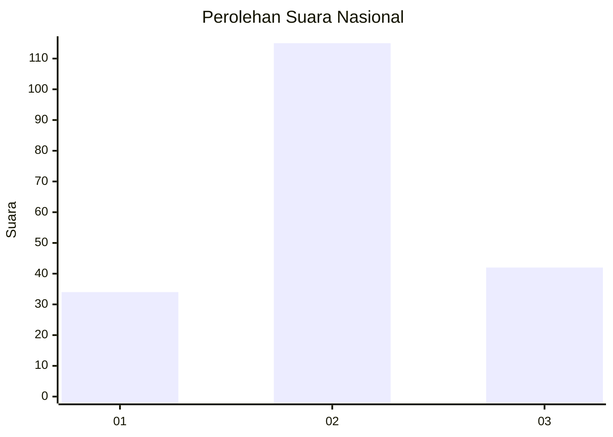
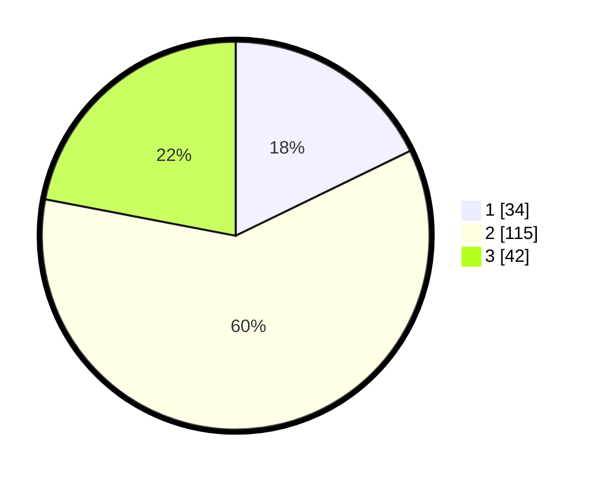

# Hasil

## Grafik

## Tabel

| No. | Nama Paslon    | Suara | Suara (raw) | Persentase |
|:--- |:-------------- | -----:| -----------:| ----------:|
| 1   | ANIES MUHAIMIN | 34    | [34][p-1]   | 17,80      |
| 2   | PRABOWO GIBRAN | 115   | [115][p-2]  | 60,21      |
| 3   | GANJAR MAHFUD  | 42    | [42][p-3]   | 21,99      |

[p-1]: https://github.com/gigit-pemilu/pemilu-2024/blob/main/pilpres/hitung-suara/sub/51-bali/sub/71-kota-denpasar/sub/03-denpasar-barat/sub/2001-padangsambian-kelod/sub/010-tps/sub/paslon-1.txt
[p-2]: https://github.com/gigit-pemilu/pemilu-2024/blob/main/pilpres/hitung-suara/sub/51-bali/sub/71-kota-denpasar/sub/03-denpasar-barat/sub/2001-padangsambian-kelod/sub/010-tps/sub/paslon-2.txt
[p-3]: https://github.com/gigit-pemilu/pemilu-2024/blob/main/pilpres/hitung-suara/sub/51-bali/sub/71-kota-denpasar/sub/03-denpasar-barat/sub/2001-padangsambian-kelod/sub/010-tps/sub/paslon-3.txt

## Foto C Plano

https://sirekap-obj-formc.kpu.go.id/2350/pemilu/ppwp/51/71/03/20/01/5171032001010-20240214-155259--ed2482ba-688d-4c45-badb-854c4bc4496a.jpg

https://sirekap-obj-formc.kpu.go.id/2350/pemilu/ppwp/51/71/03/20/01/5171032001010-20240214-155243--a4e022fc-e685-493d-b45e-636700d88323.jpg

https://sirekap-obj-formc.kpu.go.id/2350/pemilu/ppwp/51/71/03/20/01/5171032001010-20240214-155222--440d3f2b-9bc6-4256-bfb2-e6e292dcb47c.jpg

## Metadata

| Key        | Value               |
| ---------- | ------------------- |
| Time Stamp | 2024-02-14 21:46:01 |

## DATA PEMILIH TETAP

Jumlah pemilih dalam DPT: **236**.
 * L: **112**.
 * P: **124**.

## DATA PENGGUNA HAK PILIH

Jumlah pengguna hak pilih dalam DPT: **177**.
 * L: **77**.
 * P: **100**.

Jumlah pengguna hak pilih dalam DPTb: **0**.
 * L: **0**.
 * P: **0**.

Jumlah pengguna hak pilih dalam DPK: **14**.
 * L: **8**.
 * P: **6**.

Jumlah pengguna hak pilih: **191**.
 * L: **85**.
 * P: **106**.

## JUMLAH SUARA SAH DAN TIDAK SAH

JUMLAH SELURUH SUARA SAH: **191**.

JUMLAH SUARA TIDAK SAH: **0**.

JUMLAH SELURUH SUARA SAH DAN SUARA TIDAK SAH: **191**.

